# Ping

**The cheapest way to send money anywhere.**

No app needed to receive. No crypto knowledge required. Fees under 1%.

---

## The Problem

Sending money across borders is expensive and slow:

| Service | Fee to send $200 | Speed |
|---------|------------------|-------|
| Western Union | $10-15 (5-7%) | 1-3 days |
| Bank wire | $25-50 | 3-5 days |
| PayPal | $6-10 (3-5%) | Instant |
| Wise | $2-4 (1-2%) | Hours |
| **Ping** | **$1-2 (<1%)** | **Seconds** |

> 300 million migrant workers send $700 billion home every year, losing **$40+ billion to fees**.

---

## How We're Different

Others have solved parts of this. We combine the best:

| Feature | WorldRemit | Remitly | Chipper Cash | **Ping** |
|---------|------------|---------|--------------|----------|
| No app to receive | ❌ | ❌ | ❌ | ✅ |
| Stablecoin rails | ❌ | ❌ | ✅ | ✅ |
| Fees under 1% | ❌ | ❌ | ✅ | ✅ |
| Claim via link | ❌ | ❌ | ❌ | ✅ |
| Global coverage | Partial | Partial | Africa only | ✅ |
| B2B API | ❌ | ❌ | ❌ | ✅ |

**Our position**: Stablecoin economics + no-download UX + global coverage.

---

## How It Works

### High-Level Flow

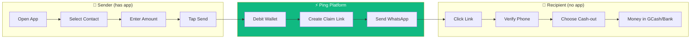

### Detailed User Journey

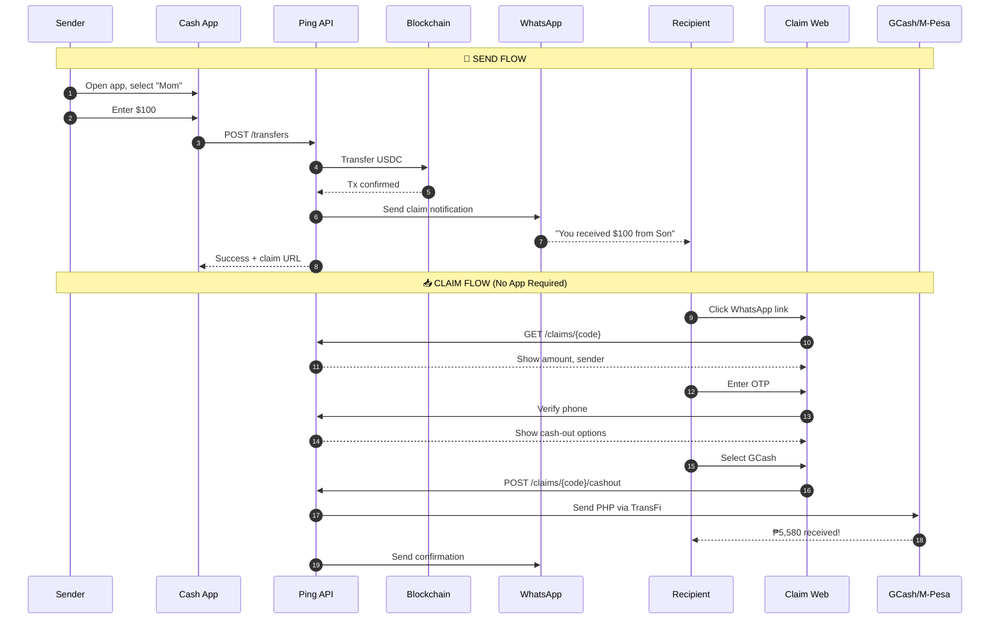

---

## Recipient Claim Flow

The recipient **never needs to download our app**. Everything happens in their browser:

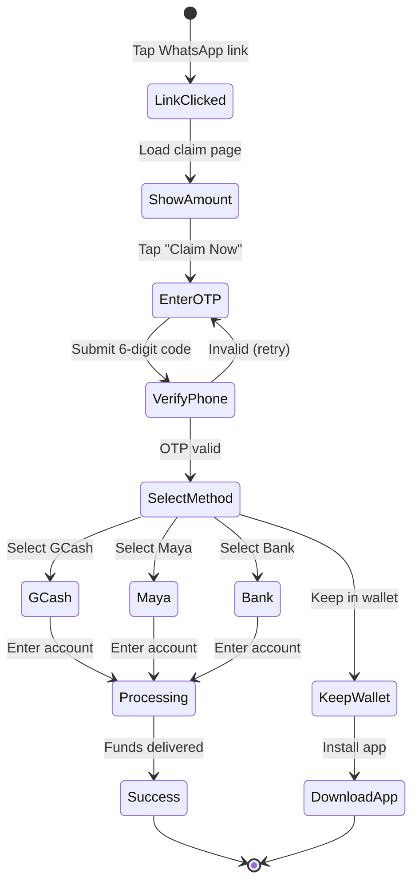

---

## Supported Corridors (Phase 1)

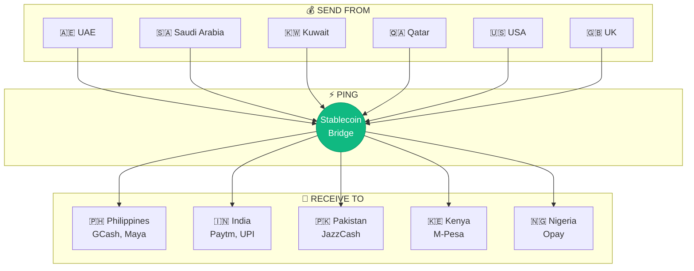

---

## Target Users

### Primary: Migrant Workers in GCC

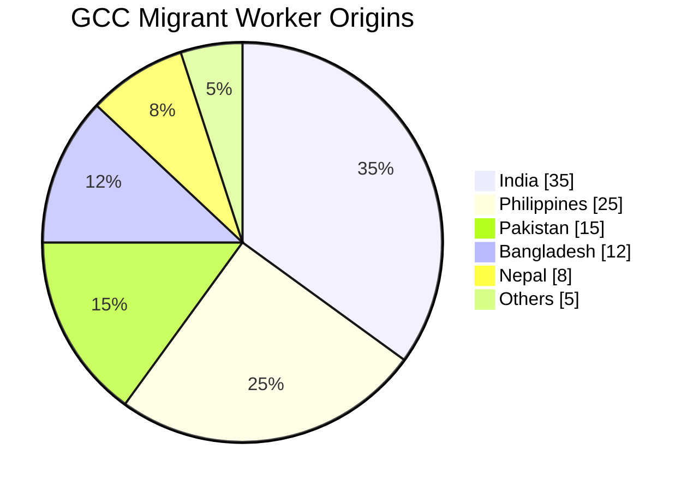

- **35M+ migrant workers** in Gulf countries
- Send **$100-500/month** home
- Current pain: **5-7% fees** to exchange houses
- Our value: **<1% fees**, instant delivery

---

## Technology

### Why Stablecoins?

We use USDC/USDT on fast blockchains as **invisible infrastructure**:

| Benefit | Traditional Rails | Stablecoin Rails |
|---------|-------------------|------------------|
| Speed | Hours to days | **Seconds** |
| Cost | $5-50 per transfer | **$0.001-0.01** |
| Availability | Banking hours | **24/7/365** |
| Coverage | Limited corridors | **Global** |

> **Users never see "crypto"** - they see dollars in, local currency out.

### System Architecture

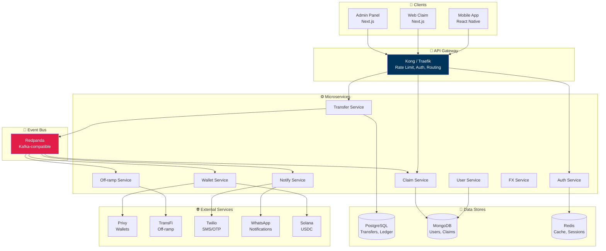

### Tech Stack

| Component | Technology | Why |
|-----------|------------|-----|
| Mobile App | React Native + Expo | Cross-platform, fast iteration |
| Web Claim | Next.js 14 | SSR, great mobile web UX |
| API | Fastify | Fast, TypeScript-native |
| Auth/Wallets | Privy | MPC wallets, social login |
| Database (ACID) | PostgreSQL | Financial data integrity |
| Database (Scale) | MongoDB | User profiles, high read |
| Cache | Redis | Sessions, rate limits |
| Events | Redpanda | Kafka-compatible, simpler |
| Off-ramp | TransFi | 300+ local payment methods |
| Blockchain | Solana | Fast, cheap USDC transfers |

---

## Business Model

### Revenue Streams

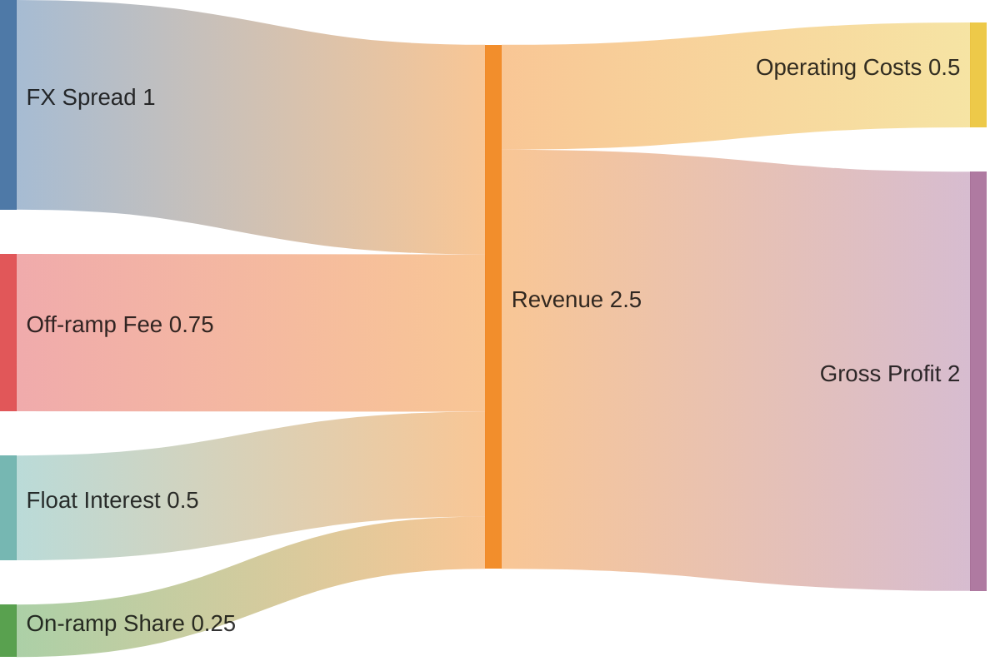

| Stream | Rate | Example ($200 transfer) |
|--------|------|-------------------------|
| FX spread | 0.5-1% | $1-2 |
| Off-ramp share | 0.3-0.5% | $0.60-1 |
| Float interest | 5% APY | Variable |

### Unit Economics

```
Average transfer:     $200
Revenue:              $1.50 - $2.50
Costs:                $0.15
━━━━━━━━━━━━━━━━━━━━━━━━━━━━
Gross margin:         90%+
```

---

## Regulatory Approach

### Strategy: Partner, Don't Build

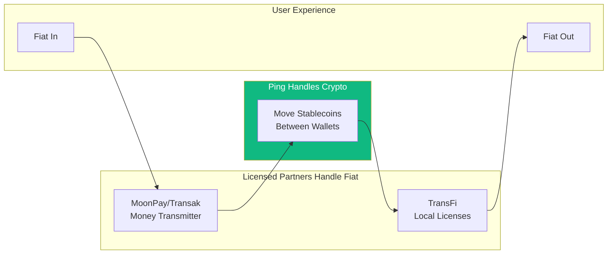

We **never touch fiat directly**, minimizing regulatory burden.

### KYC Tiers

| Tier | Limit | Requirements |
|------|-------|--------------|
| 0 | Receive only | Phone verification |
| 1 | $500/month | Name + Phone |
| 2 | $5,000/month | ID document |
| 3 | $50,000/month | Full KYC + address |

---

## Roadmap

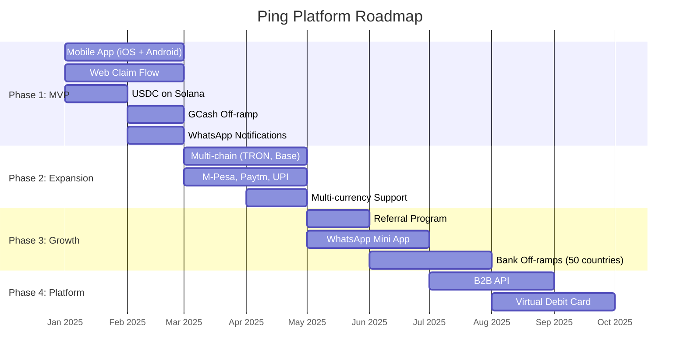

---

## Growth Strategy

### Viral Loop

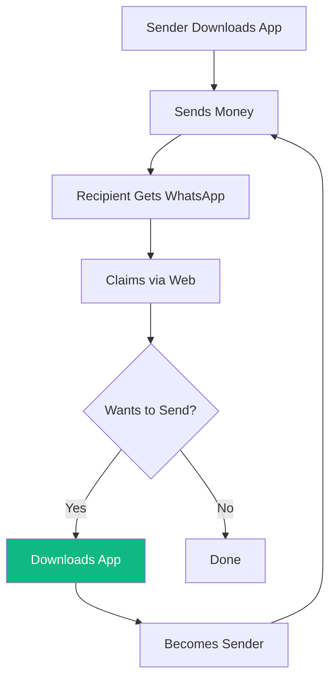

> **Every transfer is a potential new user** with zero friction to receive.

---

## Market Opportunity

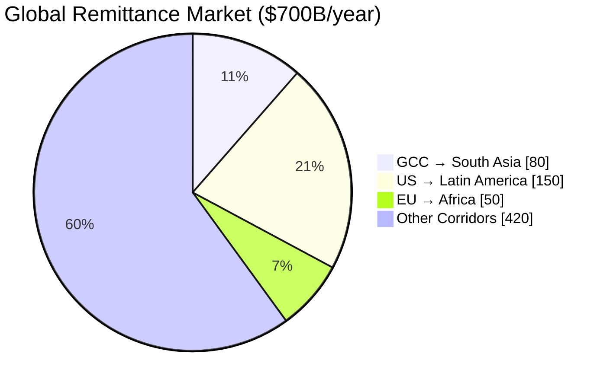

| Metric | Value |
|--------|-------|
| Global remittance market | $700B/year |
| Average fees | 6.2% |
| Total fees paid | $43B/year |
| **Our target (1%)** | **$430M opportunity** |

---

## Competitive Landscape

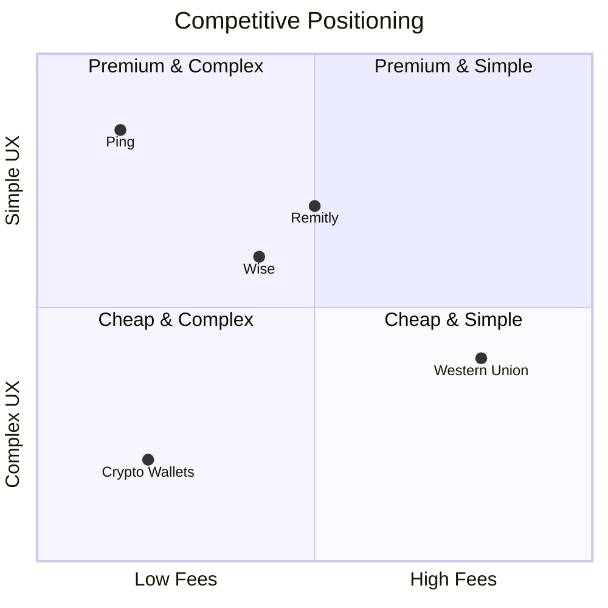

| Company | Strengths | Weaknesses | Our Advantage |
|---------|-----------|------------|---------------|
| Western Union | Brand, cash pickup | Expensive, slow | 10x cheaper |
| Wise | Transparent pricing | Still 1-2% fees | Cheaper, instant |
| Remitly | Good mobile UX | Need accounts | No app to receive |
| Crypto wallets | Cheap | Complex UX | No crypto knowledge |

---

## Getting Started

### Prerequisites

```bash
node >= 20.0.0
pnpm >= 9.0.0
docker >= 24.0.0
```

### Local Development

```bash
# Clone repository
git clone https://github.com/ping-cash/ping-cash.git
cd cash

# Install dependencies
pnpm install

# Start infrastructure (Postgres, MongoDB, Redis, Redpanda)
docker-compose up -d

# Run database migrations
pnpm db:migrate

# Start all services
pnpm dev
```

---

## Documentation

| Document | Description |
|----------|-------------|
| [Architecture](docs/ARCHITECTURE.md) | System design and data flows |
| [NFR](docs/NFR.md) | Non-functional requirements |
| [API](docs/API.md) | REST API specification |
| [Database](docs/DATABASE.md) | Schema documentation |

---

## Contributing

See [CONTRIBUTING.md](CONTRIBUTING.md) for guidelines.

---

## License

Proprietary - All rights reserved.

---

**Ping** - Because sending money shouldn't cost more than the message.
