# Phase 1 Technical Architecture

## Overview

This document describes the technical architecture for Ping Phase 1 MVP, covering:
- System components and their interactions
- Data flows for key user journeys
- Technology choices and rationale
- Security considerations
- Infrastructure requirements

## System Architecture

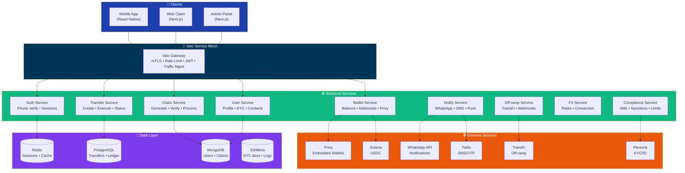

## Component Details

### 1. Mobile App (React Native)

**Purpose**: Primary interface for senders to create and manage transfers.

**Key Features**:
- Phone number authentication via Privy
- Contact list access and sync
- Transfer creation and history
- Balance management
- Cash-in: Apple Pay, Google Pay, Card, Bank, USDC direct
- Cash-out: To sender's country or recipient's home country

**Tech Stack**:
| Component | Technology |
|-----------|------------|
| Framework | React Native 0.73+ |
| Build | Expo (managed workflow) |
| Auth | Privy React Native SDK |
| Navigation | React Navigation 6 |
| Data Fetching | TanStack Query |
| State | Zustand |

**Directory Structure**:
```
mobile/
├── app/                    # Expo Router screens
│   ├── (auth)/            # Auth screens
│   ├── (main)/            # Main app screens
│   │   ├── home.tsx
│   │   ├── send.tsx
│   │   ├── contacts.tsx
│   │   └── history.tsx
│   └── _layout.tsx
├── components/
│   ├── ui/                # Design system
│   ├── transfer/          # Transfer components
│   └── wallet/            # Wallet components
├── hooks/
├── services/
│   ├── api.ts            # Backend API client
│   ├── privy.ts          # Privy integration
│   └── contacts.ts       # Contact sync
├── store/
└── utils/
```

### 2. Web Claim Flow (Next.js)

**Purpose**: Browser-based interface for recipients to claim transfers without downloading app.

**Key Features**:
- Claim link resolution
- Phone OTP verification
- Smart country detection (auto-detect from recipient phone)
- Off-ramp method selection (country-specific options)
- Cash-out processing (mobile wallets, bank, cash pickup)
- Receipt generation

**Cash-Out UX**:
- Auto-detect recipient's country from phone number
- Show relevant options first (GCash for PH, M-Pesa for KE, etc.)
- Allow switching to other countries if needed

**Tech Stack**:
| Component | Technology |
|-----------|------------|
| Framework | Next.js 14 (App Router) |
| Language | TypeScript |
| Styling | Tailwind CSS |
| Components | Shadcn/ui |
| Data | Server Actions |

**Directory Structure**:
```
web/
├── app/
│   ├── claim/
│   │   └── [code]/
│   │       ├── page.tsx          # Claim landing
│   │       ├── verify/page.tsx   # OTP verification
│   │       └── cashout/page.tsx  # Cash-out selection
│   └── api/                      # API routes (if needed)
├── components/
├── lib/
│   ├── api.ts
│   └── validation.ts
└── styles/
```

### 3. Backend Services (Node.js)

**Purpose**: Core business logic, data management, and external integrations.

**Tech Stack**:
| Component | Technology |
|-----------|------------|
| Runtime | Node.js 20 LTS |
| Language | TypeScript |
| Framework | Fastify |
| ORM | Prisma |
| Queues | Bull |
| Validation | Zod |

---

## Service Breakdown

### Auth Service


**Endpoints**:
| Method | Endpoint | Description |
|--------|----------|-------------|
| POST | `/auth/init` | Start phone verification |
| POST | `/auth/verify` | Verify OTP, create session |
| POST | `/auth/refresh` | Refresh JWT token |
| POST | `/auth/logout` | Invalidate session |

### Transfer Service

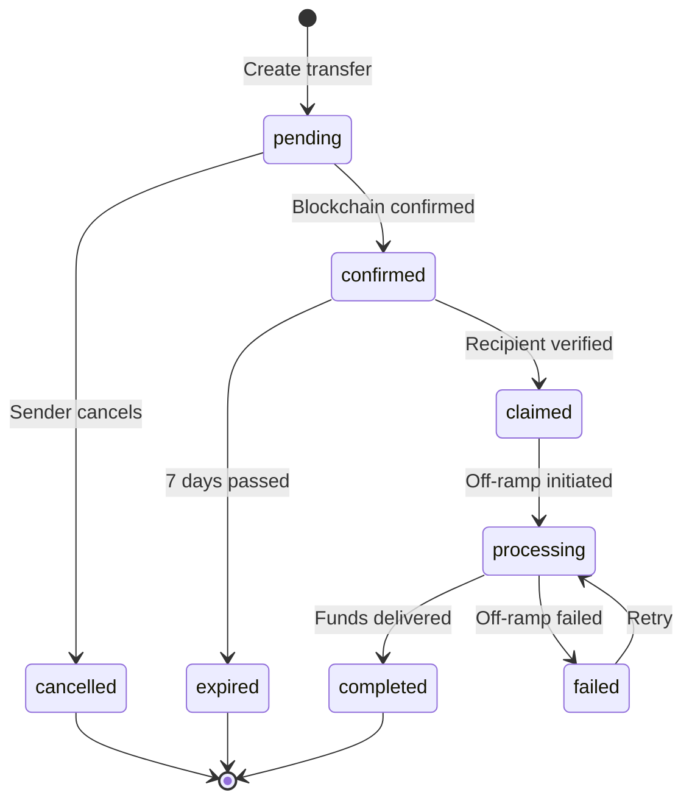

**Endpoints**:
| Method | Endpoint | Description |
|--------|----------|-------------|
| POST | `/transfers` | Create new transfer |
| GET | `/transfers/:id` | Get transfer details |
| GET | `/transfers` | List user's transfers |
| POST | `/transfers/:id/cancel` | Cancel pending transfer |

### Claim Service

**Security Features**:
- Claim codes: 12-char alphanumeric (62^12 possibilities)
- Rate limited: 5 OTP attempts per claim
- Expires after 7 days or on completion

**Endpoints**:
| Method | Endpoint | Description |
|--------|----------|-------------|
| GET | `/claims/:code` | Get claim details (public) |
| POST | `/claims/:code/verify` | Verify phone ownership |
| POST | `/claims/:code/cashout` | Initiate cash-out |

### Wallet Service


**Endpoints**:
| Method | Endpoint | Description |
|--------|----------|-------------|
| GET | `/wallet/balance` | Get USDC balance |
| GET | `/wallet/address` | Get deposit address |
| POST | `/wallet/send` | Send to another user |

### Notification Service

**Channels**:
| Channel | Primary Use | Fallback |
|---------|-------------|----------|
| WhatsApp | Claim notifications | SMS |
| SMS | OTP codes | - |
| Push | App users | SMS |

**Templates**:
| Template | Example |
|----------|---------|
| `TRANSFER_RECEIVED` | "You received $100 from Mom" |
| `CLAIM_REMINDER` | "Don't forget to claim your $100" |
| `CASHOUT_COMPLETE` | "₱5,580 sent to your GCash" |

### Off-ramp Service

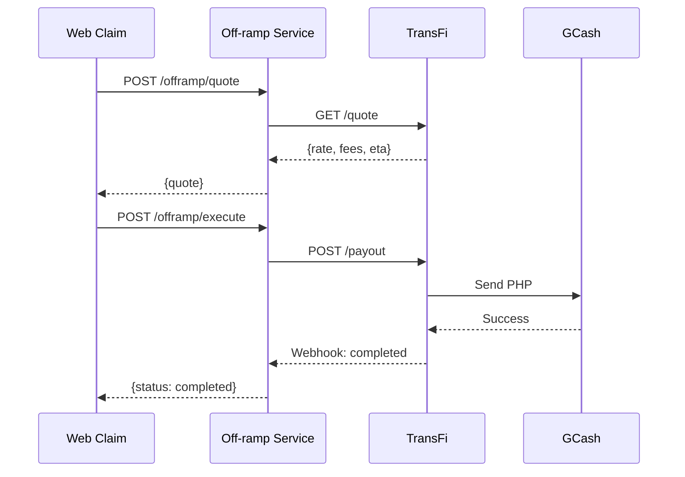

**Supported Methods (Phase 1)**:

| Country | Methods |
|---------|---------|
| 🇵🇭 Philippines | GCash, Maya, Bank (BDO/BPI), Cash Pickup |
| 🇮🇳 India | UPI/IMPS, Bank (NEFT), Paytm |
| 🇵🇰 Pakistan | JazzCash, Easypaisa, Bank |
| 🇧🇩 Bangladesh | bKash, Nagad, Bank |
| 🇰🇪 Kenya | M-Pesa, Bank |

See [CASHFLOW.md](./CASHFLOW.md) for complete country coverage.

---

## Data Flows

### Flow 1: User Registration

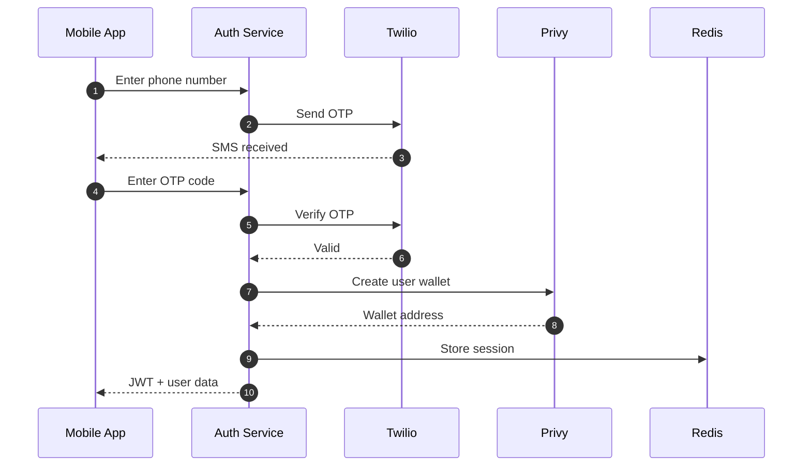

### Flow 2: Send Money

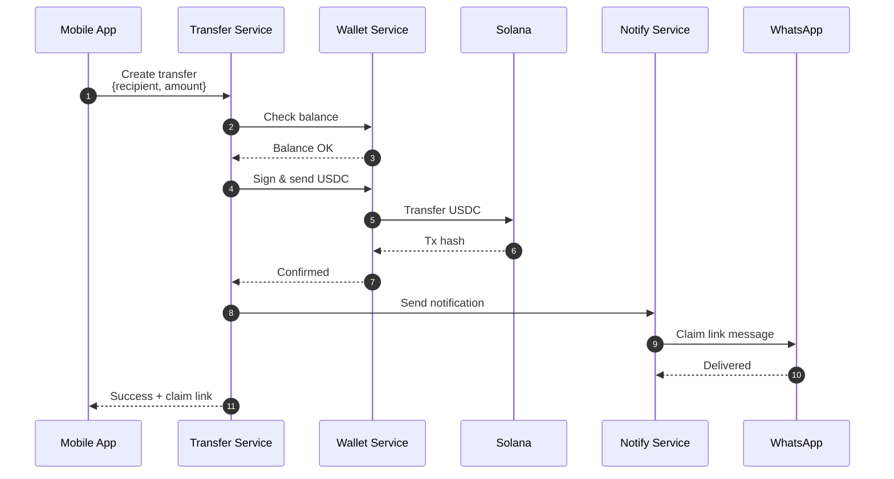

### Flow 3: Claim Money (Web)

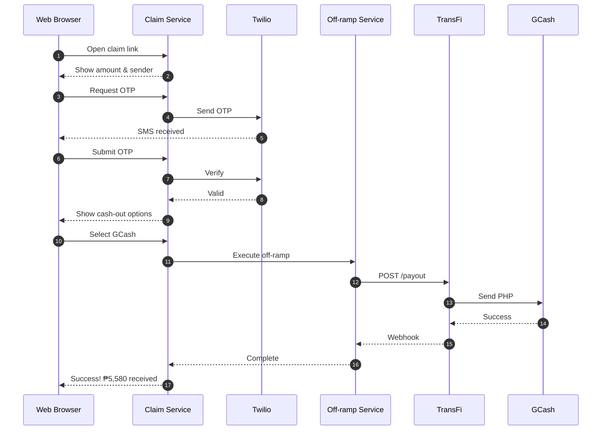

---

## Security Architecture

### Authentication Flow

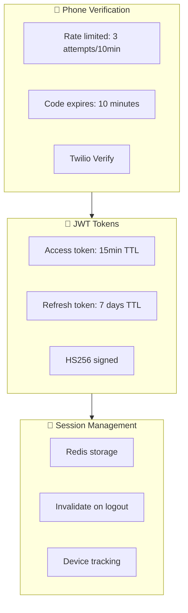

### Wallet Security (Privy MPC)

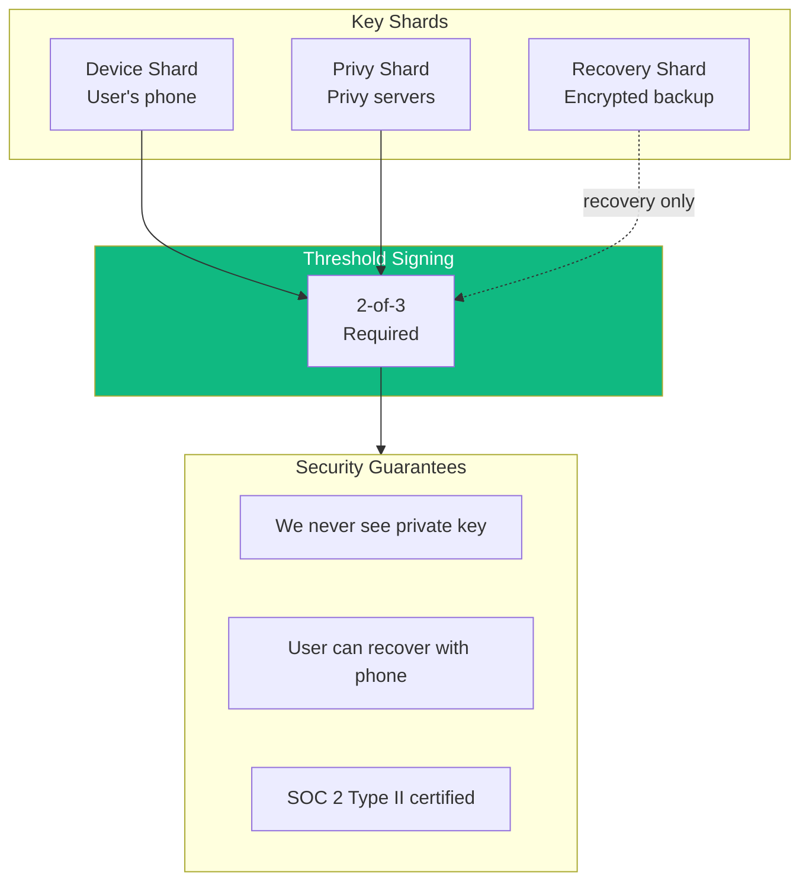

### Claim Link Security

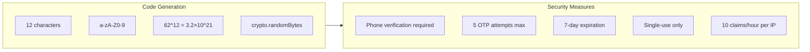

### Data Encryption

| Data Type | At Rest | In Transit |
|-----------|---------|------------|
| Phone numbers | Hashed (SHA256) for lookup, encrypted for display | TLS 1.3 |
| Wallet addresses | Plaintext (public data) | TLS 1.3 |
| KYC documents | AES-256 encrypted | TLS 1.3 |
| Session tokens | Redis (encrypted at rest) | TLS 1.3 |
| Database | PostgreSQL TDE | TLS 1.3 |

---

## Infrastructure

### Phase 1 Deployment (Kubernetes)

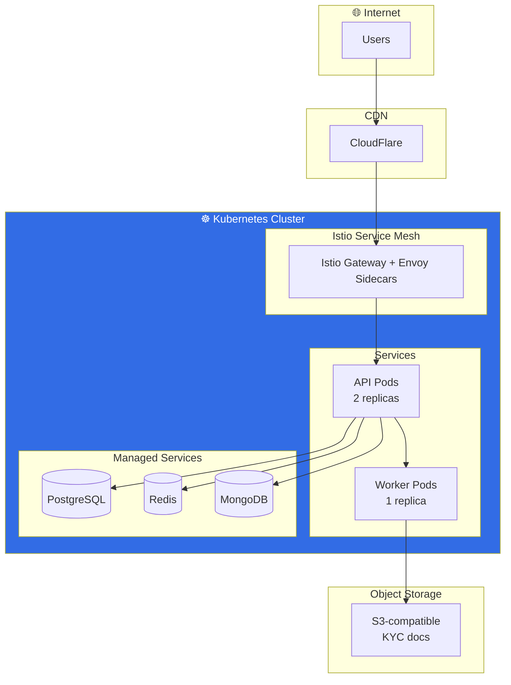

### Resource Sizing (Phase 1)

| Resource | Spec | Monthly Cost |
|----------|------|--------------|
| K8s Cluster (Civo) | 3 nodes × 2 vCPU, 4GB | ~$60 |
| PostgreSQL (Managed) | 1 vCPU, 2GB, 20GB | ~$30 |
| MongoDB (Atlas) | M10 Shared | ~$60 |
| Redis (Managed) | 256MB | ~$10 |
| Object Storage | 10GB | ~$5 |
| CloudFlare | Pro plan | ~$20 |
| **Total** | | **~$185/month** |

### Monitoring & Observability

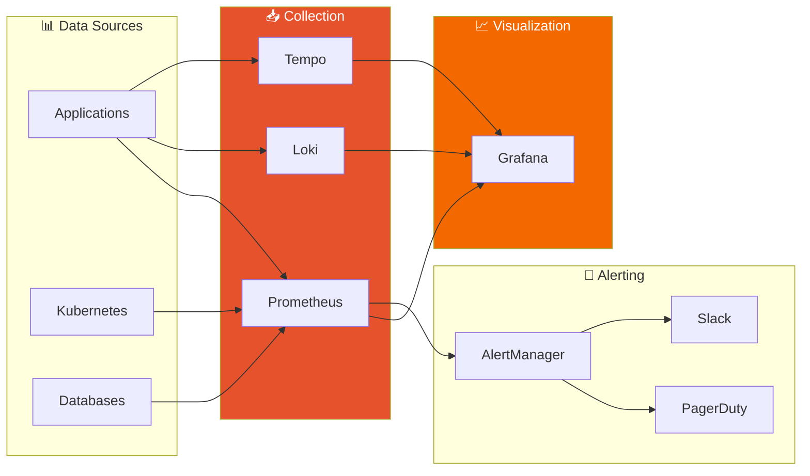

**Key Metrics**:
| Metric | Target |
|--------|--------|
| Transfer success rate | 99.5% |
| API latency (p99) | < 500ms |
| Error rate | < 0.1% |
| Uptime | 99.9% |

---

## API Specification

See [API.md](./API.md) for complete OpenAPI specification.

### Key Endpoints

| Method | Endpoint | Description | Auth |
|--------|----------|-------------|------|
| POST | `/auth/init` | Start phone verification | Public |
| POST | `/auth/verify` | Verify OTP, get JWT | Public |
| GET | `/wallet/balance` | Get user's USDC balance | Required |
| POST | `/transfers` | Create new transfer | Required |
| GET | `/transfers/:id` | Get transfer status | Required |
| GET | `/claims/:code` | Get claim info | Public |
| POST | `/claims/:code/verify` | Verify claim ownership | Public |
| POST | `/claims/:code/cashout` | Execute cash-out | Public |

---

## Development Setup

### Prerequisites

```bash
node >= 20.0.0
pnpm >= 9.0.0
docker >= 24.0.0
```

### Local Development

```bash
# Clone repository
git clone https://github.com/ping-cash/ping-cash.git
cd cash

# Install dependencies
pnpm install

# Start local services (Postgres, MongoDB, Redis, Redpanda)
docker-compose up -d

# Run database migrations
pnpm db:migrate

# Start development servers
pnpm dev          # All services
pnpm dev:api      # Backend only
pnpm dev:web      # Web claim flow only
pnpm dev:mobile   # Mobile app only
```

### Environment Variables

```bash
# .env.local
DATABASE_URL=postgresql://localhost:5432/cash
REDIS_URL=redis://localhost:6379
MONGODB_URL=mongodb://localhost:27017/cash

# Privy
PRIVY_APP_ID=xxx
PRIVY_APP_SECRET=xxx

# Twilio
TWILIO_ACCOUNT_SID=xxx
TWILIO_AUTH_TOKEN=xxx
TWILIO_VERIFY_SID=xxx

# WhatsApp
WHATSAPP_PHONE_NUMBER_ID=xxx
WHATSAPP_ACCESS_TOKEN=xxx

# TransFi
TRANSFI_API_KEY=xxx
TRANSFI_WEBHOOK_SECRET=xxx

# Solana
SOLANA_RPC_URL=https://api.mainnet-beta.solana.com
```

---

## Phase 1 Deliverables Checklist

### Mobile App
- [ ] Phone authentication flow
- [ ] Home screen with balance
- [ ] Contact list with search
- [ ] Send money flow
- [ ] Transfer history
- [ ] Cash-in (Apple Pay, Google Pay, Card, Bank, USDC)
- [ ] Cash-out (to sender's country or home country)

### Web Claim Flow
- [ ] Claim landing page
- [ ] OTP verification
- [ ] Smart country detection from phone number
- [ ] Cash-out method selection (country-specific)
- [ ] Mobile wallet integrations (GCash, M-Pesa, bKash, etc.)
- [ ] Bank transfer integration
- [ ] Success/receipt page

### Backend
- [ ] Auth service (phone + Privy)
- [ ] Transfer service
- [ ] Claim service
- [ ] Wallet service (Privy integration)
- [ ] Notification service (WhatsApp + SMS)
- [ ] Off-ramp service (TransFi)

### Infrastructure
- [ ] Kubernetes setup (Civo/Vultr)
- [ ] Istio service mesh installation
- [ ] CI/CD pipeline (GitHub Actions)
- [ ] Monitoring dashboards (Kiali, Grafana)
- [ ] Alerting rules

### Compliance
- [ ] AML screening integration
- [ ] Transaction monitoring
- [ ] KYC flow (Persona)
- [ ] Privacy policy
- [ ] Terms of service
