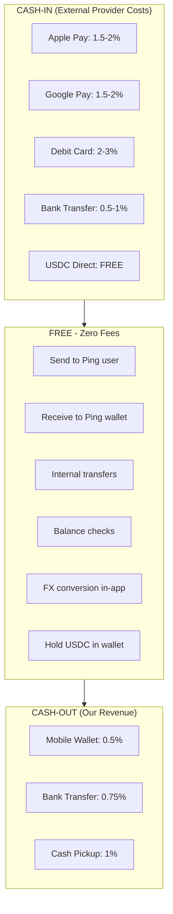
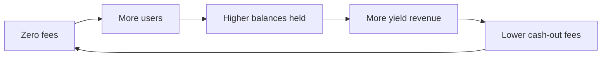
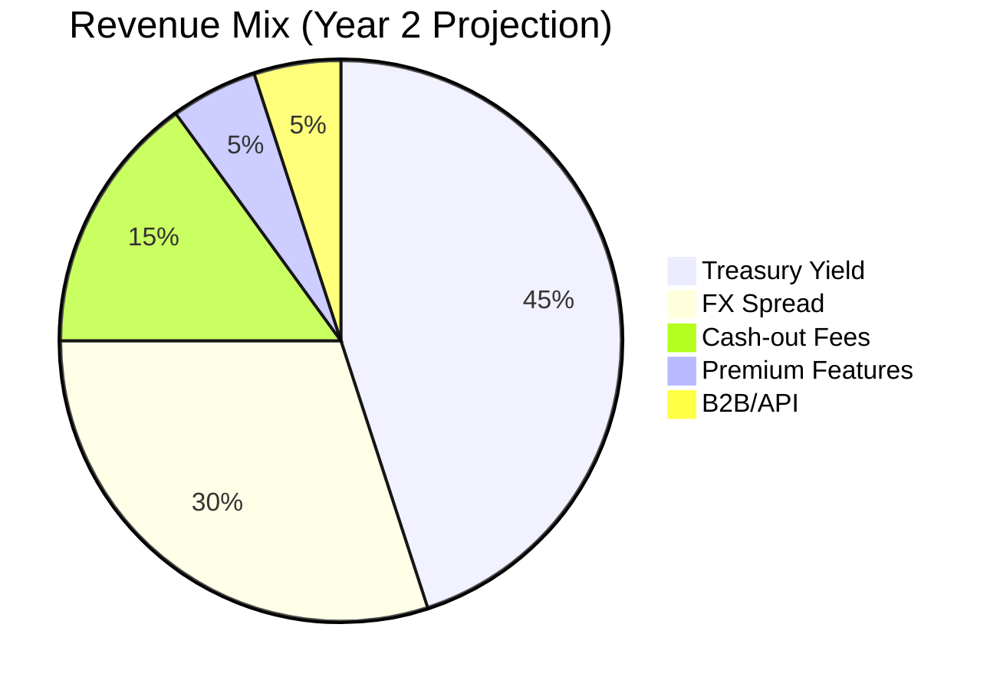
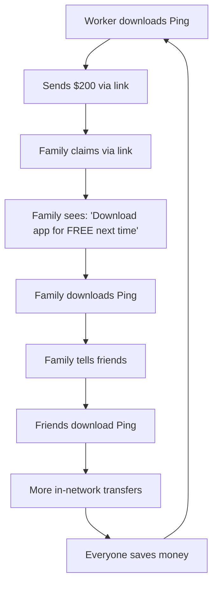
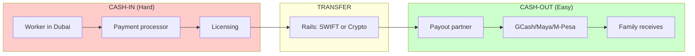
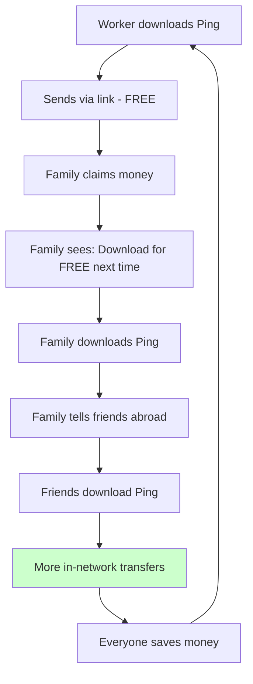

# Business Strategy

**WHAT:** Product positioning, GTM, competitive analysis, revenue model, fee structure, market opportunity, and country-by-country cash-out coverage.

**AUTHORITY:** 📐 PERMANENT. Updated when strategy materially shifts; otherwise stable.

This document was consolidated on 2026-05-21 from:
- `docs/BUSINESS.md` (revenue model, market opportunity, financial projections)
- `docs/STRATEGY.md` (competitive moat, defensibility, risk assessment)
- `docs/COMPETITORS.md` (vs domestic e-wallets — GCash/Maya/M-Pesa)
- `docs/CASHFLOW.md` (country-by-country cash-in/cash-out fee tables)

---

## Table of Contents

1. [Positioning](#positioning)
2. [Fee Structure](#fee-structure)
3. [Revenue Streams](#revenue-streams)
4. [Market Opportunity](#market-opportunity)
5. [Go-to-Market](#go-to-market)
6. [Competitive Analysis](#competitive-analysis)
7. [Why Domestic E-Wallets Aren't Competitors](#why-domestic-e-wallets-arent-competitors)
8. [Defensibility & Moat](#defensibility--moat)
9. [Risk Assessment](#risk-assessment)
10. [Cash-In Coverage by Country](#cash-in-coverage-by-country)
11. [Cash-Out Coverage by Country](#cash-out-coverage-by-country)
12. [Compliance & Limits](#compliance--limits)
13. [Financial Projections](#financial-projections)

---

## Positioning

**Ping** is a worldwide P2P social money network. Send money to anyone — friends, family, colleagues, neighbors — instantly and for free between users, with minimal sub-1% fees only when money exits the network.

**Initial GTM beachhead:** Migrant-worker remittance corridors (GCC → Philippines, India, Bangladesh, Pakistan, Egypt, Kenya), where traditional rails charge 5-7% and take days. **Long-term brand:** global social-money layer, not a corridor-specific remittance app.

**Core value proposition:**
- **Zero fees within network** — Ping users send to other Ping users for free
- **Minimal cash-out fees** — 0.5-1% when leaving the network
- **Instant delivery** — seconds, not days
- **No app needed to receive** — claim via link

---

## Fee Structure

> **Source:** previously docs/BUSINESS.md § "Fee Structure" (merged here on 2026-05-21).

**Zero fees within the Ping network.** We only charge when money leaves our ecosystem.



### Comparison vs Traditional Rails

| Action | Ping | Wise | Remitly | Western Union |
|---|---|---|---|---|
| Send in-network | **FREE** | N/A | N/A | N/A |
| FX conversion | **FREE** | 0.5-1% | Included | 2-4% |
| Cash-out to mobile wallet | **0.5%** | N/A | 1-2% | 3-5% |
| Cash-out to bank | **0.75%** | 0.5% | 1-2% | 2-3% |
| **Total for $100 send** | **$0.50** | $1.50 | $3.99 | $7.00 |

### Why Zero In-Network Fees?

Revenue comes from **treasury yield** on user balances, not transaction fees. This creates a flywheel:



---

## Revenue Streams

> **Source:** previously docs/BUSINESS.md § "Revenue Streams" (merged here on 2026-05-21).



### 1. Treasury Yield (45%)

When users hold USDC in Ping wallets, we deploy that capital to earn yield. Users don't earn this directly — we provide custody, security, UX, compliance, and instant withdrawals (the same model traditional banks use).

```
User Balance in Ping:    $10,000,000 (aggregate)
We hold as:              USDC in treasury
We deploy to:
  - Circle Yield:        4-5% APY (risk-free, USDC native)
  - T-Bills via Ondo:    4-5% APY (tokenized treasury)
  - DeFi Lending:        5-8% APY (Aave/Compound - higher risk)
Annual yield:            $400,000 - $800,000
Cost to user:            $0 (instant withdrawal anytime)
```

| Source | APY | Risk | Allocation |
|---|---|---|---|
| Circle Yield | 4-5% | Very Low (USDC native) | 50% |
| T-Bill tokens (Ondo/Backed) | 4-5% | Very Low (US Treasury) | 30% |
| Aave/Compound | 3-6% | Low (DeFi blue chip) | 15% |
| Liquid buffer (for withdrawals) | 0% | None | 5% |

### 2. FX Spread (30%)

Difference between mid-market rate and the rate we offer:

```
Mid-market rate (interbank): 1 USD = 55.85 PHP
Our rate to user:            1 USD = 55.65 PHP
                             ─────────────────
Spread:                      0.36% (~20 pips)
```

| Provider | Typical FX Margin |
|---|---|
| Banks | 2-4% |
| Western Union | 2-4% |
| Remitly | 1-2% |
| Wise | 0.5-1% |
| **Ping** | **0.3-0.5%** |

How we get competitive rates:
1. Circle USDC → local currency via institutional liquidity providers
2. Batch conversions (aggregate orders for better rates)
3. Multi-provider arbitrage (route to best rate)
4. Direct stablecoin-to-fiat rails where available

### 3. Cash-Out Fees (15%)

| Method | Our Fee | Provider Cost | Our Margin |
|---|---|---|---|
| Mobile wallet (GCash, M-Pesa) | 0.5% | 0.3% | 0.2% |
| Bank transfer | 0.75% | 0.4% | 0.35% |
| Cash pickup | 1.0% | 0.7% | 0.3% |

### 4. Premium Features (5% — Future)

| Feature | Price | Target Users |
|---|---|---|
| Priority support (24/7 chat) | $4.99/mo | Power senders |
| Higher limits (Tier 3 KYC) | $9.99/mo | Business users |
| Scheduled/recurring transfers | $2.99/mo | Regular senders |
| Family dashboard (multi-recipient) | $4.99/mo | Family supporters |

### 5. B2B / API Access (5% — Future)

| Product | Pricing |
|---|---|
| API access (per transfer) | $0.10 per transfer |
| White-label solution | Revenue share (20-30%) |
| Payroll integration | Per-employee fee |
| Enterprise volume | Custom pricing |

### Unit Economics at Scale (Year 2)

```
Average transfer: $200
FX spread (0.4%): $0.80
Cash-out fee (0.5%): $1.00
─────────────────────
Revenue per transfer: $1.80

Variable costs:
- Off-ramp provider: $0.60
- Blockchain fees: $0.01
- SMS/WhatsApp: $0.05
─────────────────────
Gross margin per transfer: $1.14 (63%)

+ Treasury yield allocation per user-month: $0.40
─────────────────────
Blended gross margin: ~65%
```

---

## Market Opportunity

> **Source:** previously docs/BUSINESS.md § "Market Opportunity" (merged here on 2026-05-21).

### Global Remittance Market

- **$700B/year** moved internationally
- **6.2% average fees** — $43B annual fee pool
- **300M+ migrant workers** sending money home
- **GCC alone:** $126B annual outward remittances

### GCC Outward Remittances by Origin (2023)

| Country | Outward Volume |
|---|---|
| UAE | $47B |
| Saudi Arabia | $39B |
| Kuwait | $15B |
| Qatar | $12B |
| Oman | $10B |
| Bahrain | $3B |
| **Total GCC** | **$126B** |

### Primary Destination Corridors

| Corridor | Annual Volume | Average Fee | Our Fee Pool Target |
|---|---|---|---|
| GCC → India | $40B | 3-5% | $1.2-2B |
| GCC → Philippines | $12B | 4-6% | $480-720M |
| GCC → Pakistan | $8B | 4-6% | $320-480M |
| GCC → Bangladesh | $6B | 4-6% | $240-360M |
| GCC → Egypt | $5B | 3-5% | $150-250M |

### Target Segments

**Primary:** Migrant workers in GCC sending $200-500/month home
- 25+ million migrant workers in GCC
- Average monthly remittance: $300-400
- Pain points: high fees, slow transfers, complex processes

**Secondary:** Professionals sending larger amounts ($1,000-5,000)
- Higher value, lower frequency
- More price-sensitive, comparison-driven

---

## Go-to-Market

> **Source:** previously docs/BUSINESS.md § "Go-to-Market Strategy" (merged here on 2026-05-21).

### Phase 1: Philippines Corridor (Months 1-6)

**Why first:**
- Largest GCC→SEA corridor
- Excellent mobile wallet infrastructure (GCash, Maya)
- English-speaking, tech-savvy diaspora
- Strong social-media presence for viral growth

**Target:** 1,000 MAU, $100K monthly volume

### Phase 2: India + Pakistan (Months 6-12)

**Why:**
- Largest corridors by volume
- UPI enables instant delivery
- Huge market size justifies localization

**Target:** 10,000 MAU, $2M monthly volume

### Phase 3: Africa — Kenya, Nigeria (Year 2)

**Why:**
- M-Pesa dominance makes delivery trivial
- Less competition from traditional players
- Growing tech adoption

**Target:** 100,000 MAU, $30M monthly volume

---

## Competitive Analysis

> **Source:** previously docs/BUSINESS.md § "Competitive Landscape" + docs/STRATEGY.md § "Competitive Capability Matrix" (merged here on 2026-05-21).

### Categories of Competitors

| Category | Examples |
|---|---|
| **Global Remittance** | Wise, Remitly, Western Union, MoneyGram, WorldRemit |
| **Africa-focused** | Chipper Cash, Sendwave, Lemfi, Eversend, Flutterwave |
| **US Crypto/Stablecoin** | Strike, Coinbase, Circle (USDC), Paxos, Stellar |
| **Domestic e-wallets** *(not competitors — see next section)* | GCash, Maya, M-Pesa, Paytm |

### Global Remittance Players

| Company | HQ | Model | Fees | Speed | Key Differentiator |
|---|---|---|---|---|---|
| **Wise** | UK | Bank rails | 0.5-2% | 1-3 days | Mid-market FX, transparent pricing |
| **Remitly** | US | Bank + mobile wallets | 0-$4.99 | Minutes-days | Fast mobile wallet delivery |
| **WorldRemit** | UK | Multi-channel | 1-3% | Instant-days | 150+ countries, cash pickup |
| **Western Union** | US | Agent network | 3-7% | Minutes | 500K+ agent locations |
| **MoneyGram** | US | Agent + digital | 2-5% | Minutes | Walmart partnership |

### Africa-Focused Players

| Company | HQ | Focus | Fees | Speed | Differentiator |
|---|---|---|---|---|---|
| Chipper Cash | US | Africa P2P | 0-2% | Instant | P2P within Africa, social |
| Sendwave | US | US/UK→Africa | $0 (FX margin) | Instant | Zero explicit fees |
| Lemfi | UK | Diaspora→Africa | 0.5-1% | Same day | Business accounts |
| Eversend | Uganda | Africa super-app | 0.5-2% | Instant | Virtual cards, savings |

### Crypto/Stablecoin Players

| Company | Model | Fees | Speed | Differentiator |
|---|---|---|---|---|
| Strike | Bitcoin/Lightning | 0% | Instant | El Salvador, Lightning |
| Coinbase One | Crypto rails | 0% (sub) | Instant | $30/mo unlimited |
| Circle (USDC) | Stablecoin infra | 0% | Instant | Enterprise, USDC issuer |
| Stellar (XLM) | Blockchain rails | <$0.01 | 5 sec | MoneyGram partnership |

### Capability Heatmap (0-10 scale)

> **Legend:** 🟢 8-10 (Strong) · 🟡 5-7 (Moderate) · 🟠 2-4 (Weak) · 🔴 0-1 (None)

| Vendor | GCC Cash-In | US/EU Cash-In | PH Cash-Out | India Cash-Out | Africa Cash-Out | Stablecoin Rails | Speed | Low Fees | No-App Receive | Network Effects | Global Coverage | Compliance |
|---|:-:|:-:|:-:|:-:|:-:|:-:|:-:|:-:|:-:|:-:|:-:|:-:|
| **Ping (Us)** | 🟢 8 | 🟡 6 | 🟢 9 | 🟡 7 | 🟡 7 | 🟢 10 | 🟢 10 | 🟢 10 | 🟢 10 | 🟡 5* | 🟡 6 | 🟡 6 |
| **GCash** | 🔴 0 | 🔴 0 | 🟢 10 | 🔴 0 | 🔴 0 | 🔴 0 | 🟢 9 | 🟢 9 | 🔴 0 | 🟢 9 | 🔴 1 | 🟢 9 |
| **Maya** | 🔴 0 | 🔴 0 | 🟢 10 | 🔴 0 | 🔴 0 | 🟠 3 | 🟢 9 | 🟢 9 | 🔴 0 | 🟢 8 | 🔴 1 | 🟢 9 |
| **M-Pesa** | 🔴 0 | 🔴 1 | 🔴 0 | 🔴 0 | 🟢 10 | 🔴 0 | 🟢 9 | 🟢 8 | 🔴 0 | 🟢 10 | 🔴 1 | 🟢 9 |
| **Wise** | 🟡 7 | 🟢 10 | 🟢 8 | 🟢 9 | 🟡 7 | 🔴 1 | 🟡 5 | 🟢 8 | 🔴 0 | 🟠 3 | 🟢 10 | 🟢 10 |
| **Remitly** | 🟡 7 | 🟢 9 | 🟢 9 | 🟢 9 | 🟢 8 | 🔴 0 | 🟡 7 | 🟡 6 | 🔴 0 | 🟠 2 | 🟢 9 | 🟢 9 |
| **Western Union** | 🟢 9 | 🟢 10 | 🟢 9 | 🟢 9 | 🟢 10 | 🔴 0 | 🟡 6 | 🔴 2 | 🟢 8 | 🟠 2 | 🟢 10 | 🟢 10 |
| **Sendwave** | 🔴 1 | 🟢 8 | 🔴 0 | 🔴 0 | 🟢 9 | 🔴 0 | 🟢 9 | 🟢 9 | 🔴 0 | 🟠 4 | 🟠 4 | 🟢 8 |
| **Chipper Cash** | 🔴 0 | 🟡 5 | 🔴 0 | 🔴 0 | 🟢 9 | 🟠 3 | 🟢 9 | 🟢 8 | 🔴 0 | 🟡 7 | 🟠 3 | 🟡 7 |
| **Strike** | 🔴 1 | 🟢 9 | 🔴 1 | 🔴 1 | 🟠 3 | 🟢 10 | 🟢 10 | 🟢 10 | 🔴 0 | 🟠 4 | 🟠 4 | 🟡 7 |
| **Circle (USDC)** | 🟠 3 | 🟢 9 | 🟠 2 | 🟠 2 | 🟠 2 | 🟢 10 | 🟢 10 | 🟢 10 | 🔴 0 | 🟠 3 | 🟡 6 | 🟢 10 |
| **Paytm/UPI** | 🔴 0 | 🔴 0 | 🔴 0 | 🟢 10 | 🔴 0 | 🔴 0 | 🟢 10 | 🟢 10 | 🔴 0 | 🟢 10 | 🔴 0 | 🟢 9 |

*\* Ping network effects are low today but designed to grow virally*

### Where Ping Wins

| Capability | Ping | Best Competitor | Gap |
|---|---|---|---|
| Stablecoin Rails | 10 | Strike/Circle (10) | Tied, but we have cash-out |
| Speed | 10 | Strike, UPI (10) | Tied |
| Low Fees | 10 | Strike (10), GCash (9) | Match Strike, beat others |
| No-App Receive | 10 | Western Union (8) | +2 (and we're cheaper) |
| **GCC + Stablecoin** | Unique | None | No one else combines these |

### Where Ping Is Weak

| Capability | Ping | Target | How to Improve |
|---|---|---|---|
| Network Effects | 5 | 8+ | Viral referrals, both-sided incentives |
| Global Coverage | 6 | 8+ | Add corridors (India, Pakistan, Bangladesh) |
| Compliance | 6 | 8+ | Obtain GCC licenses, strengthen AML |
| US/EU Cash-In | 6 | 8+ | Expand beyond GCC focus (Phase 2) |

### Competitive Positioning

```mermaid
quadrantChart
    title Cost vs Speed (Remittance Players)
    x-axis Slow (Days) --> Fast (Seconds)
    y-axis Expensive (5%+) --> Cheap (<1%)
    quadrant-1 Premium Fast
    quadrant-2 Premium Slow
    quadrant-3 Budget Slow
    quadrant-4 Budget Fast

    Western Union: [0.6, 0.3]
    Wise: [0.3, 0.7]
    Remitly: [0.5, 0.6]
    Sendwave: [0.8, 0.85]
    Strike: [0.95, 0.95]
    Ping: [0.95, 0.98]
```

---

## Why Domestic E-Wallets Aren't Competitors

> **Source:** previously docs/COMPETITORS.md (merged here on 2026-05-21).

**GCash, Maya, M-Pesa, Paytm are domestic e-wallets. Ping is a cross-border remittance platform.**

This is the most common confusion. People in the Philippines use GCash daily and wonder: *"Why do I need Ping when I already have GCash?"*

**Answer:** GCash is for **receiving and spending money in the Philippines**. Ping is for **sending money TO the Philippines** cheaper and faster than anything else.

### Platform Comparison

| Platform | Primary Function | Geographic Scope | Use Case |
|---|---|---|---|
| **GCash** | E-wallet, payments, bills | Philippines only | Pay for things, receive money |
| **Maya** | E-wallet, banking, crypto | Philippines only | GCash + banking |
| **M-Pesa** | Mobile money | Kenya/Tanzania | Send money, pay bills |
| **Paytm** | E-wallet + UPI | India only | Domestic payments |
| **Ping** | Cross-border remittance | Global → 40+ countries | Send internationally |

### Feature Comparison

| Feature | **Ping** | **GCash** | **Maya** | **Wise** |
|---|---|---|---|---|
| Send internationally | Yes | No | Limited | Yes |
| Receive internationally | Yes | Via partners | Via partners | Yes |
| Domestic payments | No | Yes | Yes | No |
| Pay bills | No | Yes | Yes | No |
| In-network transfer fee | **FREE** | FREE (domestic) | FREE (domestic) | N/A |
| Cross-border fee | **0-1%** | N/A | N/A | 0.5-2% |
| App required to receive | **No** | Yes | Yes | Yes |
| KYC for small amounts | **No** | Yes (full) | Yes (full) | Yes |

### Real-World Scenario: Dubai → Philippines $200

| Method | Fee | FX Loss | Total Cost | Family Receives |
|---|---|---|---|---|
| Western Union | $10 | $6 | **$16 (8%)** | $184 |
| Remitly | $4 | $3 | **$7 (3.5%)** | $193 |
| Wise | $2 | $2 | **$4 (2%)** | $196 |
| **Ping (in-network)** | $0 | $0 | **$0 (0%)** | $200 |
| **Ping (to GCash)** | $1 | $0 | **$1 (0.5%)** | $199 |

### Network Effect — Why Ping Lands Differently



**GCash has no incentive to make cross-border cheap** — they benefit from remittance partnership revenue ($50M+/year from Remitly/Wise/Western Union routing through them).

### Common Questions

**"My family already has GCash, why do they need Ping?"**
> They don't *need* Ping. You can send money via a claim link, and they cash out to GCash. But if they DO download Ping, future transfers are *completely free*.

**"Can I send from Ping to GCash?"**
> Yes. Ping supports cash-out to GCash (0.5% fee). Recipient clicks the claim link, chooses GCash, money arrives in seconds.

**"Is Ping trying to replace GCash?"**
> No. GCash is your wallet for daily life in the Philippines. Ping is the cheapest way to send money TO the Philippines from abroad.

### Sales One-Liner

> "GCash is for **spending** money in the Philippines. Ping is for **sending** money to the Philippines — for free."

---

## Defensibility & Moat

> **Source:** previously docs/STRATEGY.md (merged here on 2026-05-21).

### The Core Question

**Why can't GCash/Maya just add international sending and replace us?**

**Short answer:** They CAN, but it would take 2-3 years, $5-10M, and cannibalize their existing revenue. We're betting on speed and their organizational inertia.

### The Remittance Flow



**Key insight: Cash-IN is the hard part, not cash-OUT.** GCash/Maya have excellent cash-OUT (they ARE the destination). GCash/Maya have ZERO cash-IN in GCC countries.

### Barrier 1: No GCC Presence

GCash cannot accept money from a worker in Dubai because they have:

| Requirement | GCash Status |
|---|---|
| UAE payment processor | None |
| Saudi payment processor | None |
| Oman payment processor | None |
| GCC bank partnerships | None |
| Apple Pay merchant account (GCC) | None |
| Card processing in GCC | None |

They can only **receive** money that arrives THROUGH existing rails (Remitly, Western Union, Wise).

### Barrier 2: Licensing Per Country

To collect money FROM customers, you need a money transmission license in THAT country.

| Country | License | Typical Cost | Timeline | GCash Has It? |
|---|---|---|---|---|
| UAE | Central Bank registration | $500K+ | 18 months | ❌ No |
| Saudi Arabia | SAMA license | $1M+ | 24 months | ❌ No |
| Oman | CBO license | $300K+ | 12 months | ❌ No |
| Kuwait | CBK license | $500K+ | 18 months | ❌ No |
| Qatar | QCB license | $500K+ | 18 months | ❌ No |
| Bahrain | CBB license | $300K+ | 12 months | ❌ No |
| Philippines | BSP license | N/A | N/A | ✅ Yes |

### Barrier 3: Innovator's Dilemma

If GCash launched its own GCC sending product:
- Remitly/WU/Wise become competitors (they'd lose ~$50M/year in partnership revenue)
- Undercutting partners would force partners to drop GCash as payout
- They can't disrupt their own revenue stream without pain

### Barrier 4: Stablecoin Adoption

Traditional rails (what GCash would use):

```
Dubai Bank → Correspondent Bank → SWIFT → US intermediary → Partner bank → Philippines bank → GCash
Fees per hop: $2-5 · Total: $15-25 · Time: 1-3 days
```

Our rails:

```
Payment Processor → USDC mint → Solana → Recipient wallet
Fees per hop: <$0.01 · Total: <$0.01 · Time: 2 seconds
```

Why GCash won't adopt stablecoins:
- BSP (Philippine central bank) is cautious on crypto
- Organizational inertia ("we've always used bank rails")
- Payments company, not crypto company
- Bank partners don't want crypto competition
- Globe Telecom (parent) is a traditional telco

### Our Actual Moat

**Temporary advantages (1-3 years):**

| Advantage | Duration | Notes |
|---|---|---|
| Speed to market | 1-2 years | First mover in stablecoin GCC remittance |
| Stablecoin-native architecture | 2-3 years | They'd need to rebuild from scratch |
| Focus | Ongoing | We do 1 thing, they do 50 |
| No partner conflicts | Ongoing | We don't have Remitly revenue to protect |

**Durable advantages (if we execute):**

| Advantage | How We Build It |
|---|---|
| Network effects | Both sender + receiver = FREE transfers |
| Brand in GCC diaspora | "The free remittance app" |
| Data/ML on corridors | Optimize FX, fraud, conversion |
| Regulatory relationships | Licenses are hard to get, easy to maintain |

### The Network Effect Flywheel



**GCash can't replicate this** because:
1. They'd charge fees (bank rails are expensive)
2. They don't have senders, only receivers
3. No viral incentive — "download GCash to receive" is already happening

---

## Risk Assessment

> **Source:** previously docs/STRATEGY.md § "Honest Risk Assessment" (merged here on 2026-05-21).

### High Probability

| Risk | Likelihood | Impact | Mitigation |
|---|---|---|---|
| Wise adopts stablecoins | 40% in 3 years | High | Be established first, better UX |
| New startup with same model | 50% in 2 years | Medium | Network effects, speed |
| Regulatory friction in GCC | 30% | Medium | Multiple country strategy |

### Medium Probability

| Risk | Likelihood | Impact | Mitigation |
|---|---|---|---|
| GCash builds GCC presence | 20% in 3 years | High | Network effects, brand |
| Circle/USDC regulatory issues | 15% | High | Multi-stablecoin support |
| Payment processor drops us | 20% | Medium | Multiple processors |

### Low Probability

| Risk | Likelihood | Impact | Mitigation |
|---|---|---|---|
| Stablecoin ban globally | 5% | Critical | Would pivot to traditional rails |
| GCash acquires us | 10% | Positive? | Good exit scenario |

### Competitive Response Scenarios

**Scenario 1: GCash Launches GCC Sending (2-3 Years Out)**
- Their approach: Partner with GCC payment processor, traditional bank rails, price at 1-2% (can't do zero with bank rails)
- Our response: Already have network effects, still cheaper, brand established

**Scenario 2: Wise Adopts Stablecoins (1-2 Years Out)**
- Their approach: Add USDC as funding, reduce fees to 0.3-0.5%, keep existing infra
- Our response: Still have zero in-network fees, better claim-link UX, faster (no batch settlements)

**Scenario 3: New Startup Copies Our Model**
- Their advantage: Same tech stack, potentially better funded
- Our response: Network effects on both sides, brand, regulatory relationships, 12-18 month head start

---

## Cash-In Coverage by Country

> **Source:** previously docs/CASHFLOW.md § "Cash-In by GCC Country" (merged here on 2026-05-21).

| Method | Provider | Speed | Fee | Limit per Tx | Best For |
|---|---|---|---|---|---|
| Apple Pay | Stripe/Checkout | Instant | 1.5-2.5% | $2,000 | Convenience, security |
| Google Pay | Stripe/Checkout | Instant | 1.5-2.5% | $2,000 | Android users |
| Debit Card | Stripe | Instant | 1.5-2.9% | $5,000 | Quick funding |
| Credit Card | Stripe | Instant | 2.9-3.5% | $5,000 | Emergency funding |
| Bank Transfer | Lean/Checkout | 1-24 hrs | 0.5-1% | $50,000 | Large amounts |
| USDC Direct | Native Solana | Instant | **FREE** | Unlimited | Crypto users |
| CEX Withdrawal | Coinbase/Binance | Minutes | Network fee | Varies | Existing crypto holders |

### GCC Country-by-Country

**UAE:** Apple Pay (Stripe), Google Pay (Stripe), Visa/Mastercard (Stripe), Bank Transfer (Lean — ENBD/ADCB/FAB), USDC Direct
**Saudi Arabia:** Apple Pay (Checkout via mada), mada Debit (Checkout), Visa/Mastercard (Checkout), SADAD (TBD), Bank Transfer (Al Rajhi/NCB)
**Qatar:** Visa/Mastercard (Stripe), Bank Transfer (QPay — QNB/Commercial Bank), Apple Pay (limited)
**Kuwait:** KNET (Tap Payments), Visa/Mastercard (Tap), Apple Pay (Tap), Bank Transfer (NBK/KFH)
**Oman:** Visa/Mastercard (Thawani), Bank Transfer (Bank Muscat/NBO), Apple Pay (limited)
**Bahrain:** BenefitPay (Tap), Visa/Mastercard (Tap), Apple Pay (Tap)

---

## Cash-Out Coverage by Country

> **Source:** previously docs/CASHFLOW.md § "Cash-Out by Country" (merged here on 2026-05-21).

### Asia-Pacific

#### Philippines

| Method | Provider | Speed | Our Fee | Min | Max |
|---|---|---|---|---|---|
| GCash | TransFi | Instant | 0.5% | $5 | $2,000 |
| Maya (PayMaya) | TransFi | Instant | 0.5% | $5 | $2,000 |
| Bank Transfer (BDO/BPI/UnionBank/Metrobank) | TransFi | 1-24 hrs | 0.75% | $20 | $10,000 |
| Cash Pickup (Cebuana Lhuillier) | Cebuana | 1 hr | 1.0% | $20 | $1,000 |

#### India

| Method | Provider | Speed | Our Fee | Min | Max |
|---|---|---|---|---|---|
| UPI/IMPS | TransFi | Instant | 0.5% | $10 | $2,000 |
| Bank (NEFT) | TransFi | 2-4 hrs | 0.5% | $50 | $25,000 |
| Paytm Wallet | TransFi | Instant | 0.75% | $5 | $500 |
| PhonePe | TBD | Instant | 0.5% | $5 | $500 |
| Google Pay (India) | TBD | Instant | 0.5% | $5 | $500 |

#### Pakistan

| Method | Provider | Speed | Our Fee | Min | Max |
|---|---|---|---|---|---|
| JazzCash | TransFi | Instant | 0.5% | $10 | $1,000 |
| Easypaisa | TransFi | Instant | 0.5% | $10 | $1,000 |
| Bank Transfer (HBL/MCB/UBL) | TransFi | 1-24 hrs | 0.75% | $50 | $5,000 |

#### Bangladesh

| Method | Provider | Speed | Our Fee | Min | Max |
|---|---|---|---|---|---|
| bKash | TransFi | Instant | 0.5% | $10 | $1,000 |
| Nagad | TransFi | Instant | 0.5% | $10 | $1,000 |
| Rocket | TBD | Instant | 0.5% | $10 | $500 |
| Bank Transfer | TransFi | 1-24 hrs | 0.75% | $50 | $5,000 |

#### Nepal · Sri Lanka · Indonesia · Vietnam

| Country | Methods |
|---|---|
| **Nepal** | eSewa, Khalti, Bank Transfer |
| **Sri Lanka** | Bank Transfer, Dialog Genie |
| **Indonesia** | GoPay, OVO, Dana, Bank (BCA/Mandiri) |
| **Vietnam** | MoMo, ZaloPay, Bank Transfer |

### Africa

#### Kenya · Nigeria · Ghana · Ethiopia · Uganda · Tanzania · South Africa

| Country | Methods |
|---|---|
| **Kenya** | M-Pesa (TransFi), Airtel Money (TransFi), Bank (KCB/Equity/Co-op) |
| **Nigeria** | Bank Transfer (Flutterwave: GTBank/Access/Zenith), OPay, PalmPay |
| **Ghana** | MTN MoMo (TransFi), Vodafone Cash, Bank Transfer |
| **Ethiopia** | Telebirr, Bank (CBE) |
| **Uganda** | MTN MoMo (TransFi), Airtel Money (TransFi), Bank Transfer |
| **Tanzania** | M-Pesa (Vodacom, TransFi), Tigo Pesa, Bank Transfer |
| **South Africa** | Bank Transfer (TransFi: FNB/Standard Bank/ABSA) |

### Middle East

| Country | Methods |
|---|---|
| **Egypt** | Bank Transfer (TransFi), Vodafone Cash, Orange Money, InstaPay |
| **Jordan** | Bank Transfer, CliQ |
| **Lebanon** | OMT (cash pickup), Fresh USD Account |

### Europe & Americas

| Country | Methods |
|---|---|
| **United Kingdom** | Bank Faster Payments (Wise API) |
| **EU (SEPA)** | SEPA Instant + Regular (Wise API) |
| **United States** | Bank ACH + Wire (Wise API) |

### Cash-Out Fee Summary

| Method | Our Fee |
|---|---|
| Mobile Wallet (GCash, M-Pesa, etc.) | 0.5% |
| Bank Transfer | 0.75% |
| Cash Pickup | 1.0% |

---

## Compliance & Limits

> **Source:** previously docs/CASHFLOW.md § "Compliance & Limits" (merged here on 2026-05-21).

### KYC Tiers

| Tier | Requirements | Daily Limit | Monthly Limit |
|---|---|---|---|
| **Tier 1** (Basic) | Phone verification only | $200 | $1,000 |
| **Tier 2** (Verified) | ID + Selfie | $2,000 | $10,000 |
| **Tier 3** (Premium) | Address proof + Source of funds | $10,000 | $50,000 |

### Country-Specific Regulatory Limits

| Country | Max per Transaction | Regulation |
|---|---|---|
| India | $25,000 | FEMA |
| Pakistan | $5,000 | SBP |
| Nigeria | $5,000 | CBN |
| Philippines | $10,000 | BSP |

---

## Financial Projections

> **Source:** previously docs/BUSINESS.md § "Financial Projections" (merged here on 2026-05-21).

| Metric | Month 6 | Year 1 | Year 2 | Year 3 |
|---|---|---|---|---|
| Monthly Active Users | 1,000 | 10,000 | 100,000 | 500,000 |
| Monthly Transfer Volume | $100K | $2M | $30M | $150M |
| Avg Wallet Balance (aggregate) | $50K | $500K | $10M | $50M |
| Treasury Yield (monthly) | $190 | $1,900 | $40,000 | $200,000 |
| FX Spread Revenue (monthly) | $400 | $8,000 | $120,000 | $600,000 |
| Cash-out Fee Revenue (monthly) | $300 | $6,000 | $90,000 | $450,000 |
| Premium/B2B (monthly) | $0 | $0 | $10,000 | $100,000 |
| **Total MRR** | **$890** | **$15,900** | **$260,000** | **$1,350,000** |
| **Annual Revenue** | **$10,680** | **$190,800** | **$3,120,000** | **$16,200,000** |

### Cost Structure

| Category | Bootstrap | Growth | Scale |
|---|---|---|---|
| Infrastructure | $150/mo | $500/mo | $3,000/mo |
| External services (Twilio, etc.) | $50/mo | $500/mo | $5,000/mo |
| Off-ramp provider fees | Variable | Variable | Variable |
| Compliance/KYC | $100/mo | $1,000/mo | $10,000/mo |
| Team | $0 (founder) | $10,000/mo | $50,000/mo |

---

## Key Metrics to Watch

| Metric | Why It Matters | Target (Year 1) |
|---|---|---|
| In-network % | Network effects strength | >30% of transfers |
| Both-sided users | Viral coefficient | >20% of recipients download |
| NPS | Brand defensibility | >50 |
| CAC payback | Unit economics | <3 months |
| Corridor concentration | Risk diversification | No corridor >40% |

---

## Investor Summary

> "GCash and Maya are fantastic products — for the Philippines. But they can't collect money in Dubai. They're not licensed there, have no payment processing there, and their bank rail costs would force 2-3% fees.
>
> We built Ping on stablecoin rails from day one. Our cost to move $200 is less than a penny. That lets us offer zero fees for in-network transfers — something GCash structurally cannot match without a complete rebuild.
>
> Could they eventually compete? Yes, in 2-3 years with $5-10M investment. By then, we'll have the network effects, brand, and regulatory relationships that make catching up painful.
>
> We're not building a feature. We're building a network."
