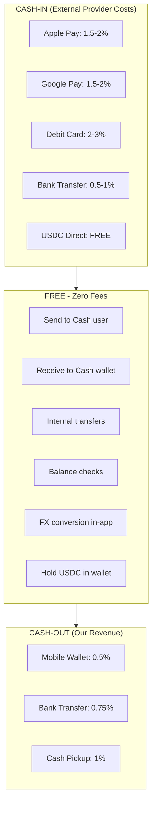
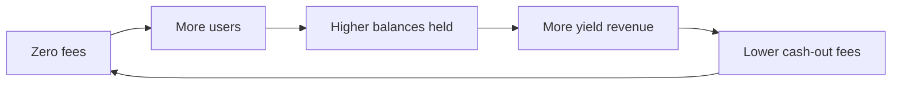
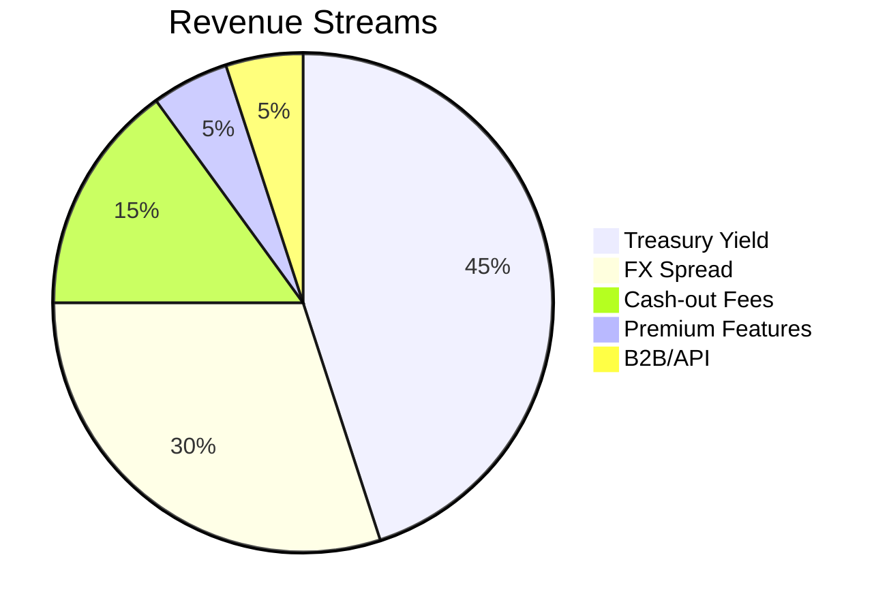

# Business Model & Competitive Analysis

## Executive Summary

Cash is a stablecoin-powered remittance platform targeting migrant workers in GCC countries sending money home. Our core value proposition:

- **Zero fees within network** - users can send to other Cash users for free
- **Minimal cash-out fees** - 0.5-1% when leaving the network
- **Instant delivery** - seconds, not days
- **No app needed to receive** - claim via link

---

## Competitive Landscape

### Global Remittance Players

| Company | HQ | Model | Fees | Speed | Key Differentiator |
|---------|-----|-------|------|-------|-------------------|
| **Wise** | UK | Bank rails | 0.5-2% | 1-3 days | Mid-market FX rate, transparent pricing |
| **Remitly** | US | Bank + mobile wallets | 0-$4.99 | Minutes-days | Fast mobile wallet delivery |
| **WorldRemit** | UK | Multi-channel | 1-3% | Instant-days | 150+ countries, cash pickup |
| **Western Union** | US | Cash network | 3-7% | Minutes | 500K+ agent locations worldwide |
| **MoneyGram** | US | Cash + digital | 2-5% | Minutes | Walmart partnership |

### Africa-Focused Players

| Company | HQ | Focus | Fees | Speed | Differentiator |
|---------|-----|-------|------|-------|----------------|
| **Chipper Cash** | US | Africa P2P | 0-2% | Instant | P2P within Africa, social features |
| **Sendwave** | US | US/UK→Africa | $0 | Instant | Zero explicit fees (FX margin only) |
| **Lemfi** | UK | Diaspora→Africa | 0.5-1% | Same day | Business accounts focus |
| **Eversend** | Uganda | Africa super-app | 0.5-2% | Instant | Virtual cards, FX, savings |
| **Flutterwave** | Nigeria | B2B infrastructure | Varies | Instant | API/rails provider |

### US Crypto/Stablecoin Players

| Company | Model | Fees | Speed | Differentiator |
|---------|-------|------|-------|----------------|
| **Strike** | Bitcoin/Lightning | 0% | Instant | Lightning network, El Salvador |
| **Coinbase One** | Crypto rails | 0% (subscription) | Instant | $30/mo unlimited |
| **Circle (USDC)** | Stablecoin infra | 0% | Instant | Enterprise focus, USDC issuer |
| **Paxos** | Stablecoin/PayPal | Varies | Instant | PayPal USD backend |
| **Stellar (XLM)** | Blockchain rails | <$0.01 | 5 sec | MoneyGram partnership |

### Competitive Positioning

```mermaid
quadrantChart
    title Cost vs Speed (Remittance Players)
    x-axis Slow (Days) --> Fast (Seconds)
    y-axis Expensive (5%+) --> Cheap (<1%)
    quadrant-1 Premium Fast
    quadrant-2 Premium Slow
    quadrant-3 Budget Slow
    quadrant-4 Budget Fast

    Western Union: [0.6, 0.3]
    Wise: [0.3, 0.7]
    Remitly: [0.5, 0.6]
    Sendwave: [0.8, 0.85]
    Strike: [0.95, 0.95]
    Cash: [0.95, 0.98]
```

### Our Competitive Advantages

| vs Competitor | Our Advantage |
|---------------|---------------|
| **vs Wise** | Faster (seconds vs days), no bank dependency |
| **vs Remitly** | Lower fees, no app needed to receive |
| **vs Sendwave** | Multi-corridor (not just Africa), in-network free |
| **vs Strike** | Simpler UX (no Bitcoin complexity), proper fiat on/off-ramps |
| **vs Chipper** | GCC→Home corridors vs Africa-internal only |
| **vs Western Union** | 85% cheaper, instant digital delivery |

---

## Fee Structure

### Our Fee Philosophy

**Zero fees within the Cash network.** We only charge when money leaves our ecosystem.



### Detailed Fee Comparison

| Action | Cash | Wise | Remitly | Western Union |
|--------|------|------|---------|---------------|
| Send in-network | **FREE** | N/A | N/A | N/A |
| FX conversion | **FREE** | 0.5-1% | Included | 2-4% |
| Cash-out to mobile wallet | **0.5%** | N/A | 1-2% | 3-5% |
| Cash-out to bank | **0.75%** | 0.5% | 1-2% | 2-3% |
| **Total for $100 send** | **$0.50** | $1.50 | $3.99 | $7.00 |

### Why Zero In-Network Fees?

We generate revenue from **treasury yield** on user balances, not transaction fees. This creates a flywheel:



---

## Revenue Streams

### Revenue Mix (Year 2 Projection)



### 1. Treasury Yield (45% of Revenue)

**What it is**: When users hold USDC in Cash wallets, we deploy that capital to earn yield.

**How it works**:
```
User Balance in Cash:    $10,000,000 (aggregate)
                              ↓
We hold as:              USDC in treasury
                              ↓
We deploy to:
  - Circle Yield:        4-5% APY (risk-free, USDC native)
  - T-Bills via Ondo:    4-5% APY (tokenized treasury)
  - DeFi Lending:        5-8% APY (Aave/Compound - higher risk)
                              ↓
Annual yield:            $400,000 - $800,000
                              ↓
Cost to user:            $0 (they can withdraw anytime)
```

**Yield Allocation Strategy**:

| Source | APY | Risk Level | Our Allocation |
|--------|-----|------------|---------------|
| Circle Yield | 4-5% | Very Low (USDC native) | 50% |
| T-Bill Tokens (Ondo/Backed) | 4-5% | Very Low (US Treasury) | 30% |
| Aave/Compound | 3-6% | Low (DeFi blue chip) | 15% |
| Liquid buffer (for withdrawals) | 0% | None | 5% |

**Why users don't earn this yield**: We provide the service (custody, security, UX, compliance, instant withdrawals). This is exactly how traditional banks work - they earn on deposits while providing free checking accounts.

### 2. FX Spread (30% of Revenue)

**What it is**: The difference between the mid-market rate and the rate we offer users.

**Example**:
```
Mid-market rate (interbank): 1 USD = 55.85 PHP
Our rate to user:            1 USD = 55.65 PHP
                             ─────────────────
Spread:                      0.36% (~20 pips)
```

**Why it's competitive**:
| Provider | Typical FX Margin |
|----------|------------------|
| Banks | 2-4% |
| Western Union | 2-4% |
| Remitly | 1-2% |
| Wise | 0.5-1% |
| **Cash** | **0.3-0.5%** |

**Revenue calculation**:
```
$1M monthly transfer volume
× 0.4% average FX spread
= $4,000/month FX revenue
```

**How we get competitive FX rates**:
1. Circle USDC → local currency via institutional liquidity providers
2. Batch conversions (aggregate orders for better rates)
3. Multi-provider arbitrage (route to best rate)
4. Direct stablecoin-to-fiat rails where available

### 3. Cash-Out Fees (15% of Revenue)

**What it is**: Small fee charged when users withdraw to external rails.

| Method | Our Fee | Provider Cost | Our Margin |
|--------|---------|---------------|------------|
| Mobile wallet (GCash, M-Pesa) | 0.5% | 0.3% | 0.2% |
| Bank transfer | 0.75% | 0.4% | 0.35% |
| Cash pickup | 1.0% | 0.7% | 0.3% |

**Revenue calculation**:
```
$1M monthly cash-out volume
× 0.5% average fee
× 60% margin (after provider cost)
= $3,000/month cash-out revenue
```

### 4. Premium Features (5% of Revenue - Future)

| Feature | Price | Target Users |
|---------|-------|--------------|
| Priority support (24/7 chat) | $4.99/mo | Power senders |
| Higher limits (Tier 3 KYC) | $9.99/mo | Business users |
| Scheduled/recurring transfers | $2.99/mo | Regular senders |
| Family dashboard (multi-recipient) | $4.99/mo | Family supporters |

### 5. B2B / API Access (5% of Revenue - Future)

For businesses that want to embed Cash:

| Product | Pricing |
|---------|---------|
| API access (per transfer) | $0.10 per transfer |
| White-label solution | Revenue share (20-30%) |
| Payroll integration | Per-employee fee |
| Enterprise volume | Custom pricing |

---

## Financial Projections

### Revenue Model by Growth Stage

| Metric | Month 6 | Year 1 | Year 2 | Year 3 |
|--------|---------|--------|--------|--------|
| Monthly Active Users | 1,000 | 10,000 | 100,000 | 500,000 |
| Monthly Transfer Volume | $100K | $2M | $30M | $150M |
| Avg Wallet Balance (aggregate) | $50K | $500K | $10M | $50M |
| **Treasury Yield** | $190 | $1,900 | $40,000 | $200,000 |
| **FX Spread Revenue** | $400 | $8,000 | $120,000 | $600,000 |
| **Cash-out Fee Revenue** | $300 | $6,000 | $90,000 | $450,000 |
| **Premium/B2B** | $0 | $0 | $10,000 | $100,000 |
| **Total MRR** | $890 | $15,900 | $260,000 | $1,350,000 |
| **Annual Revenue** | $10,680 | $190,800 | $3,120,000 | $16,200,000 |

### Unit Economics

**At Scale (Year 2)**:

```
Average transfer: $200
FX spread (0.4%): $0.80
Cash-out fee (0.5%): $1.00
─────────────────────
Revenue per transfer: $1.80

Variable costs:
- Off-ramp provider: $0.60
- Blockchain fees: $0.01
- SMS/WhatsApp: $0.05
─────────────────────
Gross margin per transfer: $1.14 (63%)

+ Treasury yield allocation per user-month: $0.40
─────────────────────
Blended gross margin: ~65%
```

### Cost Structure

| Category | Bootstrap | Growth | Scale |
|----------|-----------|--------|-------|
| Infrastructure | $150/mo | $500/mo | $3,000/mo |
| External services (Twilio, etc.) | $50/mo | $500/mo | $5,000/mo |
| Off-ramp provider fees | Variable | Variable | Variable |
| Compliance/KYC | $100/mo | $1,000/mo | $10,000/mo |
| Team | $0 (founder) | $10,000/mo | $50,000/mo |

---

## Market Opportunity

### GCC Remittance Corridor

The GCC (Gulf Cooperation Council) is one of the largest remittance source regions globally:

| Country | Outward Remittances (2023) |
|---------|---------------------------|
| UAE | $47 billion |
| Saudi Arabia | $39 billion |
| Kuwait | $15 billion |
| Qatar | $12 billion |
| Oman | $10 billion |
| Bahrain | $3 billion |
| **Total GCC** | **$126 billion** |

### Primary Destination Corridors

| Corridor | Annual Volume | Average Fee | Our Opportunity |
|----------|---------------|-------------|-----------------|
| GCC → India | $40B | 3-5% | $1.2-2B fee pool |
| GCC → Philippines | $12B | 4-6% | $480-720M fee pool |
| GCC → Pakistan | $8B | 4-6% | $320-480M fee pool |
| GCC → Bangladesh | $6B | 4-6% | $240-360M fee pool |
| GCC → Egypt | $5B | 3-5% | $150-250M fee pool |

### Target Market Segment

**Primary**: Migrant workers in GCC sending $200-500/month home
- 25+ million migrant workers in GCC
- Average monthly remittance: $300-400
- Pain points: High fees, slow transfers, complex processes

**Secondary**: Professionals sending larger amounts ($1,000-5,000)
- Higher value but lower frequency
- More price-sensitive, compare options

---

## Go-to-Market Strategy

### Phase 1: Philippines Corridor (Months 1-6)

**Why Philippines first**:
- Largest GCC→SEA corridor
- Excellent mobile wallet infrastructure (GCash, Maya)
- English-speaking, tech-savvy diaspora
- Strong social media presence for viral growth

**Target**: 1,000 MAU, $100K monthly volume

### Phase 2: India + Pakistan (Months 6-12)

**Why next**:
- Largest corridors by volume
- UPI makes instant delivery possible
- Huge market size justifies localization

**Target**: 10,000 MAU, $2M monthly volume

### Phase 3: Africa (Kenya, Nigeria) (Year 2)

**Why**:
- M-Pesa dominance makes delivery easy
- Less competition from traditional players
- Growing tech adoption

**Target**: 100,000 MAU, $30M monthly volume

---

## Risk Factors

### Regulatory

| Risk | Mitigation |
|------|------------|
| Money transmission licensing | Partner with licensed entities initially, obtain own licenses as we scale |
| Stablecoin regulation | USDC is regulated, Circle has good compliance track record |
| KYC/AML requirements | Tiered KYC, start with low limits |

### Operational

| Risk | Mitigation |
|------|------------|
| Off-ramp provider failure | Multi-provider strategy, always have backup |
| FX volatility | Real-time rates, short settlement windows |
| Fraud | ML-based detection, velocity limits |

### Market

| Risk | Mitigation |
|------|------------|
| Competition from Wise/Remitly | Focus on GCC niche, zero in-network fees |
| Crypto market perception | Abstract away crypto, users see only fiat |
| Economic downturn | Remittances are resilient (family support) |

---

## Summary

Cash is positioned to capture a significant share of the $126B GCC outward remittance market by:

1. **Zero in-network fees** - unique value proposition
2. **Stablecoin rails** - instant, cheap, 24/7
3. **Treasury yield model** - sustainable without transaction fees
4. **No app to receive** - lowers adoption barrier
5. **GCC focus** - underserved market with high volume

Target: $16M ARR by Year 3 with 500K monthly active users.
