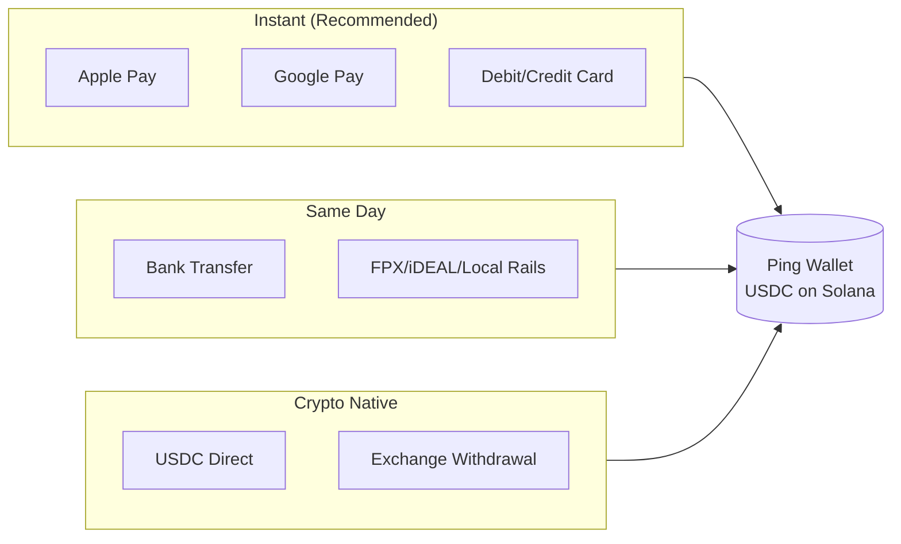
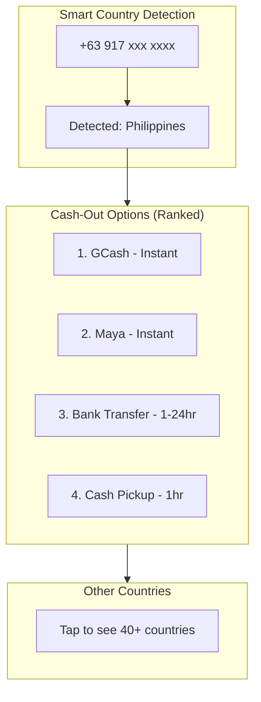
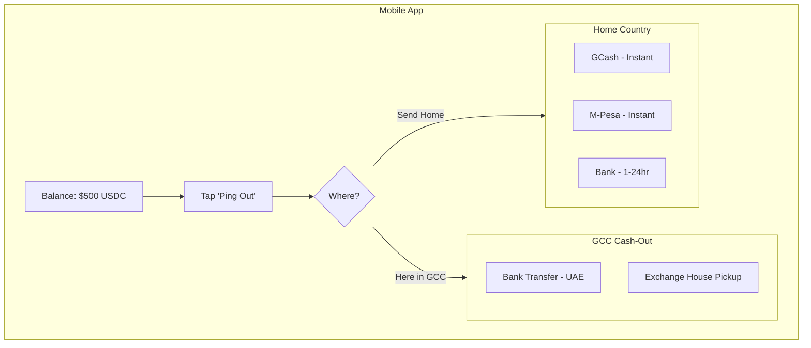
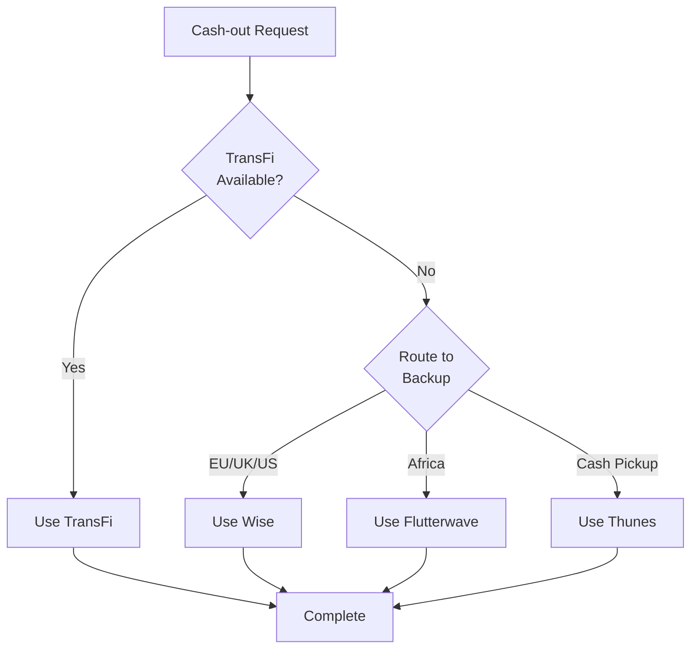

# Cash-In & Cash-Out Guide

This document details all funding (cash-in) and withdrawal (cash-out) options available in the Ping platform.

---

## Cash-In (Funding Your Wallet)

### Overview

Users can fund their Ping wallet through multiple methods. The wallet holds USDC on Solana, but users interact with familiar payment methods.

### Cash-In Methods

| Method | Provider | Speed | Fee | Limit per Tx | Best For |
|--------|----------|-------|-----|--------------|----------|
| **Apple Pay** | Stripe/Checkout | Instant | 1.5-2.5% | $2,000 | Convenience, security |
| **Google Pay** | Stripe/Checkout | Instant | 1.5-2.5% | $2,000 | Android users |
| **Debit Card** | Stripe | Instant | 1.5-2.9% | $5,000 | Quick funding |
| **Credit Card** | Stripe | Instant | 2.9-3.5% | $5,000 | Emergency funding |
| **Bank Transfer** | Lean/Checkout | 1-24 hrs | 0.5-1% | $50,000 | Large amounts |
| **USDC Direct** | Native Solana | Instant | **FREE** | Unlimited | Crypto users |
| **CEX Withdrawal** | Coinbase/Binance | Minutes | Network fee | Varies | Existing crypto holders |

### Cash-In by GCC Country

#### UAE

| Method | Provider | Notes |
|--------|----------|-------|
| Apple Pay | Stripe | Widely supported |
| Google Pay | Stripe | Growing adoption |
| Visa/Mastercard | Stripe | All UAE banks |
| Bank Transfer (Lean) | Lean Technologies | ENBD, ADCB, FAB, etc. |
| USDC Direct | Solana | For crypto-native users |

#### Saudi Arabia

| Method | Provider | Notes |
|--------|----------|-------|
| Apple Pay | Checkout.com | Good support via mada |
| mada Debit | Checkout.com | National debit network |
| Visa/Mastercard | Checkout.com | Credit cards |
| SADAD | TBD | Bill payment rails |
| Bank Transfer | TBD | Al Rajhi, NCB, etc. |

#### Qatar

| Method | Provider | Notes |
|--------|----------|-------|
| Visa/Mastercard | Stripe | Primary method |
| Bank Transfer | QPay | QNB, Commercial Bank |
| Apple Pay | Limited | Growing support |

#### Kuwait

| Method | Provider | Notes |
|--------|----------|-------|
| KNET | Tap Payments | National debit network |
| Visa/Mastercard | Tap Payments | Credit cards |
| Apple Pay | Tap Payments | Good support |
| Bank Transfer | TBD | NBK, KFH, etc. |

#### Oman

| Method | Provider | Notes |
|--------|----------|-------|
| Visa/Mastercard | Thawani | Primary method |
| Bank Transfer | TBD | Bank Muscat, NBO |
| Apple Pay | Limited | Growing |

#### Bahrain

| Method | Provider | Notes |
|--------|----------|-------|
| BenefitPay | Tap Payments | Local wallet |
| Visa/Mastercard | Tap Payments | Credit/debit |
| Apple Pay | Tap Payments | Good support |

---

## Cash-Out (Withdrawals)

### Overview

Cash-out is available in both the **mobile app** (for senders) and **web claim flow** (for recipients). The system auto-detects the target country from the phone number and shows relevant options first.

### UX Flow: Phone Number Detection

1. **Sender enters recipient phone number**: `+63 917 123 4567`
2. **System detects country**: Philippines
3. **Shows country-specific options**: GCash, Maya, Bank, Cash Pickup
4. **User can tap "Different country?"** to see all options

### Cash-Out Fees

| Method | Our Fee | What User Sees |
|--------|---------|----------------|
| Mobile Wallet (GCash, M-Pesa, etc.) | **0.5%** | "Fee: $0.50 on $100" |
| Bank Transfer | **0.75%** | "Fee: $0.75 on $100" |
| Cash Pickup | **1.0%** | "Fee: $1.00 on $100" |

---

## Cash-Out by Country

### Asia-Pacific

#### Philippines

| Method | Provider | Speed | Our Fee | Min | Max |
|--------|----------|-------|---------|-----|-----|
| **GCash** | TransFi | Instant | 0.5% | $5 | $2,000 |
| **Maya (PayMaya)** | TransFi | Instant | 0.5% | $5 | $2,000 |
| **Bank Transfer** | TransFi | 1-24 hrs | 0.75% | $20 | $10,000 |
| BDO | | | | | |
| BPI | | | | | |
| UnionBank | | | | | |
| Metrobank | | | | | |
| **Cash Pickup** | Cebuana Lhuillier | 1 hr | 1.0% | $20 | $1,000 |

#### India

| Method | Provider | Speed | Our Fee | Min | Max |
|--------|----------|-------|---------|-----|-----|
| **UPI/IMPS** | TransFi | Instant | 0.5% | $10 | $2,000 |
| **Bank (NEFT)** | TransFi | 2-4 hrs | 0.5% | $50 | $25,000 |
| **Paytm Wallet** | TransFi | Instant | 0.75% | $5 | $500 |
| **PhonePe** | TBD | Instant | 0.5% | $5 | $500 |
| **Google Pay (India)** | TBD | Instant | 0.5% | $5 | $500 |

#### Pakistan

| Method | Provider | Speed | Our Fee | Min | Max |
|--------|----------|-------|---------|-----|-----|
| **JazzCash** | TransFi | Instant | 0.5% | $10 | $1,000 |
| **Easypaisa** | TransFi | Instant | 0.5% | $10 | $1,000 |
| **Bank Transfer** | TransFi | 1-24 hrs | 0.75% | $50 | $5,000 |
| HBL | | | | | |
| MCB | | | | | |
| UBL | | | | | |

#### Bangladesh

| Method | Provider | Speed | Our Fee | Min | Max |
|--------|----------|-------|---------|-----|-----|
| **bKash** | TransFi | Instant | 0.5% | $10 | $1,000 |
| **Nagad** | TransFi | Instant | 0.5% | $10 | $1,000 |
| **Rocket** | TBD | Instant | 0.5% | $10 | $500 |
| **Bank Transfer** | TransFi | 1-24 hrs | 0.75% | $50 | $5,000 |

#### Nepal

| Method | Provider | Speed | Our Fee | Min | Max |
|--------|----------|-------|---------|-----|-----|
| **eSewa** | TBD | Instant | 0.5% | $10 | $500 |
| **Khalti** | TBD | Instant | 0.5% | $10 | $500 |
| **Bank Transfer** | TBD | 1-24 hrs | 0.75% | $50 | $2,500 |

#### Sri Lanka

| Method | Provider | Speed | Our Fee | Min | Max |
|--------|----------|-------|---------|-----|-----|
| **Bank Transfer** | TransFi | 1-24 hrs | 0.75% | $50 | $5,000 |
| **Dialog Genie** | TBD | Instant | 0.5% | $10 | $500 |

#### Indonesia

| Method | Provider | Speed | Our Fee | Min | Max |
|--------|----------|-------|---------|-----|-----|
| **GoPay** | TBD | Instant | 0.5% | $10 | $1,000 |
| **OVO** | TBD | Instant | 0.5% | $10 | $1,000 |
| **Dana** | TBD | Instant | 0.5% | $10 | $1,000 |
| **Bank (BCA, Mandiri)** | TransFi | 1-24 hrs | 0.75% | $50 | $5,000 |

#### Vietnam

| Method | Provider | Speed | Our Fee | Min | Max |
|--------|----------|-------|---------|-----|-----|
| **MoMo** | TBD | Instant | 0.5% | $10 | $500 |
| **ZaloPay** | TBD | Instant | 0.5% | $10 | $500 |
| **Bank Transfer** | TransFi | 1-24 hrs | 0.75% | $50 | $5,000 |

---

### Africa

#### Kenya

| Method | Provider | Speed | Our Fee | Min | Max |
|--------|----------|-------|---------|-----|-----|
| **M-Pesa** | TransFi | Instant | 0.5% | $5 | $1,000 |
| **Airtel Money** | TransFi | Instant | 0.5% | $5 | $500 |
| **Bank Transfer** | TransFi | 1-24 hrs | 0.75% | $50 | $5,000 |
| KCB | | | | | |
| Equity | | | | | |
| Co-op Bank | | | | | |

#### Nigeria

| Method | Provider | Speed | Our Fee | Min | Max |
|--------|----------|-------|---------|-----|-----|
| **Bank Transfer** | Flutterwave | 1-24 hrs | 0.75% | $50 | $5,000 |
| GTBank | | | | | |
| Access Bank | | | | | |
| Zenith | | | | | |
| **OPay** | TBD | Instant | 0.5% | $10 | $500 |
| **PalmPay** | TBD | Instant | 0.5% | $10 | $500 |

#### Ghana

| Method | Provider | Speed | Our Fee | Min | Max |
|--------|----------|-------|---------|-----|-----|
| **MTN MoMo** | TransFi | Instant | 0.5% | $5 | $1,000 |
| **Vodafone Ping** | TBD | Instant | 0.5% | $5 | $500 |
| **Bank Transfer** | TransFi | 1-24 hrs | 0.75% | $50 | $2,500 |

#### Ethiopia

| Method | Provider | Speed | Our Fee | Min | Max |
|--------|----------|-------|---------|-----|-----|
| **Telebirr** | TBD | Instant | 0.5% | $10 | $500 |
| **Bank (CBE)** | TBD | 1-24 hrs | 0.75% | $50 | $2,500 |

#### Uganda

| Method | Provider | Speed | Our Fee | Min | Max |
|--------|----------|-------|---------|-----|-----|
| **MTN MoMo** | TransFi | Instant | 0.5% | $5 | $500 |
| **Airtel Money** | TransFi | Instant | 0.5% | $5 | $500 |
| **Bank Transfer** | TBD | 1-24 hrs | 0.75% | $50 | $2,000 |

#### Tanzania

| Method | Provider | Speed | Our Fee | Min | Max |
|--------|----------|-------|---------|-----|-----|
| **M-Pesa (Vodacom)** | TransFi | Instant | 0.5% | $5 | $500 |
| **Tigo Pesa** | TBD | Instant | 0.5% | $5 | $500 |
| **Bank Transfer** | TBD | 1-24 hrs | 0.75% | $50 | $2,000 |

#### South Africa

| Method | Provider | Speed | Our Fee | Min | Max |
|--------|----------|-------|---------|-----|-----|
| **Bank Transfer** | TransFi | 1-24 hrs | 0.75% | $50 | $10,000 |
| FNB | | | | | |
| Standard Bank | | | | | |
| ABSA | | | | | |

---

### Middle East

#### Egypt

| Method | Provider | Speed | Our Fee | Min | Max |
|--------|----------|-------|---------|-----|-----|
| **Bank Transfer** | TransFi | 1-24 hrs | 0.75% | $50 | $5,000 |
| **Vodafone Ping** | TBD | Instant | 0.5% | $10 | $500 |
| **Orange Money** | TBD | Instant | 0.5% | $10 | $500 |
| **InstaPay** | TBD | Instant | 0.5% | $10 | $1,000 |

#### Jordan

| Method | Provider | Speed | Our Fee | Min | Max |
|--------|----------|-------|---------|-----|-----|
| **Bank Transfer** | TBD | 1-24 hrs | 0.75% | $50 | $2,500 |
| **CliQ** | TBD | Instant | 0.5% | $10 | $1,000 |

#### Lebanon

| Method | Provider | Speed | Our Fee | Min | Max |
|--------|----------|-------|---------|-----|-----|
| **OMT** | TBD | Cash pickup | 1.0% | $50 | $1,000 |
| **Fresh USD Account** | TBD | 1-24 hrs | 0.75% | $100 | $5,000 |

---

### Europe & Americas

#### United Kingdom

| Method | Provider | Speed | Our Fee | Min | Max |
|--------|----------|-------|---------|-----|-----|
| **Bank (Faster Payments)** | Wise API | Instant | 0.5% | $50 | $10,000 |

#### European Union (SEPA)

| Method | Provider | Speed | Our Fee | Min | Max |
|--------|----------|-------|---------|-----|-----|
| **Bank (SEPA Instant)** | Wise API | <1 hr | 0.5% | $50 | $10,000 |
| **Bank (SEPA Regular)** | Wise API | 1 day | 0.5% | $50 | $50,000 |

#### United States

| Method | Provider | Speed | Our Fee | Min | Max |
|--------|----------|-------|---------|-----|-----|
| **Bank (ACH)** | Wise API | 1-3 days | 0.5% | $50 | $10,000 |
| **Bank (Wire)** | Wise API | Same day | 0.75% | $500 | $50,000 |

---

## Mobile App Cash-Out

In addition to recipients claiming via web, **senders can also cash out** through the mobile app.

### Use Cases

1. **Cash out locally in GCC** - sender needs local currency
2. **Self-transfer** - send to yourself abroad, then cash out
3. **Refund scenario** - cancelled transfer, want cash back
4. **Exit from holding** - been earning yield, now want to spend

### Mobile App Cash-Out Flow

### Availability Matrix

| Feature | Mobile App (Sender) | Web Claim (Recipient) |
|---------|--------------------|-----------------------|
| Cash-out to GCC country | Yes | N/A |
| Cash-out to home country | Yes | Yes |
| Multiple withdrawals | Yes | No (one-time) |
| Partial withdrawal | Yes | No (full amount) |
| KYC required | Yes (Tier 2+) | Phone verification only |
| Exchange house pickup | Yes | No |

---

## Provider Integration Status

### Primary Provider: TransFi

TransFi is our main off-ramp partner, providing:
- 70+ countries
- Mobile wallets + bank transfers
- Competitive rates
- Webhook support for real-time status

### Backup Providers

| Provider | Coverage | Use Case |
|----------|----------|----------|
| **Wise Business API** | EU, UK, US | Developed markets, large transfers |
| **Flutterwave** | Africa | Nigeria, Ghana backup |
| **Yellow Card** | Africa | Crypto-native African rails |
| **Thunes** | Global | Cash pickup network |

### Provider Failover Logic

---

## Compliance & Limits

### KYC Tiers and Limits

| Tier | Requirements | Daily Limit | Monthly Limit |
|------|--------------|-------------|---------------|
| **Tier 1** (Basic) | Phone verification only | $200 | $1,000 |
| **Tier 2** (Verified) | ID + Selfie | $2,000 | $10,000 |
| **Tier 3** (Premium) | Address proof + Source of funds | $10,000 | $50,000 |

### Country-Specific Limits

Some countries have regulatory limits:

| Country | Max per Transaction | Notes |
|---------|---------------------|-------|
| India | $25,000 | FEMA regulations |
| Pakistan | $5,000 | SBP limits |
| Nigeria | $5,000 | CBN regulations |
| Philippines | $10,000 | BSP limits |

---

## Summary

Ping provides comprehensive cash-in and cash-out coverage:

- **Cash-in**: Apple Pay, Google Pay, Cards, Bank Transfer, USDC direct
- **Cash-out**: 40+ countries, 100+ methods (mobile wallets, banks, cash pickup)
- **Smart UX**: Auto-detect country from phone number
- **Low fees**: 0.5% mobile wallet, 0.75% bank, 1% cash pickup
- **Both channels**: Mobile app (senders) + Web (recipients)
