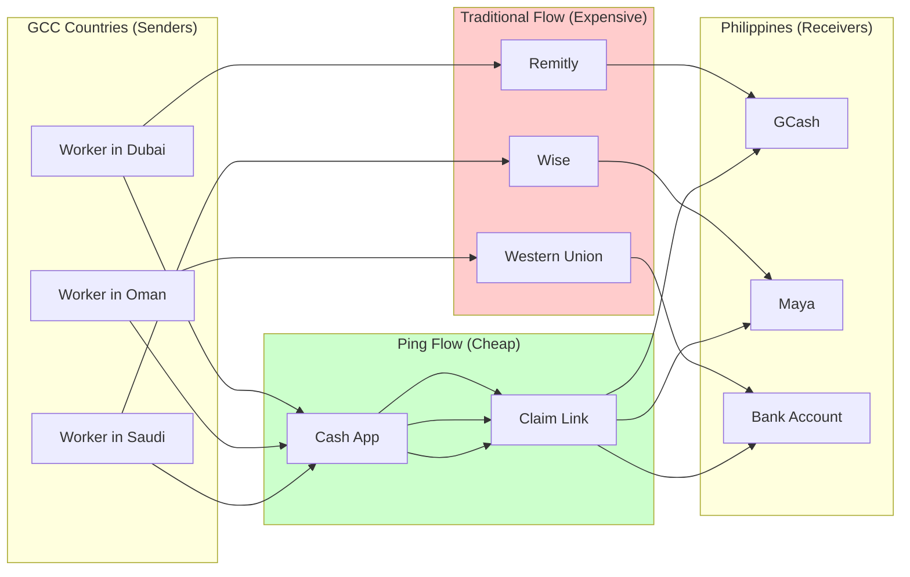
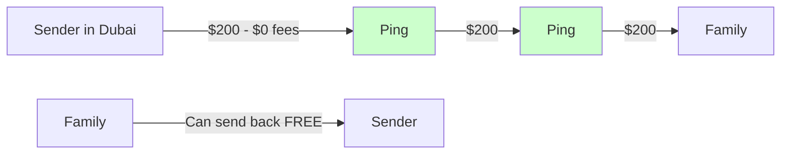
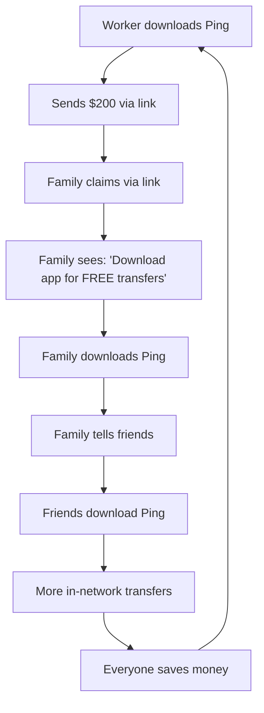

# Ping vs Domestic E-Wallets (GCash, Maya, etc.)

## The Key Distinction

**GCash and Maya are domestic e-wallets. Ping is a cross-border remittance platform.**

This is the most common confusion we encounter. People in the Philippines use GCash daily and wonder: "Why do I need Ping when I already have GCash?"

The answer: **GCash is for receiving and spending money in the Philippines. Ping is for sending money TO the Philippines cheaper and faster than anything else.**

---

## Understanding the Ecosystem



**The key insight**: GCash/Maya are **endpoints**, not remittance platforms. They're where money lands, not how it travels across borders.

---

## Platform Comparison

### What Each Platform Does

| Platform | Primary Function | Geographic Scope | Use Case |
|----------|------------------|------------------|----------|
| **GCash** | E-wallet, payments, bills | Philippines only | Pay for things, receive money, bills |
| **Maya** | E-wallet, banking, crypto | Philippines only | Similar to GCash + banking features |
| **GrabPay** | E-wallet, transport | Southeast Asia | Pay for rides, food delivery |
| **M-Pesa** | Mobile money | Kenya, Tanzania, etc. | Send money, pay bills, banking |
| **Ping** | Cross-border remittance | Global → 40+ countries | Send money internationally, cheap |

### Feature Comparison

| Feature | **Ping** | **GCash** | **Maya** | **Wise** |
|---------|----------|-----------|----------|----------|
| **Send internationally** | Yes | No | Limited | Yes |
| **Receive internationally** | Yes | Yes (via partners) | Yes (via partners) | Yes |
| **Domestic payments** | No (not our focus) | Yes | Yes | No |
| **Pay bills** | No | Yes | Yes | No |
| **In-network transfer fee** | **FREE** | FREE (domestic) | FREE (domestic) | N/A |
| **Cross-border fee** | **0-1%** | N/A | N/A | 0.5-2% |
| **App required to receive** | **No** | Yes | Yes | Yes |
| **KYC for small amounts** | **No** | Yes (full) | Yes (full) | Yes |

---

## The Real-World Scenario

### Today: Worker in Dubai → Family in Philippines

```
OPTION A: Using Remitly to GCash
─────────────────────────────────
1. Open Remitly app
2. Enter amount: $200
3. Pay fee: $3.99
4. FX rate: 55.5 PHP/USD (mid-market: 56.2)
5. Family receives: ₱11,100 (~$197 value)
6. Total cost: ~$6-7 (3-3.5%)

Family needs: GCash account with full KYC
```

```
OPTION B: Using Western Union
─────────────────────────────────
1. Visit WU agent or app
2. Enter amount: $200
3. Pay fee: $8-12
4. FX rate: 54.8 PHP/USD (worse than mid-market)
5. Family receives: ₱10,960 (~$187 value)
6. Total cost: ~$13 (6.5%)

Family needs: Valid ID for pickup, or GCash account
```

```
OPTION C: Using Ping (Both have app)
─────────────────────────────────
1. Open Ping app
2. Send to family member: $200
3. Pay fee: $0 (in-network FREE)
4. FX rate: 56.2 PHP/USD (mid-market)
5. Family receives: ₱11,240 ($200 value)
6. Total cost: $0

If cashing out to GCash: +$1 (0.5% fee)
Total cost: $1 (0.5%)
```

```
OPTION D: Using Ping (Recipient has no app)
─────────────────────────────────
1. Open Ping app
2. Send via link to WhatsApp: $200
3. Pay fee: $0 (in-network FREE)
4. Family clicks link, enters OTP
5. Chooses cash-out: GCash
6. Receives: ₱11,184 (~$199 value)
7. Total cost: $1 (0.5%)

Family needs: Just a phone number and WhatsApp
```

### Savings Comparison

| Method | Fee | FX Loss | Total Cost on $200 | Family Receives |
|--------|-----|---------|-------------------|-----------------|
| Western Union | $10 | $6 | **$16 (8%)** | $184 |
| Remitly | $4 | $3 | **$7 (3.5%)** | $193 |
| Wise | $2 | $2 | **$4 (2%)** | $196 |
| **Ping (in-network)** | $0 | $0 | **$0 (0%)** | $200 |
| **Ping (to GCash)** | $1 | $0 | **$1 (0.5%)** | $199 |

---

## Why GCash Users Should Care About Ping

### For Senders (Workers Abroad)

| Pain Point | With Traditional + GCash | With Ping |
|------------|-------------------------|-----------|
| "Fees are eating my salary" | 3-7% per transfer | 0-1% per transfer |
| "Takes too long" | Hours to days | Seconds |
| "Hidden FX charges" | Common (2-4% markup) | Transparent (0.3-0.5%) |
| "My family needs full KYC" | Yes, always | No, for small amounts |

### For Receivers (Family in Philippines)

| Pain Point | With GCash Alone | With Ping |
|------------|-----------------|-----------|
| "I need to download apps" | Need sender's app + GCash | Just click a link |
| "I need full verification" | Yes, for receiving | No, for claiming |
| "I can only receive, not send" | Correct | Can send back too |
| "International fees are high" | Sender pays 3-7% | Sender pays 0-1% |

---

## The Network Effect

### Traditional Flow (GCash as endpoint)


Every transfer: **$7 lost to fees**

### Ping Flow (When both have Ping)



Every transfer: **$0 lost to fees**

### The Viral Loop



**GCash has no incentive to make cross-border cheap** - they're a receiving endpoint, not a remittance platform. They actually benefit from remittance fees (partnership revenue).

---

## Feature Deep-Dive

### GCash Strengths (What We Don't Compete With)

| Feature | Why GCash is Better |
|---------|-------------------|
| Pay at stores | QR payments everywhere in PH |
| Pay bills | Electricity, water, internet |
| Buy load | Phone credits |
| Ping in/out | Thousands of partner locations |
| GCredit | Lending/credit features |
| GSave | Savings accounts |
| GInsure | Insurance products |

**We don't try to replace GCash for domestic use.** We complement it for international transfers.

### Ping Strengths (What GCash Can't Do)

| Feature | Why Ping is Better |
|---------|-------------------|
| Send from abroad | GCash can't send from Dubai |
| Zero in-network fees | GCash partners charge 3-7% |
| No app to receive | GCash requires full app + KYC |
| Instant international | GCash depends on partner speed |
| Transparent FX | GCash partners hide FX markup |
| Multi-country cash-out | GCash is Philippines only |

---

## Common Questions

### "My family already has GCash, why do they need Ping?"

They don't **need** to download Ping. You can send them money via a claim link, and they can cash out directly to their GCash account. But if they DO download Ping, future transfers are **completely free**.

### "Can I send from Ping to GCash?"

Yes! Ping supports cash-out to GCash (0.5% fee). The receiver clicks the claim link, chooses GCash, and money arrives in seconds.

### "What about Maya/PayMaya?"

Same story. Maya is a domestic e-wallet. We can cash out to Maya accounts. The comparison is identical to GCash.

### "Is Ping trying to replace GCash?"

No. We're different products:
- **GCash** = Your wallet for daily life in the Philippines
- **Ping** = The cheapest way to send money to the Philippines

Think of it like: GCash is your local bank account. Ping is how money gets there from abroad.

### "Why would GCash users switch to receiving via Ping?"

They don't "switch" - they still use GCash for everything else. They just tell their family abroad to use Ping instead of Remitly/WU. The money still ends up in GCash, just with lower fees.

---

## Regional Comparisons

### Philippines

| App | Type | Cross-Border | Ping Alternative |
|-----|------|--------------|------------------|
| GCash | E-wallet | Receive only | Yes, we cash out to GCash |
| Maya | E-wallet + Bank | Receive only | Yes, we cash out to Maya |
| Coins.ph | Crypto wallet | Limited | Yes, we cash out here too |
| UnionBank | Digital bank | Receive only | Yes, bank transfer option |

### Kenya

| App | Type | Cross-Border | Ping Alternative |
|-----|------|--------------|------------------|
| M-Pesa | Mobile money | Receive only | Yes, we cash out to M-Pesa |
| Airtel Money | Mobile money | Receive only | Yes, supported |
| Equity Bank | Mobile banking | Receive only | Yes, bank transfer |

### India

| App | Type | Cross-Border | Ping Alternative |
|-----|------|--------------|------------------|
| Google Pay | UPI | Receive only | Yes, we support UPI |
| PhonePe | UPI | Receive only | Yes, supported |
| Paytm | E-wallet + UPI | Receive only | Yes, supported |
| BHIM | UPI | Receive only | Yes, supported |

---

## Summary

| Aspect | GCash/Maya/M-Pesa | Ping |
|--------|-------------------|------|
| **What it is** | Domestic e-wallet | Cross-border remittance |
| **Best for** | Daily payments in your country | Sending money internationally |
| **Fees** | Free domestic, high international | Free in-network, low cash-out |
| **Coverage** | Single country | 40+ countries |
| **Competition** | Each other | Wise, Remitly, Western Union |

**Bottom line**: We don't compete with GCash. We make sending money TO GCash cheaper and faster than anyone else.

---

## For Sales/Marketing Use

### One-liner for skeptics

> "GCash is for spending money in the Philippines. Ping is for **sending** money to the Philippines - for free."

### Elevator pitch

> "Your family already uses GCash? Perfect. Tell them to click the link I send, choose GCash, and they'll get the money in seconds. No fees for me to send, and just 0.5% for them to cash out. Compare that to the $5-10 you're paying Remitly right now."

### Objection handling

| Objection | Response |
|-----------|----------|
| "GCash is free" | "GCash is free for domestic transfers. You're paying Remitly/WU 3-7% to GET money into GCash from abroad." |
| "I already use GCash" | "Great! We send TO GCash. Use Ping to send, your family cashes out to their GCash. Same endpoint, 80% cheaper to send." |
| "My family won't download another app" | "They don't have to. We send a WhatsApp link. They click, enter OTP, choose GCash, done." |
| "I trust GCash more" | "Their money still goes to GCash. We're just the cheaper, faster highway to get it there." |
