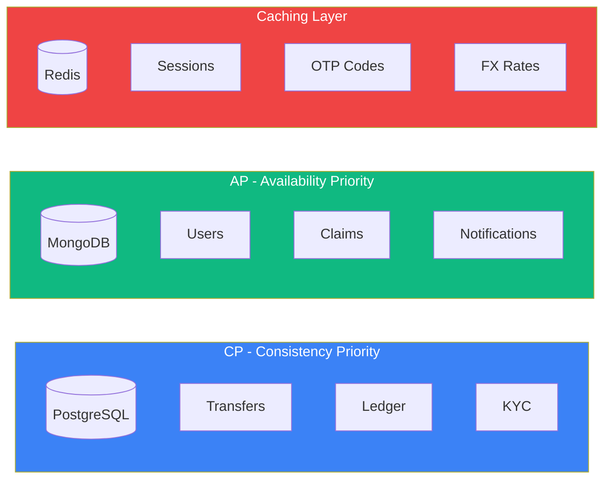
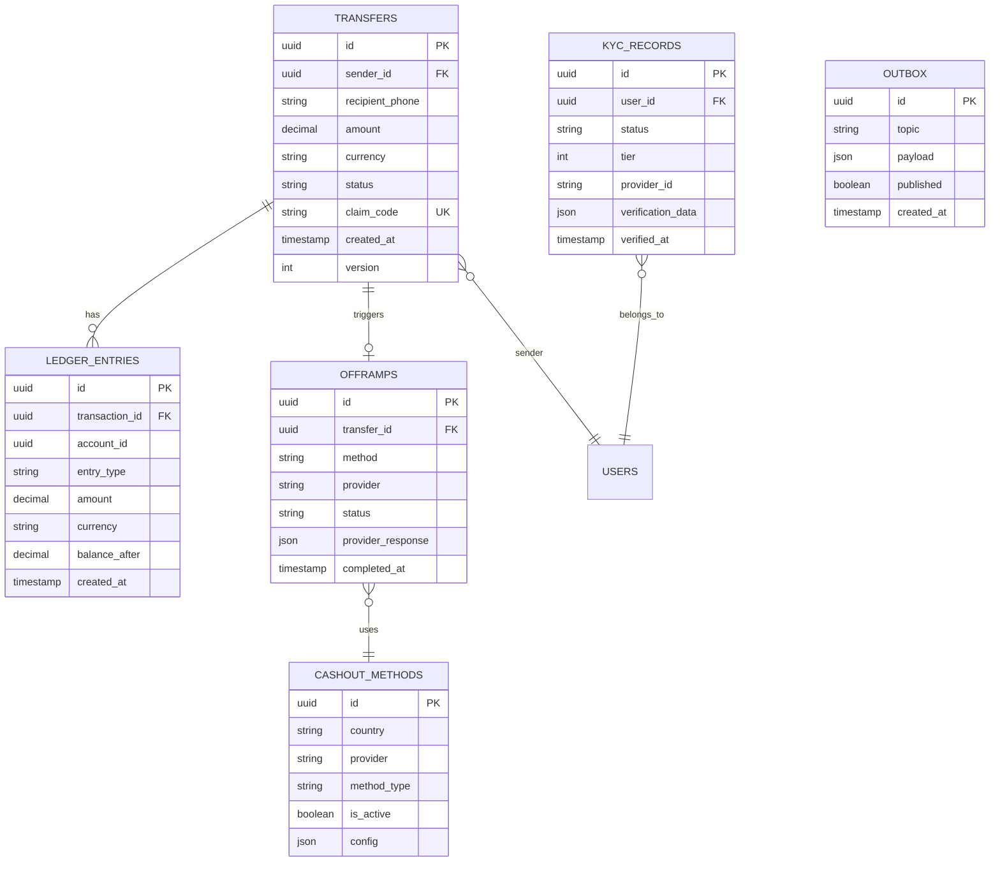
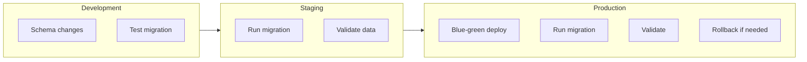

# Database Schema Documentation

## Overview

Ping uses a polyglot persistence strategy, selecting databases based on CAP theorem requirements:



| Database | Use Case | CAP | Services |
|----------|----------|-----|----------|
| PostgreSQL | Financial transactions | CP | transfer, ledger, kyc, offramp |
| MongoDB | User data, claims | AP | user, wallet, claim, notify |
| Redis | Sessions, cache | AP | auth, fx |

---

## PostgreSQL Schema

### Entity Relationship Diagram



### transfers

Core table for all money transfers.

```sql
CREATE TABLE transfers (
    id UUID PRIMARY KEY DEFAULT gen_random_uuid(),
    sender_id UUID NOT NULL,
    recipient_phone VARCHAR(20) NOT NULL,
    recipient_phone_hash VARCHAR(64) NOT NULL,

    -- Amount
    amount DECIMAL(20, 8) NOT NULL,
    currency VARCHAR(3) NOT NULL DEFAULT 'USD',
    local_amount DECIMAL(20, 8),
    local_currency VARCHAR(3),
    fx_rate DECIMAL(20, 8),

    -- Fees
    platform_fee DECIMAL(20, 8) NOT NULL DEFAULT 0,
    network_fee DECIMAL(20, 8) NOT NULL DEFAULT 0,

    -- Status
    status VARCHAR(20) NOT NULL DEFAULT 'pending',

    -- Claim
    claim_code VARCHAR(16) NOT NULL,
    claim_url TEXT NOT NULL,

    -- Blockchain
    tx_hash VARCHAR(128),
    chain VARCHAR(20) DEFAULT 'solana',

    -- Timestamps
    created_at TIMESTAMPTZ NOT NULL DEFAULT NOW(),
    updated_at TIMESTAMPTZ NOT NULL DEFAULT NOW(),
    confirmed_at TIMESTAMPTZ,
    claimed_at TIMESTAMPTZ,
    completed_at TIMESTAMPTZ,
    expires_at TIMESTAMPTZ NOT NULL,

    -- Optimistic locking
    version INTEGER NOT NULL DEFAULT 1,

    -- Constraints
    CONSTRAINT valid_amount CHECK (amount > 0),
    CONSTRAINT valid_status CHECK (status IN (
        'pending', 'confirmed', 'claimed', 'processing',
        'completed', 'cancelled', 'expired', 'failed'
    )),
    CONSTRAINT valid_currency CHECK (currency IN ('USD', 'USDC', 'USDT')),
    CONSTRAINT unique_claim_code UNIQUE (claim_code)
);

-- Indexes
CREATE INDEX idx_transfers_sender ON transfers(sender_id);
CREATE INDEX idx_transfers_recipient ON transfers(recipient_phone_hash);
CREATE INDEX idx_transfers_status ON transfers(status);
CREATE INDEX idx_transfers_created ON transfers(created_at DESC);
CREATE INDEX idx_transfers_sender_created ON transfers(sender_id, created_at DESC);
CREATE INDEX idx_transfers_expires ON transfers(expires_at) WHERE status IN ('pending', 'confirmed');
```

### ledger_entries

Double-entry accounting for all financial movements.

```sql
CREATE TABLE ledger_entries (
    id UUID PRIMARY KEY DEFAULT gen_random_uuid(),

    -- Reference
    transaction_id UUID NOT NULL,
    transaction_type VARCHAR(20) NOT NULL,

    -- Account
    account_id UUID NOT NULL,
    account_type VARCHAR(20) NOT NULL,

    -- Entry
    entry_type VARCHAR(10) NOT NULL,
    amount DECIMAL(20, 8) NOT NULL,
    currency VARCHAR(3) NOT NULL,

    -- Running balance
    balance_before DECIMAL(20, 8) NOT NULL,
    balance_after DECIMAL(20, 8) NOT NULL,

    -- Metadata
    description TEXT,
    metadata JSONB,

    -- Timestamps
    created_at TIMESTAMPTZ NOT NULL DEFAULT NOW(),

    -- Constraints
    CONSTRAINT valid_entry_type CHECK (entry_type IN ('DEBIT', 'CREDIT')),
    CONSTRAINT valid_amount CHECK (amount > 0),
    CONSTRAINT valid_account_type CHECK (account_type IN (
        'user_wallet', 'platform_fee', 'network_fee', 'offramp_reserve'
    )),
    CONSTRAINT valid_transaction_type CHECK (transaction_type IN (
        'deposit', 'transfer', 'claim', 'offramp', 'refund', 'fee'
    ))
);

-- Indexes
CREATE INDEX idx_ledger_transaction ON ledger_entries(transaction_id);
CREATE INDEX idx_ledger_account ON ledger_entries(account_id);
CREATE INDEX idx_ledger_created ON ledger_entries(created_at DESC);
CREATE INDEX idx_ledger_account_created ON ledger_entries(account_id, created_at DESC);

-- Ensure double-entry balance
CREATE OR REPLACE FUNCTION check_double_entry_balance()
RETURNS TRIGGER AS $$
BEGIN
    IF (
        SELECT COALESCE(SUM(CASE WHEN entry_type = 'DEBIT' THEN amount ELSE -amount END), 0)
        FROM ledger_entries
        WHERE transaction_id = NEW.transaction_id
    ) != 0 THEN
        RAISE EXCEPTION 'Double-entry balance violation for transaction %', NEW.transaction_id;
    END IF;
    RETURN NEW;
END;
$$ LANGUAGE plpgsql;
```

### offramps

Cash-out transaction tracking.

```sql
CREATE TABLE offramps (
    id UUID PRIMARY KEY DEFAULT gen_random_uuid(),
    transfer_id UUID NOT NULL REFERENCES transfers(id),

    -- Method
    method VARCHAR(20) NOT NULL,
    provider VARCHAR(50) NOT NULL,

    -- Recipient
    recipient_account VARCHAR(100) NOT NULL,
    recipient_name VARCHAR(100),

    -- Amount
    amount DECIMAL(20, 8) NOT NULL,
    currency VARCHAR(3) NOT NULL,

    -- Status
    status VARCHAR(20) NOT NULL DEFAULT 'pending',

    -- Provider
    provider_reference VARCHAR(100),
    provider_response JSONB,

    -- Timestamps
    created_at TIMESTAMPTZ NOT NULL DEFAULT NOW(),
    updated_at TIMESTAMPTZ NOT NULL DEFAULT NOW(),
    completed_at TIMESTAMPTZ,

    -- Constraints
    CONSTRAINT valid_method CHECK (method IN ('gcash', 'maya', 'bank', 'mpesa', 'paytm')),
    CONSTRAINT valid_offramp_status CHECK (status IN (
        'pending', 'processing', 'completed', 'failed', 'cancelled'
    ))
);

-- Indexes
CREATE INDEX idx_offramps_transfer ON offramps(transfer_id);
CREATE INDEX idx_offramps_status ON offramps(status);
CREATE INDEX idx_offramps_provider ON offramps(provider, status);
```

### kyc_records

Identity verification records.

```sql
CREATE TABLE kyc_records (
    id UUID PRIMARY KEY DEFAULT gen_random_uuid(),
    user_id UUID NOT NULL,

    -- Status
    status VARCHAR(20) NOT NULL DEFAULT 'pending',
    tier INTEGER NOT NULL DEFAULT 0,

    -- Provider
    provider VARCHAR(50) NOT NULL DEFAULT 'persona',
    provider_inquiry_id VARCHAR(100),
    provider_reference VARCHAR(100),

    -- Verification data (encrypted)
    full_name VARCHAR(200),
    date_of_birth DATE,
    nationality VARCHAR(3),
    document_type VARCHAR(50),
    document_number_hash VARCHAR(64),

    -- Address (encrypted, tier 3)
    address_line1 VARCHAR(200),
    address_city VARCHAR(100),
    address_country VARCHAR(3),

    -- Results
    verification_result JSONB,
    rejection_reasons TEXT[],

    -- Timestamps
    created_at TIMESTAMPTZ NOT NULL DEFAULT NOW(),
    updated_at TIMESTAMPTZ NOT NULL DEFAULT NOW(),
    verified_at TIMESTAMPTZ,
    expires_at TIMESTAMPTZ,

    -- Constraints
    CONSTRAINT valid_kyc_status CHECK (status IN (
        'pending', 'submitted', 'reviewing', 'verified', 'rejected', 'expired'
    )),
    CONSTRAINT valid_tier CHECK (tier BETWEEN 0 AND 3)
);

-- Indexes
CREATE INDEX idx_kyc_user ON kyc_records(user_id);
CREATE INDEX idx_kyc_status ON kyc_records(status);
CREATE INDEX idx_kyc_provider ON kyc_records(provider, provider_inquiry_id);
```

### outbox

Transactional outbox for reliable event publishing.

```sql
CREATE TABLE outbox (
    id UUID PRIMARY KEY DEFAULT gen_random_uuid(),

    -- Event
    topic VARCHAR(100) NOT NULL,
    event_type VARCHAR(100) NOT NULL,
    payload JSONB NOT NULL,

    -- Status
    published BOOLEAN NOT NULL DEFAULT FALSE,
    published_at TIMESTAMPTZ,
    retry_count INTEGER NOT NULL DEFAULT 0,
    last_error TEXT,

    -- Metadata
    correlation_id VARCHAR(100),
    causation_id VARCHAR(100),

    -- Timestamps
    created_at TIMESTAMPTZ NOT NULL DEFAULT NOW()
);

-- Indexes
CREATE INDEX idx_outbox_unpublished ON outbox(created_at) WHERE published = FALSE;
CREATE INDEX idx_outbox_correlation ON outbox(correlation_id);
```

---

## MongoDB Schema

### users Collection

User profiles and contacts.

```javascript
// Collection: users
{
  _id: ObjectId("..."),

  // Identity
  phoneHash: "sha256...",           // Indexed, unique
  phone: "+639171234567",           // Encrypted
  email: "user@example.com",        // Optional, sparse index

  // Profile
  profile: {
    name: "John Doe",
    displayName: "John",
    avatar: "https://cdn.cash.app/avatars/...",
    language: "en",
    timezone: "Asia/Manila"
  },

  // KYC
  kyc: {
    status: "verified",             // none, pending, verified, rejected
    tier: 2,                        // 0-3
    verifiedAt: ISODate("..."),
    expiresAt: ISODate("...")
  },

  // Wallet (Privy-managed)
  wallet: {
    address: "7xKp2mN9qL4rYz...",
    chain: "solana",
    privyUserId: "did:privy:..."
  },

  // Limits
  limits: {
    dailySend: 500,
    monthlySend: 5000,
    dailyRemaining: 350,
    monthlyRemaining: 4500,
    resetDaily: ISODate("..."),
    resetMonthly: ISODate("...")
  },

  // Statistics
  stats: {
    totalSent: 1500.00,
    totalReceived: 200.00,
    transferCount: 15,
    lastTransferAt: ISODate("...")
  },

  // Contacts (synced from phone)
  contacts: [
    {
      name: "Mom",
      phone: "+639181234567",
      phoneHash: "sha256...",
      isRegistered: true,
      registeredUserId: ObjectId("..."),
      lastTransferAt: ISODate("..."),
      transferCount: 5
    },
    {
      name: "Dad",
      phone: "+639191234567",
      phoneHash: "sha256...",
      isRegistered: false
    }
  ],

  // Settings
  settings: {
    notifications: {
      push: true,
      sms: true,
      email: false,
      marketing: false
    },
    privacy: {
      showInContacts: true,
      showBalance: false
    }
  },

  // Metadata
  createdAt: ISODate("..."),
  updatedAt: ISODate("..."),
  lastActiveAt: ISODate("...")
}

// Indexes
db.users.createIndex({ phoneHash: 1 }, { unique: true });
db.users.createIndex({ email: 1 }, { sparse: true });
db.users.createIndex({ "wallet.address": 1 });
db.users.createIndex({ "wallet.privyUserId": 1 });
db.users.createIndex({ "contacts.phoneHash": 1 });
db.users.createIndex({ "kyc.status": 1 });
db.users.createIndex({ createdAt: -1 });
```

### claims Collection

Claim links for transfers.

```javascript
// Collection: claims
{
  _id: ObjectId("..."),

  // Reference
  transferId: "txn_abc123",         // PostgreSQL transfer ID

  // Claim code
  code: "x7Kp2mN9qL4r",            // 12-char unique code
  url: "https://cash.app/c/x7Kp2mN9qL4r",
  shortUrl: "https://c.cash/x7Kp2mN9qL4r",

  // Sender info (denormalized for display)
  sender: {
    id: "usr_abc",
    name: "John Doe",
    phone: "+63 *** *** 4567"       // Masked
  },

  // Recipient
  recipientPhone: "+639181234567",
  recipientPhoneHash: "sha256...",

  // Amount
  amount: {
    value: 100.00,
    currency: "USD",
    localValue: 5580.00,
    localCurrency: "PHP",
    fxRate: 55.80
  },

  // Status
  status: "pending",                // pending, verified, claimed, expired, cancelled

  // Verification
  verification: {
    attempts: 0,
    maxAttempts: 5,
    lastAttemptAt: null,
    verifiedAt: null,
    lockedUntil: null
  },

  // Cash-out selection
  cashout: {
    method: null,                   // gcash, maya, bank
    account: null,                  // Selected account number
    selectedAt: null
  },

  // Timestamps
  createdAt: ISODate("..."),
  updatedAt: ISODate("..."),
  expiresAt: ISODate("..."),
  claimedAt: null,

  // Metadata
  metadata: {
    ip: "xxx.xxx.xxx.xxx",
    userAgent: "...",
    referrer: "whatsapp"
  }
}

// Indexes
db.claims.createIndex({ code: 1 }, { unique: true });
db.claims.createIndex({ transferId: 1 });
db.claims.createIndex({ recipientPhoneHash: 1 });
db.claims.createIndex({ status: 1 });
db.claims.createIndex({ expiresAt: 1 }, { expireAfterSeconds: 0 });  // TTL index
db.claims.createIndex({ createdAt: -1 });
```

### notifications Collection

Notification history and status.

```javascript
// Collection: notifications
{
  _id: ObjectId("..."),

  // Reference
  userId: ObjectId("..."),          // Optional, for registered users
  phone: "+639181234567",
  phoneHash: "sha256...",

  // Related entity
  entityType: "transfer",           // transfer, claim, kyc, system
  entityId: "txn_abc123",

  // Channel
  channel: "whatsapp",              // whatsapp, sms, push, email

  // Template
  template: "TRANSFER_RECEIVED",
  templateVersion: "1.0",
  templateParams: {
    senderName: "John",
    amount: "$100",
    claimUrl: "https://c.cash/x7Kp2mN9qL4r"
  },

  // Content (rendered)
  content: {
    body: "You received $100 from John! Claim now: https://c.cash/x7Kp2mN9qL4r",
    title: null,                    // For push
    imageUrl: null
  },

  // Delivery
  status: "delivered",              // pending, sent, delivered, failed, read
  provider: "twilio",               // twilio, whatsapp-cloud, firebase
  providerMessageId: "SM...",

  // Timestamps
  createdAt: ISODate("..."),
  sentAt: ISODate("..."),
  deliveredAt: ISODate("..."),
  readAt: null,

  // Error handling
  retryCount: 0,
  maxRetries: 3,
  lastError: null,
  nextRetryAt: null
}

// Indexes
db.notifications.createIndex({ userId: 1, createdAt: -1 });
db.notifications.createIndex({ phoneHash: 1, createdAt: -1 });
db.notifications.createIndex({ entityType: 1, entityId: 1 });
db.notifications.createIndex({ status: 1, nextRetryAt: 1 });
db.notifications.createIndex({ createdAt: -1 });
```

---

## Redis Data Structures

### Sessions

```
KEY:    session:{session_id}
TYPE:   Hash
TTL:    24 hours (86400s)

FIELDS:
  userId      - User ID
  phone       - Phone number (encrypted)
  deviceId    - Device identifier
  ip          - Client IP
  userAgent   - User agent
  createdAt   - Session creation timestamp
  lastActiveAt - Last activity timestamp

EXAMPLE:
  HSET session:sess_abc123 userId usr_xyz phone "+639171234567" ...
  EXPIRE session:sess_abc123 86400
```

### OTP Codes

```
KEY:    otp:{phone_hash}
TYPE:   Hash
TTL:    10 minutes (600s)

FIELDS:
  code        - 6-digit OTP
  attempts    - Number of verification attempts
  createdAt   - OTP generation timestamp
  purpose     - auth, claim, withdraw

EXAMPLE:
  HSET otp:a1b2c3... code 123456 attempts 0 purpose auth
  EXPIRE otp:a1b2c3... 600
```

### Rate Limiting

```
KEY:    ratelimit:{user_id}:{endpoint}
TYPE:   Sorted Set
TTL:    1 hour (3600s)

MEMBERS: Request timestamps (score = timestamp)

OPERATIONS:
  1. Add request: ZADD ratelimit:usr_abc:/transfers NOW NOW
  2. Count in window: ZCOUNT ratelimit:usr_abc:/transfers (NOW-60) NOW
  3. Cleanup old: ZREMRANGEBYSCORE ratelimit:usr_abc:/transfers -inf (NOW-3600)
```

### FX Rates Cache

```
KEY:    fx:rates:{base_currency}
TYPE:   Hash
TTL:    60 seconds

FIELDS:
  PHP         - Rate to PHP
  INR         - Rate to INR
  PKR         - Rate to PKR
  KES         - Rate to KES
  NGN         - Rate to NGN
  updatedAt   - Last update timestamp
  source      - Rate provider

EXAMPLE:
  HSET fx:rates:USD PHP 55.80 INR 83.25 PKR 278.50 ...
  EXPIRE fx:rates:USD 60
```

### Claim Code Lookup

```
KEY:    claim:{code}
TYPE:   String (JSON)
TTL:    7 days (604800s)

VALUE:
  {
    "claimId": "clm_abc123",
    "transferId": "txn_xyz789",
    "status": "pending",
    "amount": 100,
    "currency": "USD"
  }

PURPOSE: Fast claim code validation without MongoDB query
```

### User Balance Cache

```
KEY:    balance:{user_id}
TYPE:   String
TTL:    5 minutes (300s)

VALUE:  "150.50"

PURPOSE: Cached balance from wallet service for quick reads
INVALIDATION: On any wallet event (debit/credit)
```

---

## Data Migrations

### Migration Strategy



### PostgreSQL Migrations (Prisma)

```bash
# Create migration
pnpm --filter @ping/transfer-service db:migrate:create add_kyc_tier

# Apply migrations
pnpm --filter @ping/transfer-service db:migrate:deploy

# Generate client
pnpm --filter @ping/transfer-service db:generate
```

### MongoDB Migrations

```javascript
// migrations/001_add_kyc_tier.js
module.exports = {
  async up(db) {
    await db.collection('users').updateMany(
      { 'kyc.tier': { $exists: false } },
      { $set: { 'kyc.tier': 0 } }
    );

    await db.collection('users').createIndex({ 'kyc.tier': 1 });
  },

  async down(db) {
    await db.collection('users').updateMany(
      {},
      { $unset: { 'kyc.tier': '' } }
    );
  }
};
```

---

## Backup & Recovery

### PostgreSQL

| Type | Frequency | Retention | Method |
|------|-----------|-----------|--------|
| Full backup | Daily | 30 days | pg_dump |
| WAL archiving | Continuous | 7 days | pg_basebackup |
| Point-in-time | As needed | 7 days | WAL replay |

### MongoDB

| Type | Frequency | Retention | Method |
|------|-----------|-----------|--------|
| Full backup | Daily | 30 days | mongodump |
| Oplog backup | Continuous | 7 days | Oplog tailing |
| Snapshot | Weekly | 90 days | Cloud provider |

### Redis

| Type | Frequency | Retention | Method |
|------|-----------|-----------|--------|
| RDB snapshot | Hourly | 24 hours | BGSAVE |
| AOF | Continuous | 24 hours | appendonly |

---

## Monitoring

### Key Metrics

| Database | Metric | Alert Threshold |
|----------|--------|-----------------|
| PostgreSQL | Connection pool utilization | > 80% |
| PostgreSQL | Replication lag | > 10s |
| PostgreSQL | Lock wait time | > 5s |
| MongoDB | Query execution time | > 100ms |
| MongoDB | Oplog window | < 1 hour |
| Redis | Memory usage | > 80% |
| Redis | Connected clients | > 1000 |

### Queries to Monitor

```sql
-- PostgreSQL: Slow queries
SELECT * FROM pg_stat_statements
ORDER BY total_time DESC
LIMIT 10;

-- PostgreSQL: Table sizes
SELECT relname, pg_size_pretty(pg_total_relation_size(relid))
FROM pg_catalog.pg_statio_user_tables
ORDER BY pg_total_relation_size(relid) DESC;
```

```javascript
// MongoDB: Slow queries
db.setProfilingLevel(1, { slowms: 100 });
db.system.profile.find().sort({ ts: -1 }).limit(10);

// MongoDB: Collection stats
db.runCommand({ collStats: 'users' });
```
