# User Journeys & Transfer Flows

## Overview

This document illustrates the sender and receiver journeys for different transfer scenarios, showing the optimal routing based on recipient capabilities.

---

## Route Selection Logic

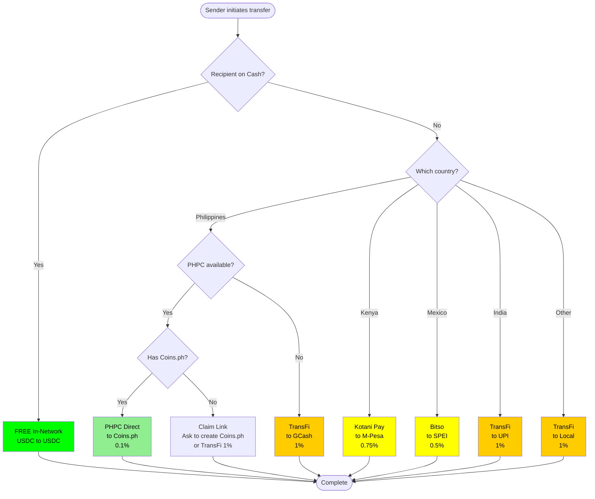

---

## Fee Comparison

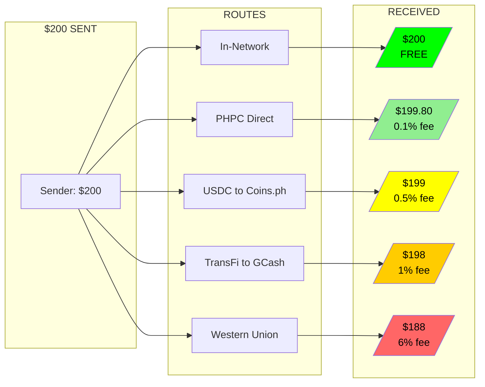

---

## Journey 1: PHPC Direct - Best Case (Philippines, 0.1% fee)

The optimal path when recipient has or creates a Coins.ph account.

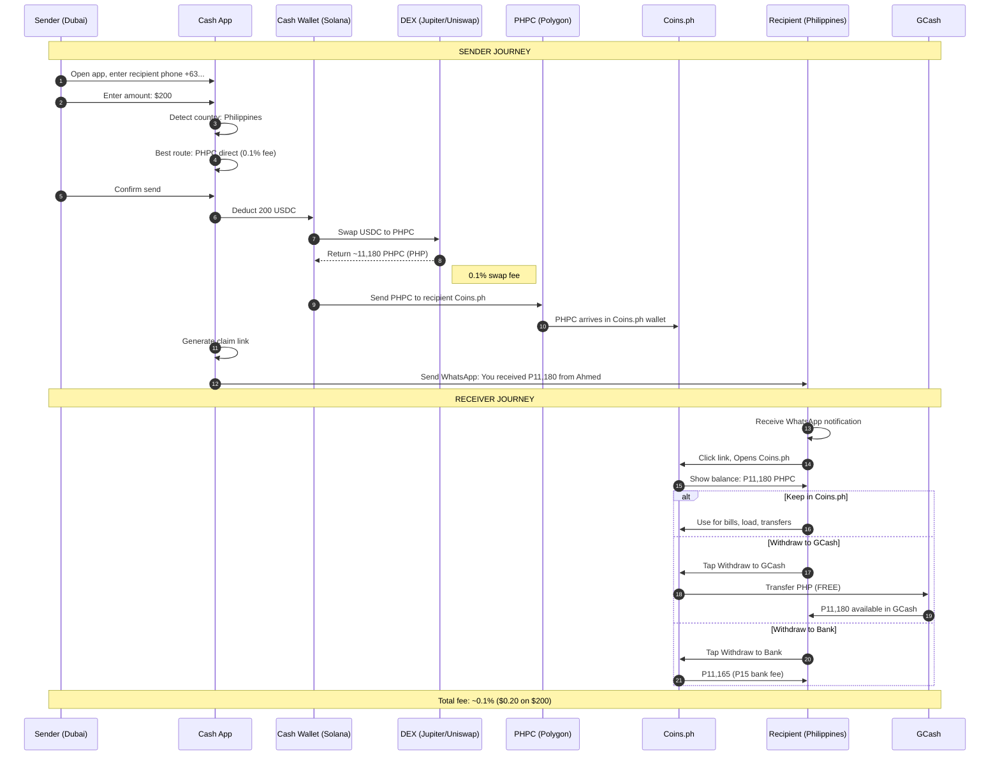

---

## Journey 2: USDC Direct to Coins.ph (0.5% fee)

When PHPC swap is not available, send USDC directly.

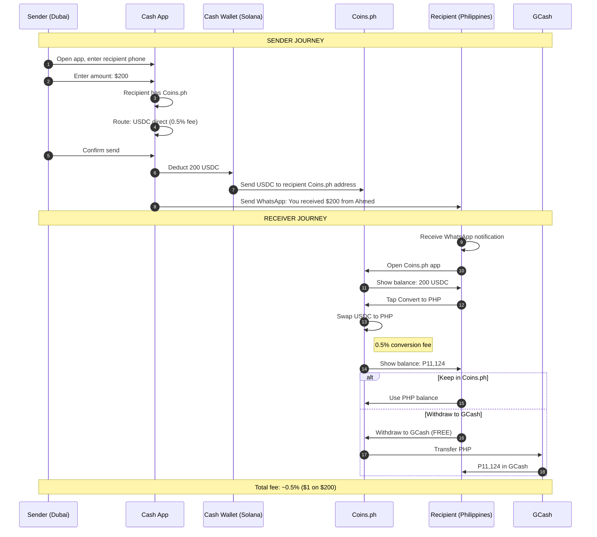

---

## Journey 3: Claim Link - No App Receiver (TransFi, 1% fee)

For recipients without Cash app or Coins.ph - fully app-less experience.

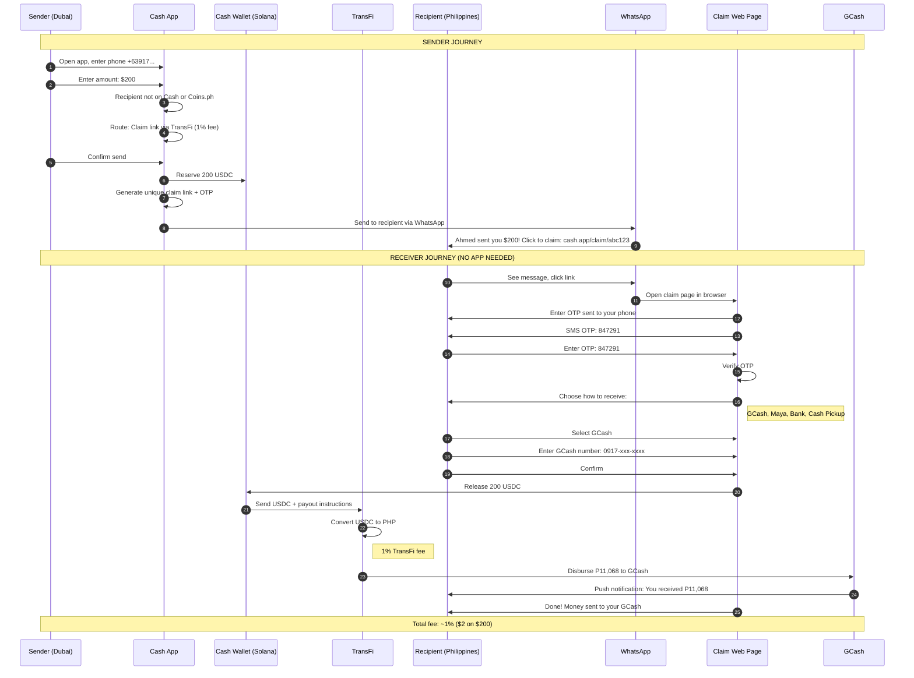

---

## Journey 4: In-Network Transfer (FREE)

Both sender and recipient have Cash app - zero fees.

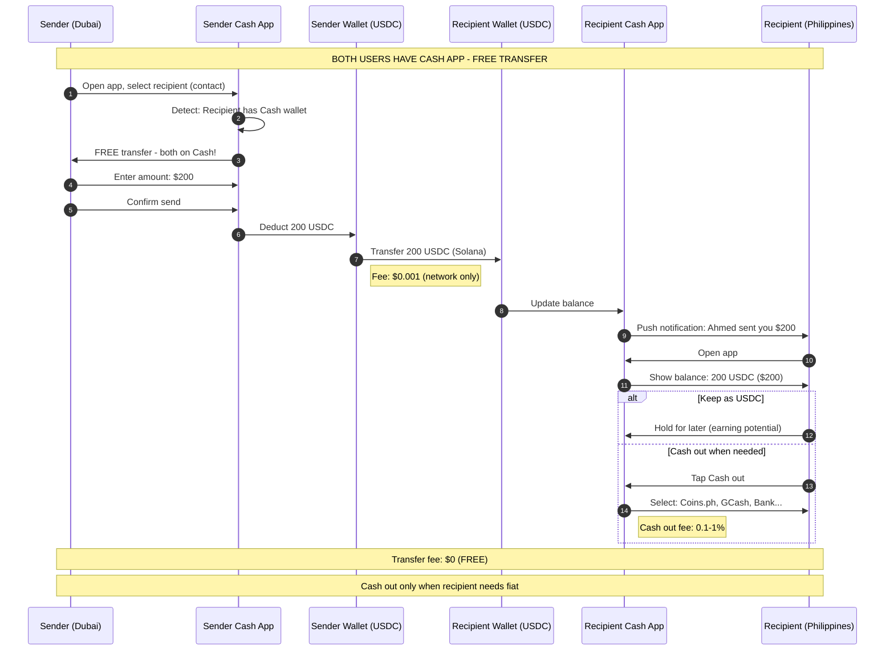

---

## Journey 5: Full Architecture Overview

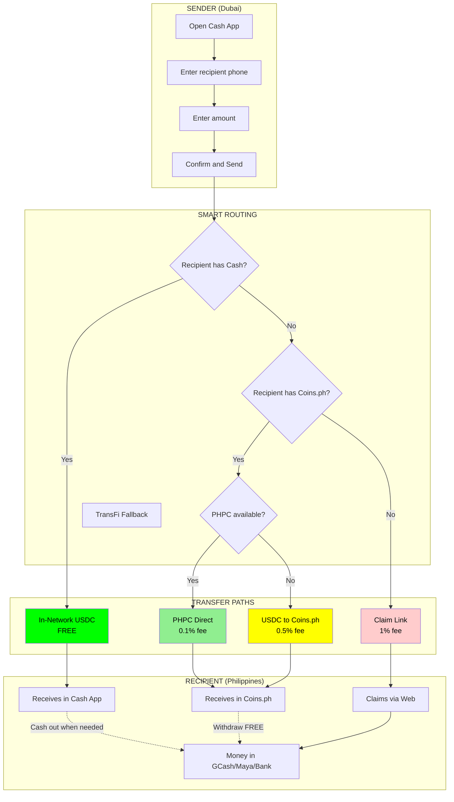

---

## Recipient Claim Flow State Machine

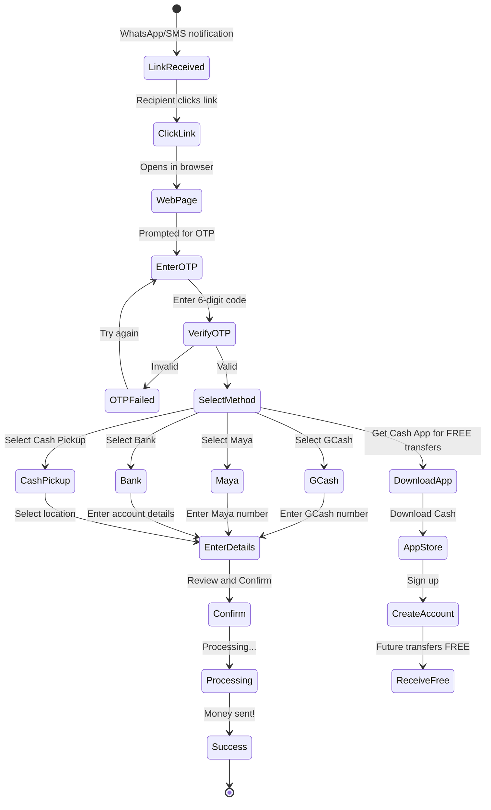

---

## Multi-Country Routing

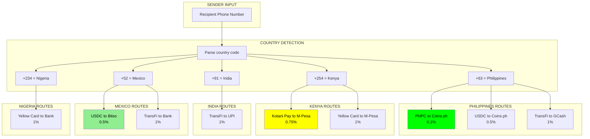

---

## Cash-Out Options by Country

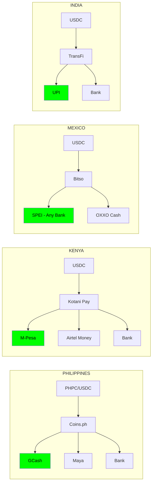

---

## Summary Table

| Journey | Recipient Has | Route | Fee | Speed |
|---------|---------------|-------|-----|-------|
| 1. PHPC Direct | Coins.ph | USDC → PHPC → Coins.ph | 0.1% | Instant |
| 2. USDC Direct | Coins.ph | USDC → Coins.ph | 0.5% | Instant |
| 3. Claim Link | Nothing | USDC → TransFi → GCash | 1% | Instant |
| 4. In-Network | Cash App | USDC → USDC | FREE | Instant |

---

## Network Effect Visualization

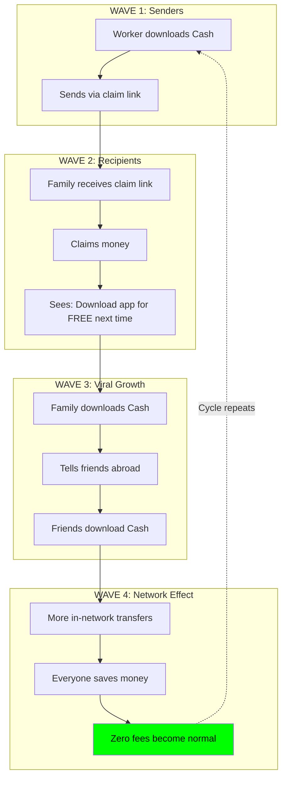
