# Non-Functional Requirements & System Design

## Executive Summary

This document defines the technical excellence standards for Cash - a world-class, globally scalable remittance platform. We prioritize:

- **Scale-ready from day one** - Architecture that handles 1M+ daily transactions
- **Cost-efficient bootstrap** - Start at ~$100/month, scale to enterprise
- **Event-driven microservices** - Loosely coupled, independently deployable
- **Modern UX** - Sub-100ms perceived latency, offline-first, delightful interactions
- **Zero compromise on security** - Bank-grade without bank complexity

---

## Table of Contents

1. [Architecture Principles](#architecture-principles)
2. [Microservices Design](#microservices-design)
3. [Design Patterns](#design-patterns)
4. [Data Architecture (CAP Theorem)](#data-architecture)
5. [Event-Driven Architecture](#event-driven-architecture)
6. [Caching Strategy](#caching-strategy)
7. [Kubernetes Infrastructure](#kubernetes-infrastructure)
8. [UX Requirements](#ux-requirements)
9. [Performance Requirements](#performance-requirements)
10. [Security Requirements](#security-requirements)
11. [Cost Optimization](#cost-optimization)

---

## Architecture Principles

### The Twelve-Factor App (Extended)

We follow and extend the [12-Factor methodology](https://12factor.net):

| Factor | Our Implementation |
|--------|-------------------|
| **Codebase** | Monorepo with Turborepo, service isolation |
| **Dependencies** | Explicit via pnpm workspaces, lockfiles |
| **Config** | Environment variables, K8s ConfigMaps/Secrets |
| **Backing Services** | Treated as attached resources, URL-configured |
| **Build, Release, Run** | GitOps with ArgoCD, immutable images |
| **Processes** | Stateless services, state in Redis/DB |
| **Port Binding** | Self-contained HTTP servers |
| **Concurrency** | Horizontal pod autoscaling |
| **Disposability** | Fast startup (<5s), graceful shutdown |
| **Dev/Prod Parity** | Identical containers, feature flags |
| **Logs** | Event streams to stdout, aggregated |
| **Admin Processes** | K8s Jobs for migrations, one-off tasks |

### Additional Principles

| Principle | Description |
|-----------|-------------|
| **API-First** | OpenAPI specs before implementation |
| **Event-First** | Every state change emits an event |
| **Observability-First** | Metrics, logs, traces from day one |
| **Security-First** | Zero-trust, encrypt everything |
| **Mobile-First** | UX optimized for 4G networks |

---

## Microservices Design

### Service Decomposition

We use **Domain-Driven Design (DDD)** to identify bounded contexts:

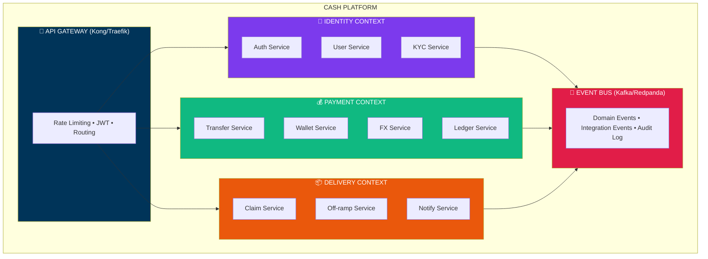

### Service Catalog

| Service | Bounded Context | Responsibility | Database | Queue Topics |
|---------|----------------|----------------|----------|--------------|
| **auth-service** | Identity | Phone verification, JWT tokens | Redis | `auth.events` |
| **user-service** | Identity | User profiles, contacts | MongoDB | `user.events` |
| **kyc-service** | Identity | Identity verification | PostgreSQL | `kyc.events` |
| **transfer-service** | Payment | Transfer orchestration | PostgreSQL | `transfer.events` |
| **wallet-service** | Payment | Balance, blockchain ops | MongoDB | `wallet.events` |
| **fx-service** | Payment | Exchange rates, quotes | Redis | `fx.events` |
| **ledger-service** | Payment | Double-entry accounting | PostgreSQL | `ledger.events` |
| **claim-service** | Delivery | Claim links, verification | MongoDB | `claim.events` |
| **offramp-service** | Delivery | Cash-out orchestration | PostgreSQL | `offramp.events` |
| **notify-service** | Delivery | WhatsApp, SMS, Push | MongoDB | `notify.events` |

### Service Communication Matrix

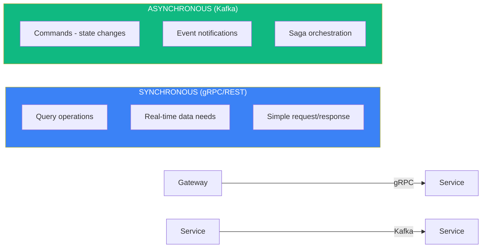

### Inter-Service Communication

| Pattern | Use Case | Implementation |
|---------|----------|----------------|
| **Sync Query** | Get user balance | gRPC with protobuf |
| **Sync Command** | Validate phone | REST with circuit breaker |
| **Async Event** | Transfer created | Kafka topic |
| **Async Command** | Send notification | Kafka with reply topic |
| **Saga** | Transfer + Claim + Offramp | Choreography via events |

---

## Design Patterns

### 1. CQRS (Command Query Responsibility Segregation)

Separate read and write models for optimal performance:

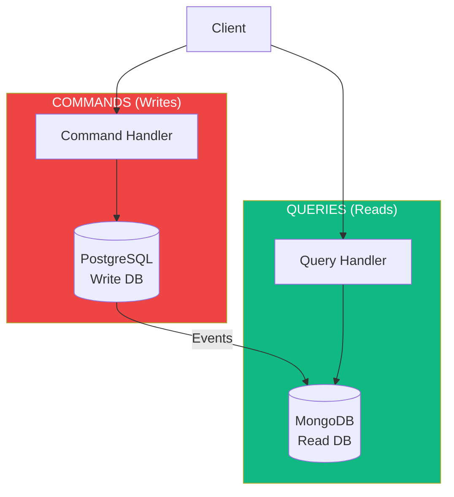

**Benefits**:
- Optimized read models (denormalized for queries)
- Independent scaling of read/write workloads
- Event sourcing ready

**Implementation**:

```typescript
// Command Model (PostgreSQL)
interface TransferCommand {
  id: string;
  senderId: string;
  recipientPhone: string;
  amount: Decimal;
  currency: Currency;
}

// Event emitted after command processing
interface TransferCreatedEvent {
  transferId: string;
  senderId: string;
  recipientPhone: string;
  amount: string;
  currency: string;
  claimCode: string;
  timestamp: Date;
}

// Read Model (MongoDB - denormalized for fast queries)
interface TransferReadModel {
  _id: string;
  sender: {
    id: string;
    name: string;
    phone: string;
  };
  recipient: {
    phone: string;
    phoneMasked: string;
  };
  amount: number;
  currency: string;
  localAmount: number;
  localCurrency: string;
  status: string;
  claimUrl: string;
  createdAt: Date;
  updatedAt: Date;
}
```

### 2. Event Sourcing (For Ledger Service)

Store all changes as immutable events:

```mermaid
flowchart LR
    subgraph Traditional["Traditional CRUD"]
        T1[UPDATE balance<br/>SET amount = 50]
        T2[❌ History lost]
    end

    subgraph EventSourced["Event Sourcing"]
        E1[INSERT BalanceDebited $50]
        E2[INSERT BalanceCredited $30]
        E3[✅ Full audit trail]
    end

    subgraph EventStore["EVENT STORE"]
        direction TB
        ES1["wallet_1 | v1 | WalletCreated | {user: abc}"]
        ES2["wallet_1 | v2 | BalanceCredited | {amount: 100}"]
        ES3["wallet_1 | v3 | BalanceDebited | {amount: 50}"]
        ES4["wallet_1 | v4 | BalanceCredited | {amount: 30}"]
    end

    Traditional --> EventSourced
    EventSourced --> EventStore

    style EventSourced fill:#10b981,color:#fff
```

**Current State** = Replay(all events for stream)
**Balance** = 0 + 100 - 50 + 30 = **$80**

**Use Cases**:
- **Ledger Service**: Complete audit trail for all financial transactions
- **Compliance**: Immutable record for regulators
- **Debugging**: Replay to any point in time

### 3. Saga Pattern (Choreography)

Manage distributed transactions across services:

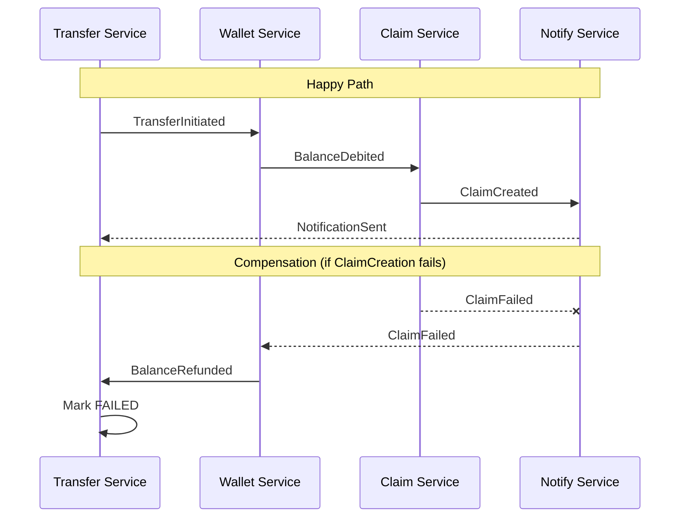

**Event Flow**:

```typescript
// 1. Transfer Service initiates
TransferInitiated {
  transferId: "txn_123",
  senderId: "usr_abc",
  amount: "100.00",
  recipientPhone: "+639181234567"
}

// 2. Wallet Service reacts
BalanceDebited {
  walletId: "wal_xyz",
  transferId: "txn_123",
  amount: "100.00",
  newBalance: "50.00"
}

// 3. Claim Service reacts
ClaimCreated {
  claimId: "clm_456",
  transferId: "txn_123",
  code: "x7Kp2mN9qL4r",
  expiresAt: "2025-01-22T10:00:00Z"
}

// 4. Notify Service reacts
NotificationSent {
  notificationId: "ntf_789",
  transferId: "txn_123",
  channel: "whatsapp",
  recipientPhone: "+639181234567"
}
```

### 4. Circuit Breaker Pattern

Prevent cascade failures when external services fail:

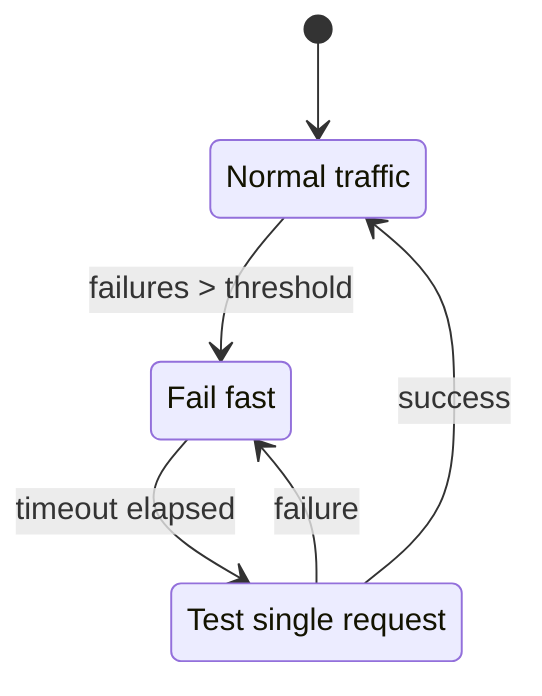

**Configuration**:
- Failure threshold: 5 failures in 30 seconds
- Open duration: 30 seconds
- Half-open max requests: 3

**Implementation with Resilience4j**:

```typescript
// Circuit breaker configuration
const circuitBreaker = new CircuitBreaker({
  name: 'transfi-offramp',
  failureRateThreshold: 50,        // 50% failure rate triggers open
  waitDurationInOpenState: 30000,  // 30 seconds
  permittedNumberOfCallsInHalfOpenState: 3,
  slidingWindowSize: 10,
  slowCallDurationThreshold: 5000, // 5 seconds
  slowCallRateThreshold: 80,       // 80% slow calls triggers open
});

// Usage
const result = await circuitBreaker.execute(async () => {
  return await transfiClient.createPayout(payoutRequest);
});
```

### 5. Outbox Pattern

Ensure reliable event publishing with database transactions:

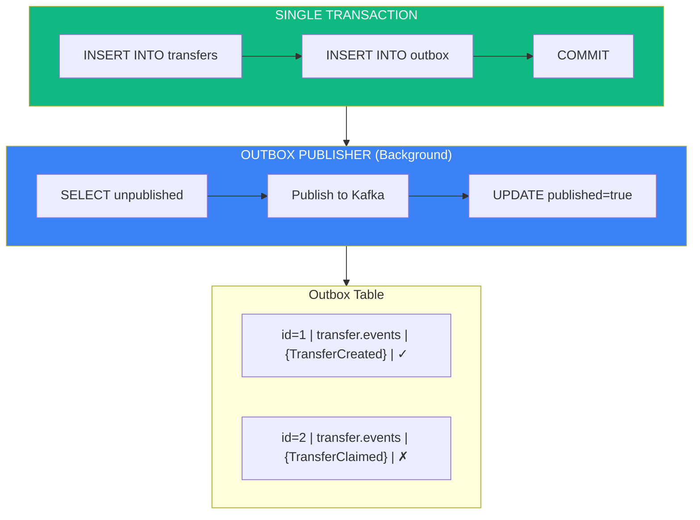

**Problem solved**: How to atomically update DB AND publish event?
- ❌ Anti-pattern (dual-write): Update DB, then publish to Kafka (can fail, inconsistent state)
- ✅ Outbox Pattern: Single transaction writes to DB and outbox, background job publishes

### 6. API Gateway Pattern

Single entry point with cross-cutting concerns:

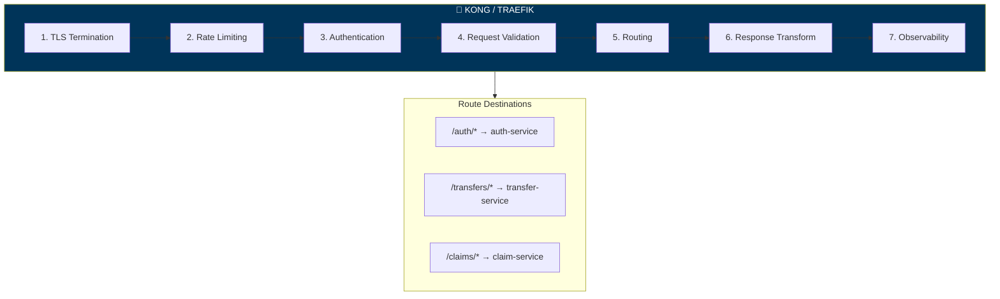

### 7. Strangler Fig Pattern (For Future Migrations)

Incrementally replace components without big-bang rewrites:

| Phase | Description |
|-------|-------------|
| Phase 1 | New service handles new features |
| Phase 2 | Route specific paths to new service |
| Phase 3 | Migrate remaining traffic |
| Phase 4 | Decommission old service |

---

## Data Architecture

### CAP Theorem Analysis

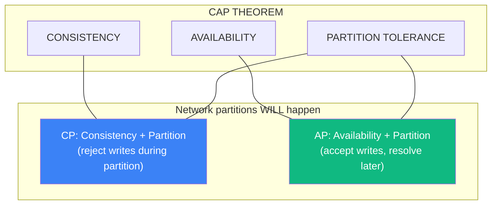

### Database Selection by Service

| Service | Database | CAP | Rationale |
|---------|----------|-----|-----------|
| **ledger-service** | PostgreSQL | CP | Financial data MUST be consistent, ACID required |
| **transfer-service** | PostgreSQL | CP | Transaction integrity critical |
| **kyc-service** | PostgreSQL | CP | Compliance data, audit requirements |
| **user-service** | MongoDB | AP | Profile reads > writes, eventual consistency OK |
| **wallet-service** | MongoDB | AP | Balance derived from events, fast reads |
| **claim-service** | MongoDB | AP | High read volume for claim lookups |
| **notify-service** | MongoDB | AP | Best-effort delivery, retries handle failures |
| **auth-service** | Redis | AP | Session data, TTL-based, fast |
| **fx-service** | Redis | AP | Cache, rates update frequently |

### PostgreSQL (CP - Strong Consistency)

For financial data requiring ACID guarantees:

```sql
-- Ledger entries with double-entry accounting
CREATE TABLE ledger_entries (
    id UUID PRIMARY KEY DEFAULT gen_random_uuid(),
    transaction_id UUID NOT NULL,
    account_id UUID NOT NULL,
    entry_type VARCHAR(10) NOT NULL CHECK (entry_type IN ('DEBIT', 'CREDIT')),
    amount DECIMAL(20, 8) NOT NULL,
    currency VARCHAR(3) NOT NULL,
    balance_after DECIMAL(20, 8) NOT NULL,
    created_at TIMESTAMPTZ NOT NULL DEFAULT NOW(),

    -- Ensure debits and credits balance
    CONSTRAINT valid_amount CHECK (amount > 0)
);

-- Optimistic locking for concurrent updates
CREATE TABLE transfers (
    id UUID PRIMARY KEY,
    version INTEGER NOT NULL DEFAULT 1,  -- Optimistic lock
    status VARCHAR(20) NOT NULL,
    -- ... other fields

    CONSTRAINT valid_status CHECK (status IN (
        'PENDING', 'CONFIRMED', 'CLAIMED', 'PROCESSING',
        'COMPLETED', 'CANCELLED', 'EXPIRED', 'FAILED'
    ))
);

-- Update with optimistic lock
UPDATE transfers
SET status = 'CLAIMED', version = version + 1
WHERE id = $1 AND version = $2;
```

### MongoDB (AP - High Availability)

For read-heavy, eventually consistent data:

```javascript
// User read model (denormalized for queries)
{
  _id: ObjectId("..."),
  phone: "+639171234567",
  phoneHash: "sha256...",  // For lookups
  profile: {
    name: "John Doe",
    email: "john@example.com",
    avatar: "https://..."
  },
  kyc: {
    status: "verified",
    tier: 2,
    verifiedAt: ISODate("...")
  },
  wallet: {
    address: "7xKp...",
    chain: "solana"
  },
  stats: {
    totalSent: 1500.00,
    totalReceived: 200.00,
    transferCount: 15
  },
  contacts: [
    { name: "Mom", phone: "+639181234567", isRegistered: true },
    { name: "Dad", phone: "+639191234567", isRegistered: false }
  ],
  createdAt: ISODate("..."),
  updatedAt: ISODate("...")
}

// Indexes for fast queries
db.users.createIndex({ "phoneHash": 1 }, { unique: true });
db.users.createIndex({ "wallet.address": 1 });
db.users.createIndex({ "contacts.phone": 1 });
```

### Redis Data Structures

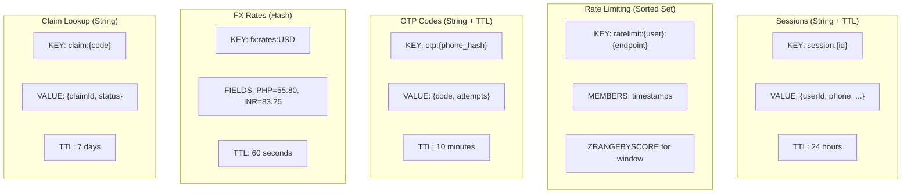

---

## Event-Driven Architecture

### Apache Kafka / Redpanda

We use **Redpanda** (Kafka-compatible, simpler operations) for event streaming:

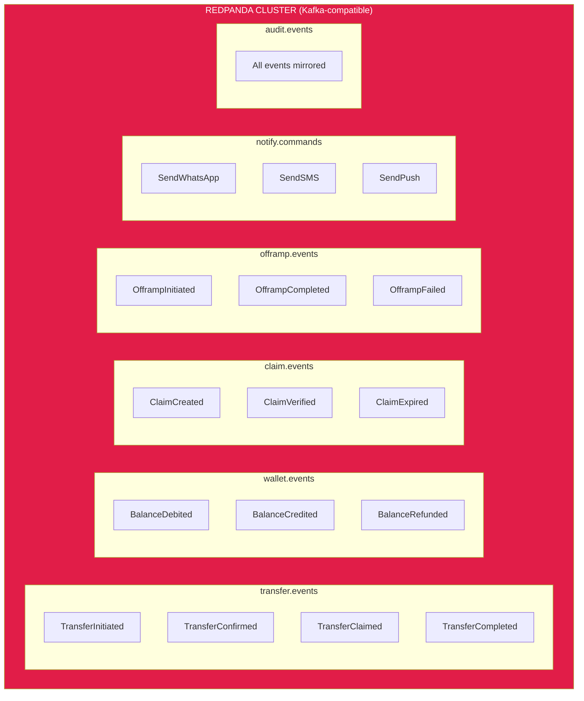

### Event Schema (CloudEvents + Avro)

```typescript
// CloudEvents envelope
interface CloudEvent<T> {
  specversion: "1.0";
  type: string;                    // e.g., "com.cash.transfer.created"
  source: string;                  // e.g., "/services/transfer"
  id: string;                      // UUID
  time: string;                    // ISO 8601
  datacontenttype: "application/json";
  data: T;

  // Extensions
  correlationid: string;           // For distributed tracing
  causationid: string;             // Event that caused this event
}

// Example event
{
  "specversion": "1.0",
  "type": "com.cash.transfer.created",
  "source": "/services/transfer",
  "id": "evt_abc123",
  "time": "2025-01-15T10:00:00Z",
  "datacontenttype": "application/json",
  "correlationid": "corr_xyz789",
  "causationid": "cmd_def456",
  "data": {
    "transferId": "txn_123",
    "senderId": "usr_abc",
    "recipientPhone": "+639181234567",
    "amount": "100.00",
    "currency": "USD",
    "claimCode": "x7Kp2mN9qL4r"
  }
}
```

### Consumer Groups & Partitioning

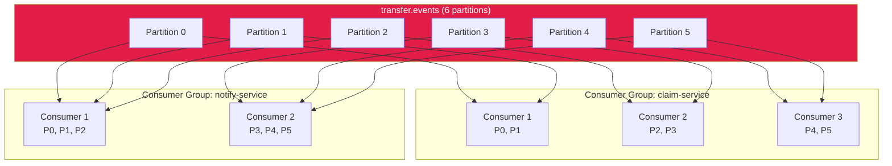

**Partitioning Key**: `sender_id`
**Guarantees**: All events for same sender processed in order

---

## Caching Strategy

### Multi-Layer Cache Architecture

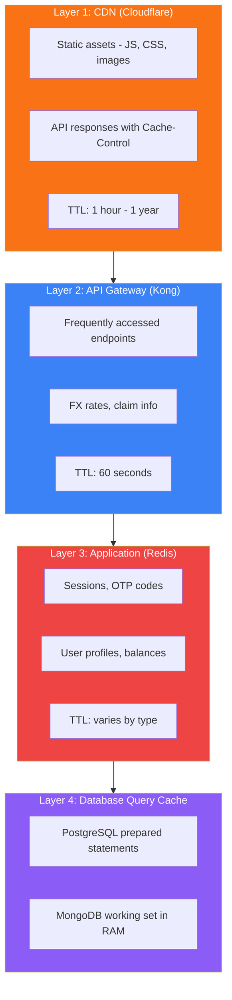

### Cache Patterns

| Pattern | Use Case | Implementation |
|---------|----------|----------------|
| **Cache-Aside** | User profiles | Read from cache, fallback to DB, populate cache |
| **Write-Through** | Session data | Write to cache + DB simultaneously |
| **Write-Behind** | Analytics | Write to cache, async persist to DB |
| **Refresh-Ahead** | FX rates | Proactively refresh before expiry |

### Cache Invalidation Strategy

```typescript
// Event-driven cache invalidation
@EventHandler('user.updated')
async handleUserUpdated(event: UserUpdatedEvent) {
  // Invalidate user cache
  await redis.del(`user:${event.userId}`);
  await redis.del(`user:phone:${event.phoneHash}`);

  // Publish cache invalidation event for CDN
  await kafka.publish('cache.invalidation', {
    keys: [`/api/users/${event.userId}`],
    tags: ['user-profile'],
  });
}
```

---

## Kubernetes Infrastructure

### Provider Comparison

| Provider | Monthly Cost | Pros | Cons |
|----------|--------------|------|------|
| **Civo** | $20 | Cheapest, K3s (fast), developer-friendly | Smaller ecosystem |
| **Vultr** | $30 | Best resources/price, global | Newer K8s offering |
| **Linode** | $34 | Akamai backing, reliable | Higher cost |
| **DigitalOcean** | $36 | Great docs, easy | Most expensive |

**Recommendation**: Start with **Civo** ($20/mo), migrate to **Vultr** for production.

### Cluster Architecture

```mermaid
flowchart TB
    subgraph K8s["☸️ KUBERNETES CLUSTER"]
        subgraph Ingress["INGRESS LAYER"]
            Traefik[Traefik Ingress]
            CertMgr[Cert-Manager]
            ExtDNS[External DNS]
        end

        subgraph Mesh["SERVICE MESH (Linkerd)"]
            mTLS[mTLS between services]
            Split[Traffic splitting - canary]
            Metrics[Golden metrics]
        end

        subgraph Apps["APPLICATION SERVICES"]
            Auth[auth<br/>2 pods]
            User[user<br/>2 pods]
            Transfer[transfer<br/>3 pods]
            Wallet[wallet<br/>2 pods]
            Claim[claim<br/>2 pods]
            Offramp[offramp<br/>2 pods]
            Notify[notify<br/>2 pods]
            FXSvc[fx<br/>1 pod]
        end

        subgraph Data["DATA SERVICES"]
            PG[(PostgreSQL<br/>Primary + Replica)]
            Mongo[(MongoDB<br/>ReplicaSet 3)]
            Redis[(Redis<br/>Sentinel 3)]
            RP[(Redpanda<br/>3 brokers)]
        end

        subgraph Observability["OBSERVABILITY"]
            Prom[Prometheus]
            Graf[Grafana]
            Loki[Loki]
            Tempo[Tempo]
        end

        Ingress --> Mesh --> Apps --> Data
        Apps --> Observability
    end

    style K8s fill:#326ce5,color:#fff
    style Mesh fill:#2beda7,color:#000
    style Data fill:#7c3aed,color:#fff
    style Observability fill:#f97316,color:#fff
```

### Resource Allocation (Bootstrap → Scale)

**Bootstrap (MVP - ~$150/month)**:

```yaml
# Minimal viable cluster
nodes:
  - type: small  # 2 vCPU, 4GB RAM
    count: 3

resources:
  services:
    auth: { cpu: 100m, memory: 128Mi, replicas: 1 }
    user: { cpu: 100m, memory: 128Mi, replicas: 1 }
    transfer: { cpu: 200m, memory: 256Mi, replicas: 1 }
    wallet: { cpu: 100m, memory: 128Mi, replicas: 1 }
    claim: { cpu: 100m, memory: 128Mi, replicas: 1 }
    offramp: { cpu: 100m, memory: 128Mi, replicas: 1 }
    notify: { cpu: 100m, memory: 128Mi, replicas: 1 }
    fx: { cpu: 50m, memory: 64Mi, replicas: 1 }

  data:
    postgresql: { cpu: 500m, memory: 1Gi }  # Managed or single pod
    mongodb: { cpu: 500m, memory: 1Gi }     # Single replica
    redis: { cpu: 100m, memory: 256Mi }     # Single pod
    redpanda: { cpu: 500m, memory: 1Gi }    # Single broker
```

**Growth (1K daily transfers - ~$500/month)**:

```yaml
nodes:
  - type: medium  # 4 vCPU, 8GB RAM
    count: 3

resources:
  services:
    auth: { cpu: 200m, memory: 256Mi, replicas: 2 }
    user: { cpu: 200m, memory: 256Mi, replicas: 2 }
    transfer: { cpu: 500m, memory: 512Mi, replicas: 2 }
    # ... scaled appropriately

  data:
    postgresql: { cpu: 1, memory: 2Gi, replicas: 2 }
    mongodb: { cpu: 1, memory: 2Gi, replicas: 3 }
    redis: { cpu: 500m, memory: 1Gi, replicas: 3 }
    redpanda: { cpu: 1, memory: 2Gi, replicas: 3 }
```

**Scale (100K daily transfers - ~$3000/month)**:

```yaml
nodes:
  - type: large  # 8 vCPU, 16GB RAM
    count: 6
  - type: medium  # Spot instances for workers
    count: 4
    spot: true

# Add HPA for auto-scaling
horizontalPodAutoscaler:
  transfer-service:
    minReplicas: 3
    maxReplicas: 10
    targetCPU: 70%
```

### Helm Charts Structure

```
helm/
├── cash-platform/               # Umbrella chart
│   ├── Chart.yaml
│   ├── values.yaml
│   └── charts/
│       ├── auth-service/
│       ├── user-service/
│       ├── transfer-service/
│       ├── wallet-service/
│       ├── claim-service/
│       ├── offramp-service/
│       ├── notify-service/
│       └── fx-service/
├── cash-data/                   # Data layer
│   ├── postgresql/
│   ├── mongodb/
│   ├── redis/
│   └── redpanda/
└── cash-observability/          # Monitoring
    ├── prometheus/
    ├── grafana/
    ├── loki/
    └── tempo/
```

---

## UX Requirements

### Design Philosophy

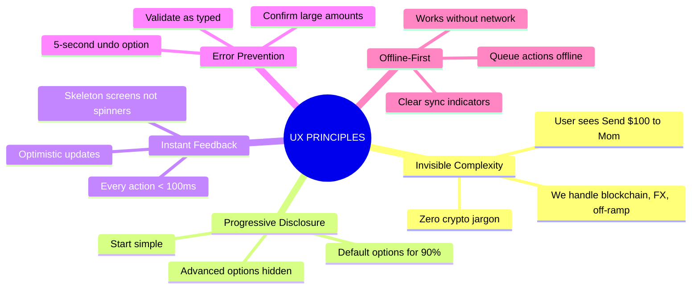

### Mobile App UX Specifications

#### Animation & Motion

```typescript
// React Native Reanimated configuration
const springConfig = {
  damping: 15,
  stiffness: 150,
  mass: 1,
};

// Screen transitions
const screenTransition = {
  animation: 'spring',
  config: springConfig,
};

// Micro-interactions
const buttonPress = {
  scale: withSpring(0.95, { damping: 10, stiffness: 400 }),
  opacity: withTiming(0.8, { duration: 100 }),
};

// Success celebration
const successAnimation = {
  confetti: true,
  haptic: 'success',
  sound: 'cash-register.mp3',
};
```

#### Haptic Feedback

| Action | Haptic Type | Duration |
|--------|-------------|----------|
| Button press | Light | 10ms |
| Toggle switch | Medium | 15ms |
| Amount confirm | Heavy | 25ms |
| Transfer success | Success | - |
| Error | Error | - |

#### Loading States

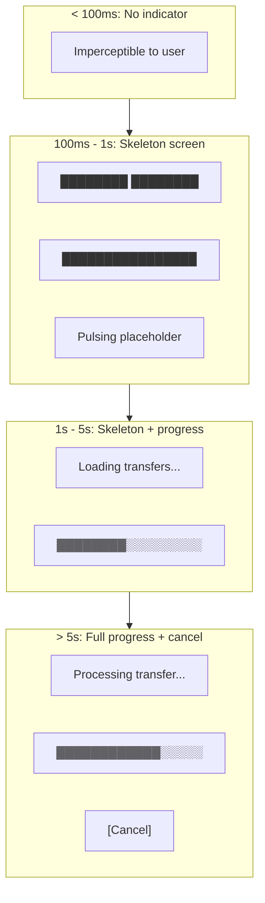

### Web Claim Flow UX

#### Mobile-First Responsive

```css
/* Design breakpoints */
--mobile: 320px;   /* Minimum supported */
--tablet: 768px;   /* iPad portrait */
--desktop: 1024px; /* Optional desktop support */

/* Touch targets */
--min-touch-target: 44px;  /* Apple HIG */
--comfortable-touch: 56px; /* Our standard */

/* Typography scale */
--text-xs: 12px;
--text-sm: 14px;
--text-base: 16px;  /* Minimum for mobile forms */
--text-lg: 18px;
--text-xl: 24px;
--text-2xl: 32px;
--text-3xl: 48px;   /* Hero amounts */
```

#### Claim Page States

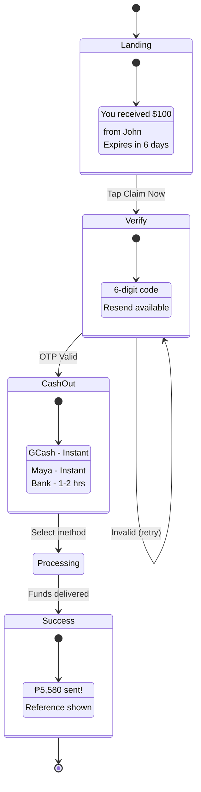

### Accessibility (WCAG 2.1 AA)

| Requirement | Implementation |
|-------------|----------------|
| Color contrast | 4.5:1 minimum for text |
| Touch targets | 44x44px minimum |
| Screen reader | Full VoiceOver/TalkBack support |
| Reduce motion | Respect system preference |
| Text scaling | Support up to 200% |

---

## Performance Requirements

### Latency SLOs

| Operation | P50 | P95 | P99 |
|-----------|-----|-----|-----|
| API response | 50ms | 150ms | 300ms |
| Transfer creation | 100ms | 300ms | 500ms |
| Claim page load | 200ms | 500ms | 1s |
| Cash-out initiation | 200ms | 500ms | 1s |
| Mobile app cold start | 1s | 2s | 3s |

### Throughput Targets

| Phase | Daily Transfers | TPS Peak | Concurrent Users |
|-------|-----------------|----------|------------------|
| MVP | 100 | 1 | 50 |
| Growth | 10,000 | 10 | 500 |
| Scale | 1,000,000 | 100 | 10,000 |

### Database Performance

```sql
-- All critical queries must have explain plans
-- Target: All queries < 10ms

-- Example: Transfer lookup (indexed)
EXPLAIN ANALYZE
SELECT * FROM transfers
WHERE id = 'txn_123';
-- Expected: Index Scan, < 1ms

-- Example: User transfers (compound index)
CREATE INDEX idx_transfers_sender_created
ON transfers (sender_id, created_at DESC);

EXPLAIN ANALYZE
SELECT * FROM transfers
WHERE sender_id = 'usr_abc'
ORDER BY created_at DESC
LIMIT 20;
-- Expected: Index Scan, < 5ms
```

---

## Security Requirements

### Defense in Depth

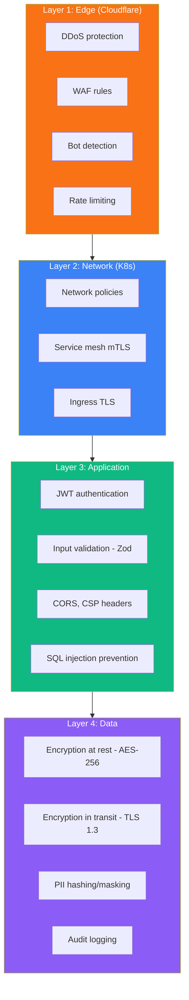

### Secrets Management

```yaml
# External Secrets Operator + Doppler/Vault
apiVersion: external-secrets.io/v1beta1
kind: ExternalSecret
metadata:
  name: cash-api-secrets
spec:
  secretStoreRef:
    name: doppler
    kind: ClusterSecretStore
  target:
    name: cash-api-secrets
  data:
    - secretKey: PRIVY_APP_SECRET
      remoteRef:
        key: PRIVY_APP_SECRET
    - secretKey: DATABASE_URL
      remoteRef:
        key: DATABASE_URL
```

---

## Cost Optimization

### Bootstrap to Scale Cost Projection

| Phase | Monthly Cost | Components |
|-------|--------------|------------|
| **MVP** | ~$150 | Civo K8s ($20) + Managed DBs ($80) + External services ($50) |
| **Growth** | ~$500 | Vultr K8s ($100) + Larger DBs ($250) + Services ($150) |
| **Scale** | ~$3,000 | Multi-node cluster + HA databases + Premium services |

### Cost-Saving Strategies

1. **Spot/Preemptible Nodes**: Use for stateless workers (50% savings)
2. **Reserved Capacity**: Commit to 1-year for databases (30% savings)
3. **Right-sizing**: Start small, scale based on actual usage
4. **Managed vs Self-hosted**: Start managed, self-host at scale
5. **CDN Caching**: Reduce API calls with aggressive caching

---

## Summary

This architecture provides:

- **World-class design patterns** (CQRS, Event Sourcing, Saga, Circuit Breaker)
- **CAP-aware database selection** (PostgreSQL for finance, MongoDB for reads)
- **Event-driven with Kafka/Redpanda** (reliable, scalable messaging)
- **Kubernetes-first** (Civo/Vultr for cost efficiency)
- **Modern UX** (offline-first, sub-100ms feedback, delightful interactions)
- **Scale-ready** (horizontal scaling from day one)
- **Cost-efficient bootstrap** (~$150/month to start)

Ready to proceed with implementation?
