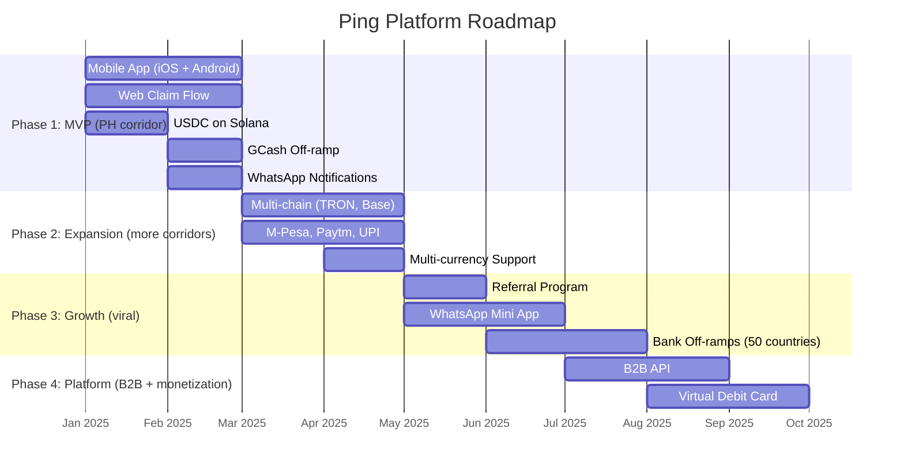

# Roadmap

**WHAT:** Phased delivery timeline for Ping. What we build when, and why.

**AUTHORITY:** 📐 PERMANENT-refreshable. Update when scope materially shifts.

**Last refreshed:** 2026-05-21

This document was consolidated on 2026-05-21 from the Roadmap section of the original `README.md`.

---

## Roadmap Overview

---

## Phase 1 — MVP: Philippines Corridor (Months 1-6)

**Goal:** Prove the model on one corridor end-to-end.

**Why Philippines first:**
- Largest GCC→SEA corridor
- Excellent mobile wallet infrastructure (GCash, Maya)
- English-speaking, tech-savvy diaspora
- Strong social-media presence for viral growth

**Target:** 1,000 MAU, $100K monthly volume.

### Deliverables

#### Mobile App
- [ ] Phone authentication flow
- [ ] Home screen with balance
- [ ] Contact list with search
- [ ] Send money flow
- [ ] Transfer history
- [ ] Cash-in (Apple Pay, Google Pay, Card, Bank, USDC)
- [ ] Cash-out (to sender's country or home country)

#### Web Claim Flow
- [ ] Claim landing page
- [ ] OTP verification
- [ ] Smart country detection from phone number
- [ ] Cash-out method selection (country-specific)
- [ ] Mobile wallet integrations (GCash, M-Pesa, bKash, etc.)
- [ ] Bank transfer integration
- [ ] Success/receipt page

#### Backend
- [ ] auth-service (phone + Privy)
- [ ] transfer-service
- [ ] claim-service
- [ ] wallet-service (Privy integration)
- [ ] notify-service (WhatsApp + SMS)
- [ ] offramp-service (TransFi)

#### Infrastructure
- [ ] Kubernetes setup (Civo/Vultr)
- [ ] Istio service mesh installation
- [ ] CI/CD pipeline (GitHub Actions)
- [ ] Monitoring dashboards (Kiali, Grafana)
- [ ] Alerting rules

#### Compliance
- [ ] AML screening integration
- [ ] Transaction monitoring
- [ ] KYC flow (Persona)
- [ ] Privacy policy
- [ ] Terms of service

---

## Phase 2 — Expansion: India + Pakistan + Bangladesh (Months 6-12)

**Goal:** Add the largest-volume corridors.

**Why next:**
- Largest corridors by volume globally
- UPI makes instant delivery possible in India
- Huge market size justifies localization

**Target:** 10,000 MAU, $2M monthly volume.

### Deliverables
- Multi-chain support (TRON, Base) — needed for cheaper rails to specific corridors
- UPI / IMPS off-ramp integration
- JazzCash + Easypaisa (Pakistan)
- bKash + Nagad (Bangladesh)
- Multi-currency support (handle PKR, BDT, INR locally)

---

## Phase 3 — Growth: Africa + Viral Mechanics (Year 2)

**Goal:** Network-effect activation.

**Why:**
- M-Pesa dominance makes delivery trivial in Kenya
- Less competition from traditional players in sub-Saharan Africa
- Growing mobile-tech adoption

**Target:** 100,000 MAU, $30M monthly volume.

### Deliverables
- Referral program (both-sided incentives)
- WhatsApp Mini App (lower friction than installing native)
- Bank off-ramps in 50 countries
- M-Pesa, Airtel Money, MTN MoMo (Kenya, Tanzania, Uganda, Ghana, Nigeria)
- Yellow Card backup rails for Africa-native crypto on-ramps

---

## Phase 4 — Platform: B2B + Monetization Beyond Yield (Year 3)

**Goal:** Revenue diversification + ecosystem expansion.

**Target:** 500,000 MAU, $150M monthly volume, $1M+ MRR.

### Deliverables
- B2B API (companies embedding Ping for payroll/disbursement)
- Virtual debit card (Mastercard/Visa rails, USDC-funded)
- White-label solution (revenue share with partners)
- Family dashboard (multi-recipient management)
- Premium subscriptions (priority support, higher limits, scheduled transfers)

---

## Strategic Priorities Per Year

> **Source:** previously docs/STRATEGY.md § "Strategic Priorities" (merged here on 2026-05-21).

### Year 1: Establish Beachhead

1. **Launch GCC → Philippines corridor** — largest, best infrastructure (GCash/Maya payout), English-speaking diaspora
2. **Build network effects** — push "both download for FREE" messaging, gamify referrals
3. **Secure licensing** — UAE first (largest GCC market); partner where licensing is slow

### Year 2: Expand & Defend

1. **Add India, Pakistan, Bangladesh** — larger volume corridors, UPI makes payout easy
2. **Deepen moat** — exclusive payout partnerships, build brand in GCC diaspora communities
3. **Treasury yield optimization** — deploy balances for sustainable revenue, reduce reliance on transaction fees

### Year 3: Scale or Exit

1. **Prove unit economics at scale** — 500K MAU, $150M monthly volume, $1M+ MRR
2. **Strategic options:**
   - Continue scaling independently
   - Acquisition target (GCash, Wise, bank)
   - Raise Series A / B

---

## Decision Points (Forward-Looking)

| Question | When We'll Know |
|---|---|
| Do we self-host treasury (vs Circle Yield) | When aggregate balance > $50M and yield delta justifies the operational overhead |
| Do we issue our own stablecoin (vs USDC) | Likely never — USDC has the regulatory cover; minting our own adds liability without offsetting value |
| Do we expand to LatAm corridors | After Africa stabilizes (Year 2 Q4) |
| Do we open the B2B API publicly | When MAU > 100K and we have evidence of organic partner demand |
| Do we raise external capital | If unit economics confirm > 65% blended gross margin AND we want to compress timeline to network-effect lock-in |

---

## Roadmap Risks

Roadmap timelines can slip on:
- **Regulatory delays** — money transmission licenses in GCC can stretch 12-24 months
- **Payment processor onboarding** — Stripe/Checkout.com approvals for fintech-adjacent products are non-trivial
- **Off-ramp provider integration** — TransFi sandbox to production cutover historically takes 3-6 weeks per country
- **App Store / Play Store review** — fintech apps face heightened scrutiny; first submission may take 4-8 weeks

See [BUSINESS-STRATEGY.md § Risk Assessment](BUSINESS-STRATEGY.md#risk-assessment) for the strategic risk catalog.
