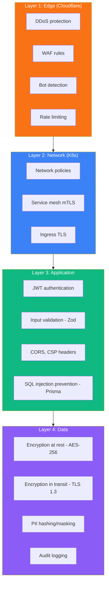
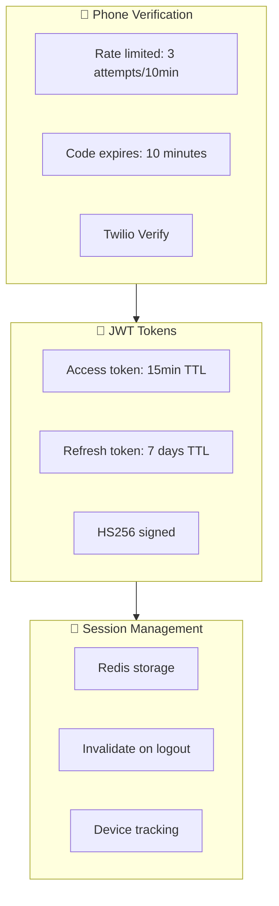
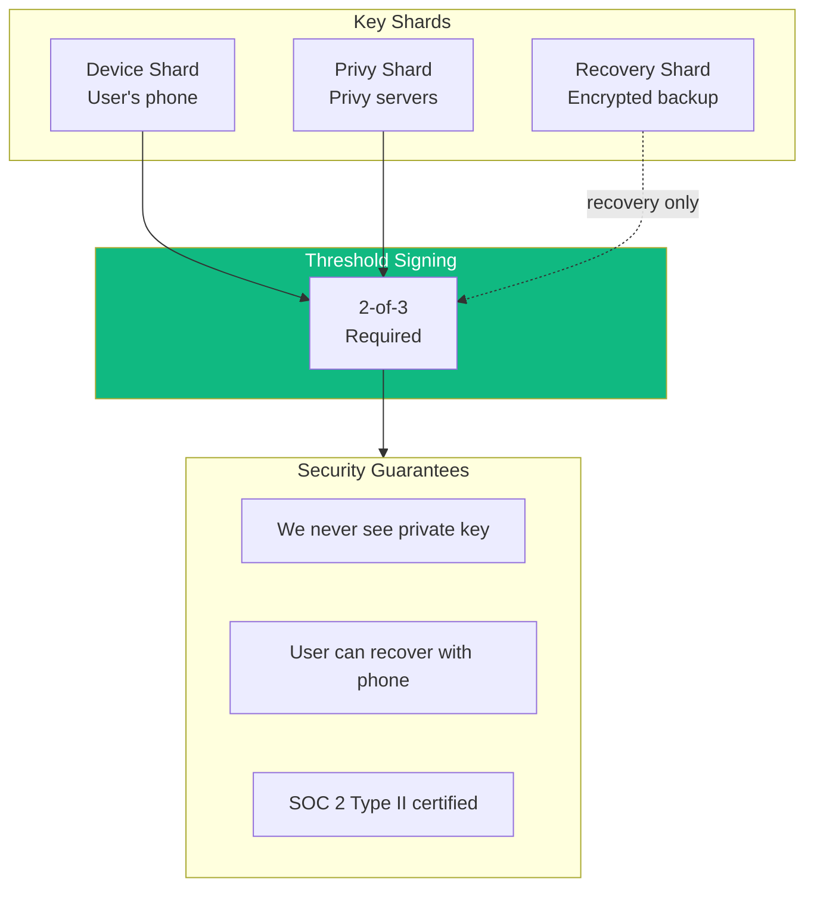
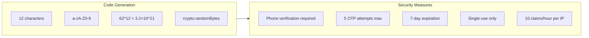

# Security

**WHAT:** Threat model, secrets policy, identity model, and defense-in-depth strategy for Ping.

**AUTHORITY:** 📐 PERMANENT.

This document was consolidated on 2026-05-21 from:

- `docs/NFR.md` § "Security Requirements"
- `docs/ARCHITECTURE.md` § "Security Architecture" (original)

---

## Threat Model

Ping moves money for migrant workers — the threat surface is the union of fintech-grade finance and consumer mobile app risks.

| Asset               | Threat                                  | Mitigation                                                                             |
| ------------------- | --------------------------------------- | -------------------------------------------------------------------------------------- |
| User phone number   | Account takeover via SIM swap           | Multi-factor verification (phone OTP + biometric on mobile), device-pinned session     |
| User USDC balance   | Wallet drain via private-key compromise | Privy MPC (2-of-3 threshold; we never hold the full key)                               |
| Claim links         | Brute-force guessing                    | 12-char alphanumeric (62^12 ≈ 3.2×10^21), 5 OTP attempts max, 7-day expiry, single-use |
| KYC documents       | Data breach                             | AES-256 at rest, S3 encryption, signed-URL access only, never logged                   |
| Transaction history | PII exposure                            | Phone numbers hashed for lookup, encrypted for display                                 |
| API endpoints       | Credential stuffing, rate abuse         | Rate limits per endpoint, JWT short TTL (15min), refresh rotation                      |
| Off-ramp webhooks   | Spoofed payout completion               | HMAC-SHA256 signature verification + idempotency keys                                  |
| Treasury USDC       | Reserve compromise                      | Multi-sig custody, Circle Yield + Ondo (audited venues), hot/cold split                |
| Service-to-service  | MITM in mesh                            | Istio automatic mTLS between all pods                                                  |

---

## Defense in Depth

> **Source:** previously docs/NFR.md § "Defense in Depth" (merged here on 2026-05-21).



---

## Authentication Flow

> **Source:** previously docs/ARCHITECTURE.md § "Authentication Flow" (merged here on 2026-05-21).



### JWT Token Structure

```typescript
interface JWTPayload {
  sub: string; // User ID
  phone: string; // Phone number (hashed)
  tier: number; // KYC tier (0-3)
  iat: number;
  exp: number; // 15 min on access tokens
  jti: string; // Token ID for revocation
}
```

### Session Lifecycle

| Action               | Effect                                                                                         |
| -------------------- | ---------------------------------------------------------------------------------------------- |
| Login (OTP verified) | New access + refresh tokens issued; session stored in Redis with 24h TTL                       |
| Token refresh        | New access token; refresh token rotates (old one invalidated)                                  |
| Logout               | Session deleted from Redis; refresh token added to revocation list (TTL 7d to outlive refresh) |
| Device-only logout   | Session deleted; refresh token NOT revoked (other devices stay active)                         |

---

## Wallet Security (Privy MPC)

> **Source:** previously docs/ARCHITECTURE.md § "Wallet Security" (merged here on 2026-05-21).

We use **Multi-Party Computation (MPC)** via Privy. The private key is split into 3 shards; signing requires 2 of 3.



**Implications for our threat model:**

- Compromising Ping's backend gives the attacker NO ability to drain user wallets (we don't hold a signing key)
- Compromising the user's phone alone is insufficient (need Privy server cooperation)
- Compromising Privy alone is insufficient (need user's phone)
- Recovery requires the user to prove phone ownership (a Privy-side flow we don't gatekeep)

---

## Claim Link Security

> **Source:** previously docs/ARCHITECTURE.md § "Claim Link Security" (merged here on 2026-05-21).



| Property            | Value                                             |
| ------------------- | ------------------------------------------------- |
| Alphabet            | `[a-zA-Z0-9]` (62 chars)                          |
| Length              | 12 chars                                          |
| Possible values     | 3.2 × 10²¹                                        |
| Generation          | `crypto.randomBytes()` (CSPRNG)                   |
| Verification        | Phone OTP required before redemption              |
| Brute-force defense | 5 attempts max per claim, 10 claims/hour per IP   |
| Expiration          | 7 days from creation OR on first successful claim |
| Reuse               | Forbidden (single-use enforced server-side)       |

---

## Data Encryption

| Data Type           | At Rest                                           | In Transit |
| ------------------- | ------------------------------------------------- | ---------- |
| Phone numbers       | Hashed (SHA256) for lookup, encrypted for display | TLS 1.3    |
| Wallet addresses    | Plaintext (public data)                           | TLS 1.3    |
| KYC documents       | AES-256 encrypted                                 | TLS 1.3    |
| Session tokens      | Redis (encrypted at rest)                         | TLS 1.3    |
| Database (Postgres) | PostgreSQL TDE                                    | TLS 1.3    |
| Database (Mongo)    | MongoDB encryption-at-rest                        | TLS 1.3    |

---

## Secrets Management

> **Source:** previously docs/NFR.md § "Secrets Management" (merged here on 2026-05-21).

**Policy:**

- Secrets NEVER live in code, images, or env-files in git
- Secrets live in **Doppler** (or **OpenBao/Vault** at scale)
- **External Secrets Operator (ESO)** syncs to K8s Secret resources
- Pods consume via volume mount or env vars from K8s Secret
- Secret rotation is a Doppler-side operation; ESO picks up changes within ~60s

```yaml
apiVersion: external-secrets.io/v1beta1
kind: ExternalSecret
metadata:
  name: ping-api-secrets
spec:
  secretStoreRef:
    name: doppler
    kind: ClusterSecretStore
  target:
    name: ping-api-secrets
  data:
    - secretKey: PRIVY_APP_SECRET
      remoteRef: { key: PRIVY_APP_SECRET }
    - secretKey: DATABASE_URL
      remoteRef: { key: DATABASE_URL }
    - secretKey: TWILIO_AUTH_TOKEN
      remoteRef: { key: TWILIO_AUTH_TOKEN }
    - secretKey: TRANSFI_API_KEY
      remoteRef: { key: TRANSFI_API_KEY }
    - secretKey: WHATSAPP_ACCESS_TOKEN
      remoteRef: { key: WHATSAPP_ACCESS_TOKEN }
```

### Local Development

Use `.env.local` (gitignored) with **dev-only** values. The repo includes `.env.example` showing required keys. NEVER commit a real secret. NEVER paste a token in markdown.

> **Historical note:** A GitHub PAT was found checked into the old CLAUDE.md (Cash brand era) and removed during the 2026-05-21 rebrand. The token was revoked at the same time. See [`sessions/2026-05-21-rebrand-and-doc-consolidation.md`](sessions/2026-05-21-rebrand-and-doc-consolidation.md).

---

## Identity & Authorization

| Workload Identity      | How                                                                        |
| ---------------------- | -------------------------------------------------------------------------- |
| Pod-to-pod             | Istio automatic mTLS with SPIFFE-style identity                            |
| Pod-to-external-API    | Short-lived service account tokens (K8s TokenReview), rotated by sidecar   |
| User-to-API            | JWT (HS256, 15min access TTL, 7day refresh)                                |
| User-to-wallet-signing | Privy MPC (2-of-3 threshold, device shard pinned to phone biometric)       |
| Admin-to-cluster       | K8s RBAC with short-lived OIDC tokens; never long-lived `kubeconfig` files |

### Pod Network Policy

Default-deny ingress + egress at namespace level. Each service explicitly allows:

- Ingress: from Istio ingress gateway + sibling services it serves
- Egress: to Redis/Postgres/Mongo/Redpanda + named external APIs (Privy, Twilio, TransFi, WhatsApp, Solana RPC)

---

## Audit Logging

| Source                                    | Destination                                      | Retention                     |
| ----------------------------------------- | ------------------------------------------------ | ----------------------------- |
| Application logs (stdout)                 | Loki                                             | 30 days hot, 1 year cold (S3) |
| Auth events (login/logout/refresh)        | Postgres `auth_events` table                     | 2 years (regulatory)          |
| Financial events (transfer/claim/offramp) | Postgres `ledger_entries` + Kafka `audit.events` | 7 years (regulatory)          |
| KYC events                                | Postgres `kyc_records` + S3 evidence bundle      | 5 years post-account-closure  |
| API access logs                           | Loki + sampled into Tempo for traces             | 30 days                       |
| Admin access (kubectl, K8s API)           | K8s audit log → Loki                             | 1 year                        |

---

## Incident Response

1. **Detect** — PagerDuty alert from Prometheus rule OR user report OR external bug-bounty submission
2. **Triage** — On-call SRE classifies severity (SEV1/2/3) per [SRE.md](SRE.md)
3. **Contain** — If credential leak: rotate the secret in Doppler immediately. If service compromise: scale to zero or rollback to prior image SHA.
4. **Eradicate** — Root-cause; deploy fix; verify on fresh prov per [DOD.md](DOD.md)
5. **Recover** — Restore service; communicate to affected users (compliance: notify within 72h for personal data breach per GDPR)
6. **Postmortem** — Written within 5 business days; lands in [`lessons-learned/`](lessons-learned/); update relevant runbook in [`runbooks/`](runbooks/) if a generic playbook would have helped

---

## Smart Contract Security (Earn Vault + Phase 2 contracts)

### Threat model

| Threat                                                           | Impact                                   | Mitigation                                                                                                         |
| ---------------------------------------------------------------- | ---------------------------------------- | ------------------------------------------------------------------------------------------------------------------ |
| Vault exploit drains user deposits                               | Critical — user funds at risk            | OtterSec / Halborn audit; multi-protocol diversification (max 40% any single venue); Nexus Mutual insurance ($1M+) |
| Reentrancy attack                                                | Critical                                 | Anchor's CPI safety + reentrancy guards in code                                                                    |
| Underlying DeFi protocol exploit (Kamino, Marginfi, Aave, Drift) | Up to 40% of vault TVL                   | Diversification across 4 venues; per-protocol position monitoring                                                  |
| Oracle manipulation (Pyth feeds)                                 | High — wrong prices feed POMM            | Secondary Switchboard oracle cross-check; reject if delta > 0.3%                                                   |
| MEV / sandwich attack on swaps                                   | Medium                                   | Jupiter MEV-protected mode; randomized execution windows                                                           |
| Squads multisig key compromise                                   | Critical — POMM redirect, treasury drain | Hardware wallets enforced for all 5 signers; ceremony procedures for high-value txs                                |
| Smart contract upgrade rug                                       | Critical                                 | 7-day timelock on ALL parameter changes; 30-day timelock on contract upgrades; public on-chain proposals           |
| Token treasury sales destabilizing $PING                         | Medium                                   | Capped 1%/quarter; on-chain timelock; 7-day public notice                                                          |
| Welcome stake Sybil farming                                      | Medium — token dilution                  | KYC Tier 1 required; phone uniqueness; ML fraud scoring; first-transfer $10+ requirement                           |

### Audit pipeline (mandatory pre-mainnet)

```
PHASE A: Smart contract development
  ├── Anchor / Rust development with formal-verification-friendly patterns
  ├── Internal review (architect-level)
  └── Internal testing (unit + integration on Solana devnet)

PHASE B: External audit
  ├── OtterSec OR Halborn lead audit ($50-80K)
  ├── 4-6 week engagement
  ├── Issue triage + remediation
  └── Public audit report published

PHASE C: Bug bounty (pre-mainnet)
  ├── Immunefi listing 14 days before mainnet
  ├── $50K-$100K bounties for critical findings
  └── Ramp to $250K-$500K post-launch

PHASE D: Mainnet launch
  ├── Initial deployment with capped TVL ($1M-$5M)
  ├── 4-week observation period
  ├── Cap progressively raised based on stability
  └── Nexus Mutual insurance coverage live

PHASE E: Ongoing
  ├── Quarterly re-audit of any contract changes
  ├── Permanent Immunefi bug bounty program
  └── Real-time on-chain monitoring (forta-style)
```

### Squads multisig procedures

- **5 signers**, all founders + key engineering + compliance lead
- **Hardware wallets enforced** (Ledger / Trezor) for all signers
- **3-of-5 threshold** for routine operations (treasury sales, parameter changes)
- **4-of-5 threshold** for high-value operations (large transfers from Stability Reserve, contract upgrade)
- **Ceremony procedures** documented for any tx > $100K — separate physical locations, video record, time delays

## Compliance Roadmap

| Requirement                                              | Status                         | Owner                                                                          |
| -------------------------------------------------------- | ------------------------------ | ------------------------------------------------------------------------------ |
| KYC tiered onboarding (Persona via `dynolabs-io/kyc`)    | 🔴 Not started                 | Compliance via shared service (per [ADR 0011](adr/0011-kyc-shared-service.md)) |
| AML transaction monitoring                               | 🔴 Not started                 | Compliance + `compliance-svc`                                                  |
| Sanctions screening (OFAC, UN, EU via Chainalysis KYT)   | 🔴 Not started                 | `compliance-svc`                                                               |
| Privacy policy + ToS                                     | 🔴 Not drafted                 | Legal (crypto-fintech counsel)                                                 |
| GDPR data-subject request flow                           | 🔴 Not built                   | Engineering                                                                    |
| SOC 2 Type I audit                                       | 🔴 Not initiated               | Compliance                                                                     |
| Penetration test                                         | 🔴 Not scheduled               | Security                                                                       |
| Bug bounty program (Immunefi)                            | 🔴 Not launched                | Security                                                                       |
| OtterSec / Halborn smart contract audit                  | 🔴 Phase 2                     | Security (Foundation funds)                                                    |
| Nexus Mutual insurance                                   | 🔴 Phase 2                     | Treasury                                                                       |
| GCC money transmission licenses                          | 🔴 Year 2+ if needed           | Founder (currently ride on partners)                                           |
| VARA crypto license (UAE)                                | 🔴 Year 2 with DMCC entity     | Founder                                                                        |
| Reg D / Reg S exempt offering documentation (token sale) | 🔴 Phase 2                     | Legal                                                                          |
| Geo-blocking US persons                                  | 🔴 At Phase 2 launch           | Engineering                                                                    |
| Liechtenstein TVTG or EU MiCA registration               | 🔴 Phase 2 (whichever cheaper) | Legal                                                                          |
