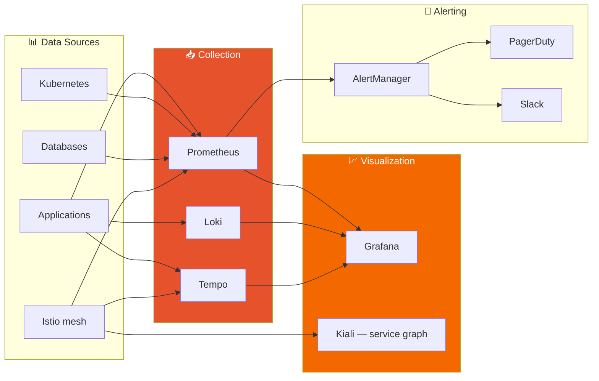

# Site Reliability

**WHAT:** SLOs, on-call expectations, observability stack, performance targets, and incident severity definitions.

**AUTHORITY:** 📐 PERMANENT.

This document was consolidated on 2026-05-21 from:
- `docs/NFR.md` § "Performance Requirements"
- `docs/ARCHITECTURE.md` § "Monitoring & Observability"

---

## Service Level Objectives

### Latency SLOs

> **Source:** previously docs/NFR.md § "Latency SLOs" (merged here on 2026-05-21).

| Operation | P50 | P95 | P99 |
|---|---|---|---|
| API response (general) | 50ms | 150ms | 300ms |
| Transfer creation | 100ms | 300ms | 500ms |
| Claim page load | 200ms | 500ms | 1s |
| Cash-out initiation | 200ms | 500ms | 1s |
| Mobile app cold start | 1s | 2s | 3s |

### Throughput Targets

> **Source:** previously docs/NFR.md § "Throughput Targets" (merged here on 2026-05-21).

| Phase | Daily Transfers | TPS Peak | Concurrent Users |
|---|---|---|---|
| MVP | 100 | 1 | 50 |
| Growth | 10,000 | 10 | 500 |
| Scale | 1,000,000 | 100 | 10,000 |

### Reliability SLOs

| Metric | Target |
|---|---|
| Transfer success rate | 99.5% |
| Uptime (API) | 99.9% (43.2 min/month error budget) |
| Uptime (Web claim) | 99.95% (21.6 min/month — recipients can't retry; higher bar) |
| Error rate (5xx) | < 0.1% |
| Cash-out completion within SLA | 99% (instant methods within 60s; bank within 24h) |

### Error Budget Policy

If we burn >50% of monthly error budget in the first half of the month:
- New feature work pauses
- All engineering effort routes to reliability work
- Next deploy requires SRE + founder approval

---

## Observability Stack

> **Source:** previously docs/ARCHITECTURE.md § "Monitoring & Observability" (merged here on 2026-05-21).



### Three Pillars

| Pillar | Tool | Retention |
|---|---|---|
| **Metrics** | Prometheus | 30 days hot, 1 year downsampled (Mimir at scale) |
| **Logs** | Loki | 30 days hot, 1 year cold (S3 archive) |
| **Traces** | Tempo (OTel) | 7 days (sampled at 10% by default; 100% on error) |

### Golden Signals (per service)

| Signal | Metric |
|---|---|
| Latency | `http_request_duration_seconds` histogram, P50/P95/P99 |
| Traffic | `http_requests_total` rate over 1m |
| Errors | `http_requests_total{status=~"5.."}` rate |
| Saturation | CPU/memory utilization, queue depth (Redpanda lag) |

### Database Health Metrics

| Database | Metric | Alert Threshold |
|---|---|---|
| PostgreSQL | Connection pool utilization | > 80% |
| PostgreSQL | Replication lag | > 10s |
| PostgreSQL | Lock wait time | > 5s |
| MongoDB | Query execution time | > 100ms (P99) |
| MongoDB | Oplog window | < 1 hour |
| Redis | Memory usage | > 80% |
| Redis | Connected clients | > 1000 |
| Redpanda | Consumer lag | > 1 minute |

---

## Incident Severity

| Severity | Definition | Response Time | Examples |
|---|---|---|---|
| **SEV1** | Critical: revenue / funds at risk; >50% users affected | 15 min ack, 1h workaround | Wallet drain in progress, transfers double-spending, payment processor offline |
| **SEV2** | Major: significant feature broken; 10-50% users affected | 30 min ack, 4h workaround | Claim flow returning 500s, off-ramp provider returning errors, SMS undeliverable in a market |
| **SEV3** | Minor: degraded experience; <10% users | 1h ack, 24h fix | Slow API responses, intermittent WhatsApp template failures, dashboard widgets not loading |

### On-Call Rotation

- **Primary:** SRE responsible for paging response, triage, comms
- **Secondary:** Engineering escalation for SEV1/2 if primary unavailable
- **Founder:** Final escalation for SEV1 if both unavailable

Rotation managed via PagerDuty. Shifts are weekly. Hand-off is a 15-min sync covering open incidents + watch-items.

---

## Runbook References

Per-incident playbooks live in [`runbooks/`](runbooks/). The most common ones:

| Scenario | Runbook |
|---|---|
| Transfer service returning 500s | [`runbooks/transfer-500.md`](runbooks/) *(to be written)* |
| Off-ramp webhook signature mismatch | [`runbooks/offramp-webhook-fail.md`](runbooks/) *(to be written)* |
| Database connection pool exhaustion | [`runbooks/db-pool-exhaustion.md`](runbooks/) *(to be written)* |
| Redpanda consumer lag spike | [`runbooks/kafka-lag.md`](runbooks/) *(to be written)* |

For generic operator how-tos (dev env setup, port mappings, etc.) see [RUNBOOKS.md](RUNBOOKS.md).

---

## Database Performance Discipline

> **Source:** previously docs/NFR.md § "Database Performance" (merged here on 2026-05-21).

All critical queries must have an explain plan attached to the PR that introduces them. Target: all hot-path queries < 10ms.

```sql
-- Example: Transfer lookup (indexed)
EXPLAIN ANALYZE
SELECT * FROM transfers WHERE id = 'txn_123';
-- Expected: Index Scan, < 1ms

-- Example: User transfers (compound index)
CREATE INDEX idx_transfers_sender_created
ON transfers (sender_id, created_at DESC);

EXPLAIN ANALYZE
SELECT * FROM transfers
WHERE sender_id = 'usr_abc'
ORDER BY created_at DESC
LIMIT 20;
-- Expected: Index Scan, < 5ms
```

PostgreSQL slow-query monitoring:

```sql
SELECT * FROM pg_stat_statements
ORDER BY total_time DESC
LIMIT 10;
```

MongoDB profiling:

```javascript
db.setProfilingLevel(1, { slowms: 100 });
db.system.profile.find().sort({ ts: -1 }).limit(10);
```

---

## Capacity Planning

We size pessimistically by leaving 50% headroom on hot paths so spikes don't degrade SLOs. See [ARCHITECTURE.md § Infrastructure → Resource Sizing](ARCHITECTURE.md#resource-sizing) for the bootstrap/growth/scale tiers.

When scaling from one tier to the next:
1. Pre-deploy the new capacity (e.g., bigger nodes) BEFORE volume crosses 80% of current tier limit
2. Run the next-tier infrastructure in parallel for 1 week (canary)
3. Cutover during a low-traffic window with rollback plan rehearsed

---

## Chaos Engineering (Future)

When MAU > 10K we will introduce regular chaos tests:
- Region-kill counter test (multi-region BCP claim verification)
- Pod-eviction tolerance (each service must survive 1 replica killed during peak)
- External-API outage simulation (TransFi / Privy / Twilio circuit-breaker validation)

Each chaos test result lands in [`lessons-learned/`](lessons-learned/).
