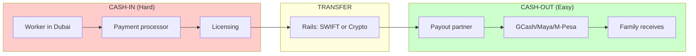
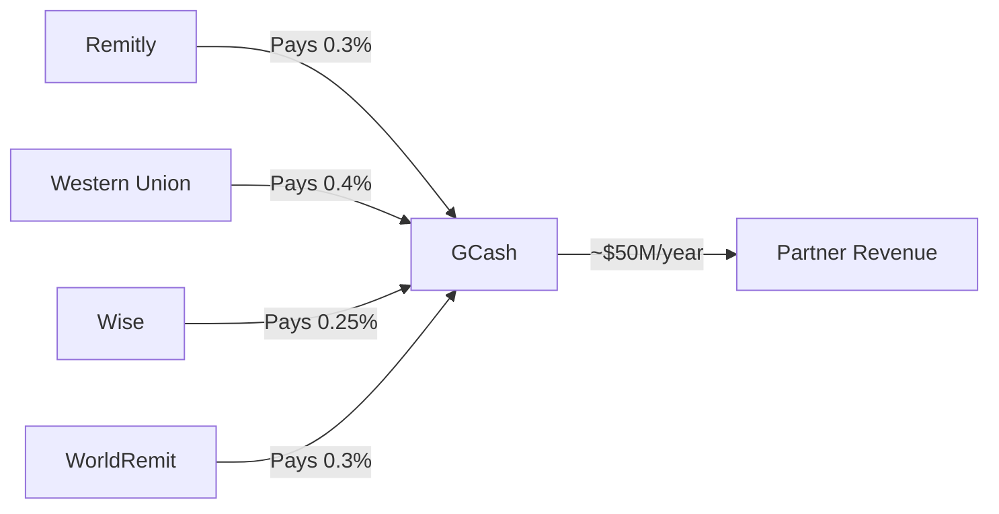
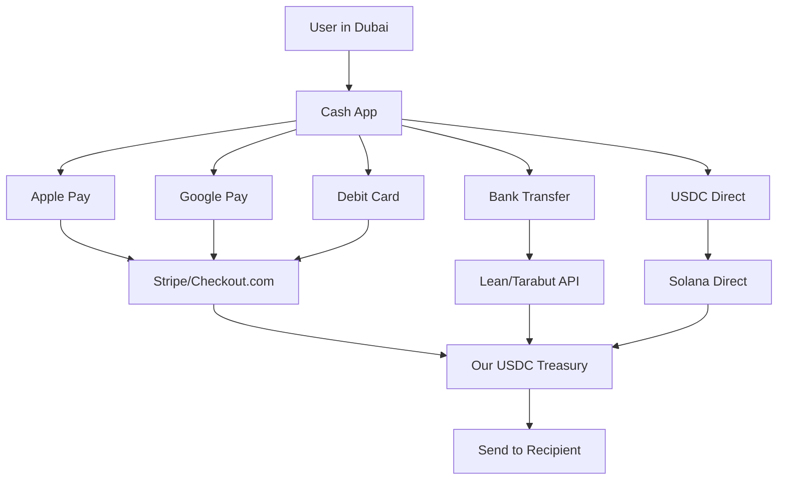
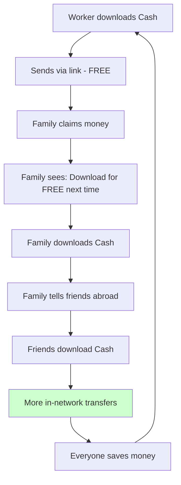

# Competitive Strategy & Defensibility

> **Internal document** - Candid analysis of our moat and competitive risks.

## The Core Question

**Why can't GCash/Maya just add international sending and replace us?**

Short answer: They CAN, but it would take 2-3 years, $5-10M, and cannibalize their existing revenue. We're betting on speed and their organizational inertia.

---

## Understanding the Remittance Flow



**The key insight: Cash-IN is the hard part, not cash-OUT.**

- GCash/Maya have excellent cash-OUT (they ARE the destination)
- GCash/Maya have ZERO cash-IN in GCC countries

---

## Barrier 1: No GCC Presence

GCash cannot accept money from a worker in Dubai because they have:

| Requirement | GCash Status |
|-------------|--------------|
| UAE payment processor | None |
| Saudi payment processor | None |
| Oman payment processor | None |
| GCC bank partnerships | None |
| Apple Pay merchant account (GCC) | None |
| Card processing in GCC | None |

**They can only receive money that arrives THROUGH existing rails** (Remitly, Western Union, Wise).

---

## Barrier 2: Licensing Per Country

To collect money FROM customers, you need a money transmission license in THAT country.

| Country | License Required | Typical Cost | Timeline | GCash Has It? |
|---------|------------------|--------------|----------|---------------|
| UAE | Central Bank registration | $500K+ | 18 months | ❌ No |
| Saudi Arabia | SAMA license | $1M+ | 24 months | ❌ No |
| Oman | CBO license | $300K+ | 12 months | ❌ No |
| Kuwait | CBK license | $500K+ | 18 months | ❌ No |
| Qatar | QCB license | $500K+ | 18 months | ❌ No |
| Bahrain | CBB license | $300K+ | 12 months | ❌ No |
| Philippines | BSP license | N/A | N/A | ✅ Yes |

**GCash is licensed IN the Philippines, not FROM the GCC.**

---

## Barrier 3: Business Model Conflict (Innovator's Dilemma)

### Current GCash Remittance Revenue



### If GCash Competes Directly

| Action | Consequence |
|--------|-------------|
| Launch own GCC sending | Remitly/WU/Wise become competitors |
| Undercut partner pricing | Partners may drop GCash as payout |
| Succeed in GCC | Lose $50M/year in partnership revenue |

**Classic innovator's dilemma**: They can't disrupt their own revenue stream without pain.

---

## Barrier 4: Stablecoin Adoption

### Traditional Remittance Rails (What GCash Would Use)

```
Dubai Bank
    → Correspondent Bank
    → SWIFT network
    → US intermediary bank
    → Partner bank
    → Philippines bank
    → GCash

Fees per hop: $2-5
Total fees: $15-25
Time: 1-3 days
```

### Our Rails (Stablecoin-Native)

```
Payment Processor
    → USDC mint
    → Solana blockchain
    → Recipient wallet

Fees per hop: <$0.01
Total fees: <$0.01
Time: 2 seconds
```

### Why GCash Won't Adopt Stablecoins

| Reason | Explanation |
|--------|-------------|
| Regulatory fear | BSP (Philippine central bank) is cautious on crypto |
| Organizational inertia | "We've always used bank rails" |
| Competency gap | Payments company, not crypto company |
| Partner pressure | Their banks don't want crypto competition |
| Conservative parent | Globe Telecom is a traditional telco |

---

## How Our Cash-IN Works

### Our Payment Stack



### What We Have vs What GCash Would Need

| Requirement | Cash | GCash Would Need |
|-------------|------|------------------|
| UAE Stripe/Checkout account | ✅ Have | Apply, integrate (3-6 months) |
| Saudi payment processor | ✅ Have | Apply, stricter approval (6-12 months) |
| GCC bank transfer APIs | ✅ Lean/Tarabut | Integration per country (6 months each) |
| Money transmission licenses | 🔄 Pending/partnered | 18-24 months per country |
| GCC compliance team | 🔄 Building | Hire, train (6-12 months) |
| Stablecoin treasury | ✅ USDC native | Organizational change (unknown) |
| GCC customer support | ✅ Arabic/English | Build team (3-6 months) |

**Realistic timeline for GCash to replicate: 2-3 years, $5-10M investment**

---

## Our Actual Moat

### Temporary Advantages (1-3 years)

| Advantage | Duration | Notes |
|-----------|----------|-------|
| Speed to market | 1-2 years | First mover in stablecoin GCC remittance |
| Stablecoin-native architecture | 2-3 years | They'd need to rebuild from scratch |
| Focus | Ongoing | We do 1 thing, they do 50 |
| No partner conflicts | Ongoing | We don't have Remitly revenue to protect |

### Durable Advantages (If We Execute)

| Advantage | How We Build It |
|-----------|-----------------|
| Network effects | Both sender + receiver = FREE transfers |
| Brand in GCC diaspora | "The free remittance app" |
| Data/ML on corridors | Optimize FX, fraud, conversion |
| Regulatory relationships | Licenses are hard to get, easy to maintain |

### The Network Effect Flywheel



**GCash can't replicate this** because:
1. They'd charge fees (bank rails are expensive)
2. They don't have senders, only receivers
3. No viral incentive ("download GCash to receive" is already happening)

---

## Honest Risk Assessment

### High Probability Risks

| Risk | Likelihood | Impact | Mitigation |
|------|------------|--------|------------|
| Wise adopts stablecoins | 40% in 3 years | High | Be established first, better UX |
| New startup with same model | 50% in 2 years | Medium | Network effects, speed |
| Regulatory friction in GCC | 30% | Medium | Multiple country strategy |

### Medium Probability Risks

| Risk | Likelihood | Impact | Mitigation |
|------|------------|--------|------------|
| GCash builds GCC presence | 20% in 3 years | High | Network effects, brand |
| Circle/USDC regulatory issues | 15% | High | Multi-stablecoin support |
| Payment processor drops us | 20% | Medium | Multiple processors |

### Low Probability Risks

| Risk | Likelihood | Impact | Mitigation |
|------|------------|--------|------------|
| Stablecoin ban globally | 5% | Critical | Would pivot to traditional rails |
| GCash acquires us | 10% | Positive? | Good exit scenario |

---

## Competitive Response Scenarios

### Scenario 1: GCash Launches GCC Sending (2-3 Years Out)

```
Their likely approach:
- Partner with existing GCC payment processor
- Use traditional bank rails (expensive)
- Price at 1-2% (can't do zero with bank rails)

Our response:
- Already have network effects
- Still cheaper (0% vs 1-2%)
- Brand established in diaspora
```

### Scenario 2: Wise Adopts Stablecoins (1-2 Years Out)

```
Their likely approach:
- Add USDC as funding method
- Reduce fees to 0.3-0.5%
- Keep existing infrastructure

Our response:
- Still have zero in-network fees
- Better UX for claim links (no app needed)
- Faster (they'll still batch settlements)
```

### Scenario 3: New Startup Copies Our Model

```
Their advantage:
- Same tech stack
- Maybe better funded

Our response:
- Network effects (both sides using Cash)
- Brand recognition
- Regulatory relationships
- 12-18 month head start
```

---

## Strategic Priorities

### Year 1: Establish Beachhead

1. **Launch GCC → Philippines corridor**
   - Largest, best infrastructure (GCash/Maya payout)
   - English-speaking, viral social media

2. **Build network effects**
   - Push "both download for FREE" messaging
   - Gamify referrals

3. **Secure licensing**
   - UAE first (largest GCC market)
   - Partner where licensing is slow

### Year 2: Expand & Defend

1. **Add India, Pakistan, Bangladesh**
   - Larger volume corridors
   - UPI makes payout easy

2. **Deepen moat**
   - Exclusive payout partnerships
   - Build brand in GCC diaspora communities

3. **Treasury yield optimization**
   - Deploy balances for sustainable revenue
   - Reduce reliance on transaction fees

### Year 3: Scale or Exit

1. **Prove unit economics at scale**
   - 500K MAU, $150M monthly volume
   - $1M+ MRR

2. **Strategic options**
   - Continue scaling independently
   - Acquisition target (GCash, Wise, bank)
   - Raise Series A/B

---

## The Bottom Line

**Our moat is temporary.** It's based on:

1. **Speed** - We're moving faster than incumbents
2. **Focus** - We only do remittance, they do 50 things
3. **Tech** - Stablecoin-native, they'd need to rebuild
4. **Conflicts** - GCash would cannibalize partner revenue

**We have a 2-3 year window** to build network effects and brand before:
- GCash could theoretically enter (but probably won't)
- Wise could adopt stablecoins (but organizationally slow)
- New competitors could emerge (but we'd have head start)

**The bet**: By the time anyone responds, we'll have enough network effects that switching costs are high.

---

## Key Metrics to Watch

| Metric | Why It Matters | Target (Year 1) |
|--------|---------------|-----------------|
| In-network % | Network effects strength | >30% of transfers |
| Both-sided users | Viral coefficient | >20% of recipients download |
| NPS | Brand defensibility | >50 |
| CAC payback | Unit economics | <3 months |
| Corridor concentration | Risk diversification | No corridor >40% |

---

## Summary for Investors

> "GCash and Maya are fantastic products - for the Philippines. But they can't collect money in Dubai. They're not licensed there, have no payment processing there, and their bank rail costs would force 2-3% fees.
>
> We built Cash on stablecoin rails from day one. Our cost to move $200 is less than a penny. That lets us offer zero fees for in-network transfers - something GCash structurally cannot match without a complete rebuild.
>
> Could they eventually compete? Yes, in 2-3 years with $5-10M investment. But by then, we'll have the network effects, brand, and regulatory relationships that make catching up painful.
>
> We're not building a feature. We're building a network."
