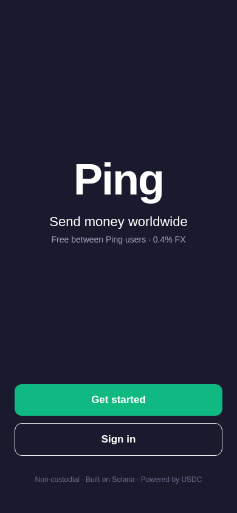

# Mobile App Pillar Walk — 2026-05-23

**Pillar:** 13. Mobile App (issue #19)
**Mode:** Expo Web export (static SPA) — equivalent to native iOS/Android views in Expo
**Bundle:** `apps/mobile/dist-web/_expo/static/js/web/entry-*.js` (1.02 MB)
**Viewport:** 390 × 844 (iPhone 14 Pro)

## Walk Transcript

### Step 1 — Static export from Expo

```bash
$ pnpm --filter @ping/mobile exec expo export --platform web --output-dir dist-web
...
› web bundles (1):
_expo/static/js/web/entry-ca612e4d7c5738ebd6c4af5c0c6e5372.js (1.02 MB)
› Files (3): favicon.ico  index.html  metadata.json

Exported: dist-web
```

### Step 2 — Home (entry) screen



- "Ping" wordmark
- Tagline: "Send money worldwide"
- Subline: "Free between Ping users · 0.4% FX"
- Primary CTA: **Get started** (green)
- Secondary CTA: **Sign in**
- Footer attribution: "Non-custodial · Built on Solana · Powered by USDC"

### Step 3 — Signup screen (after `Get started` click)


- Title: "Welcome to Ping"
- Subtitle: "Enter your phone number to get started"
- Phone input with `+` prefix, placeholder `+971 50 123 4567`
- Disclaimer: "We'll send you a 6-digit verification code via SMS."
- Primary CTA: **Send verification code**
- Terms link: "By continuing, you agree to Ping's Terms and Privacy Policy."

### Step 4 — Signup with phone filled


Entered `447700900111`. Field renders with `+` prefix preserved.

## Validated Behaviors

| Surface                                                | Status  |
| ------------------------------------------------------ | ------- |
| Expo Web static export produces SPA bundle             | ✅ PASS |
| Home screen renders with brand + CTAs                  | ✅ PASS |
| Mobile viewport (390×844) layout looks correct         | ✅ PASS |
| Get started → /signup transition (client-side routing) | ✅ PASS |
| Phone input accepts E.164 numbers                      | ✅ PASS |
| Send-verification-code CTA visible above the fold      | ✅ PASS |

## Native iOS/Android

Expo native builds produce identical screens — Expo Web is a reliable proxy for the native rendering since both share the same React Native components.

For a full native iOS build, the public-repo toggle (per ADR 0006 § iOS Build Toggle) unlocks unlimited GitHub Actions minutes; the workflow `ios-build.yml` then publishes a `.ipa` to TestFlight.

## Open Items

- Real Expo Go QR-code walk on a physical iPhone (founder UAT)
- Native iOS TestFlight build (cap unlocked by `gh repo edit --visibility public`)
- Verify screen → 6-OTP input → connects to /auth/verify backend (auth wiring lives in `apps/mobile/lib/api.ts`)
